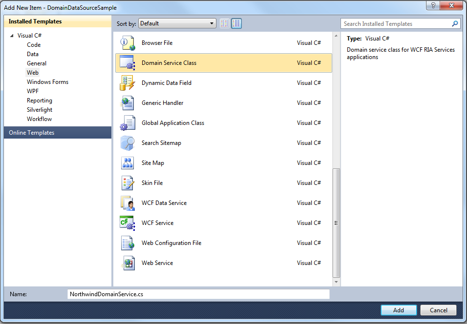

////

|metadata|
{
    "name": "binding-to-domaindatasource",
    "controlName": [],
    "tags": ["Data Binding","How Do I"],
    "guid": "c48117fb-adaa-4362-8f2f-6f2fea0fae40",  
    "buildFlags": [],
    "createdOn": "2010-06-01T14:44:16.6014186Z"
}
|metadata|
////

= Binding to DomainDataSource

== Before You Begin

The DomainDataSource control component is fully supported by all Infragistics ASP.NET AJAX controls. You can bind to it directly or use the WebHierarchicalDataSource™ component to obtain hierarchical data. For more information on using the WebHierarchicalDataSource component to bind to data, see link:webhierarchicaldatasource-getting-started-with-webhierarchicaldatasource.html[Getting Started with WebHierarchicalDataSource].

== What You Will Accomplish

You will learn how to bind WebDataGrid to the DomainDataSource component using the Northwind Customers table.

== Follow These Steps

[start=1]
. Open Visual Studio 2010, create a new ASP.NET Web Application and add a Data Model to it. This tutorial uses the LINQ to SQL model.

Before continuing to the next step you need to build the project so that the data classes and data context are generated and available to be exposed to the Domain Service.
[start=2]
. Add a new item to the web application and select the Domain Service Class template under the Web category. Type NorthwindDomainService for name and click Add.

[start=3]
. From the Domain Service dialogue window select NorthwindDataContext and choose Customer entity. Click the Enable editing check box.

By clicking OK the domain service will generate the following code into the NorthwindDomainService class:

*In C#:*

----
public class NorthwindDomainService : LinqToSqlDomainService<NorthwindDataContext>
    {
        public IQueryable<Customer> GetCustomers()
        {
            return this.DataContext.Customers;
        }
        public void InsertCustomer(Customer customer)
        {
            this.DataContext.Customers.InsertOnSubmit(customer);
        }
        public void UpdateCustomer(Customer currentCustomer)
        {
            this.DataContext.Customers.Attach(currentCustomer, this.ChangeSet.GetOriginal(currentCustomer));
        }
        public void DeleteCustomer(Customer customer)
        {
            this.DataContext.Customers.Attach(customer);
            this.DataContext.Customers.DeleteOnSubmit(customer);
        }
    }
----

[start=4]
. At your aspx page, drag the DomainDataSource component from the Toolbox. From Design, right-click on DomainDataSource and then select Configure Data Source.

.Note:
[NOTE]
====
If the control is not listed, click the Tools menu, and then click Choose Toolbox Items. In the Choose Toolbox Items dialog box, click the .NET Framework Components tab, select the DomainDataSource check box and then click OK. Click Next. On the Configure Data Access screen, select the IQueryable GetCustomers() method. Select the Enable inserts, Enable updates, and Enable deletes check boxes.
====

The following markup appears for DomainDataSource component.

*In HTML:*

----
    <asp:DomainDataSource ID="DomainDataSource1" runat="server" 
        DomainServiceTypeName="DomainDataSourceApplication.NorthwindDomainService" 
        QueryName="GetCustomers">
    </asp:DomainDataSource>
----

[start=5]
. Drag WebScriptManager and WebDataGrid from the toolbox.
[start=6]
. Set the WebDataGrid’s DataSourceID property to DomainDataSource1 and DataKeyFields to CustomerID.
[start=7]
. Run the application. WebDataGrid binds to the Customers table and displays its data.

