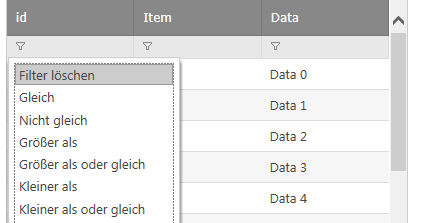
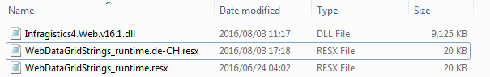
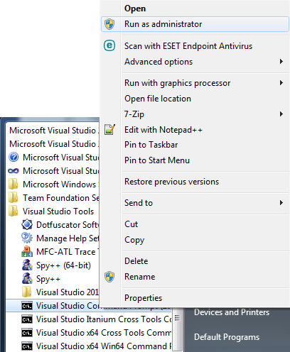
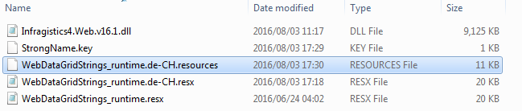
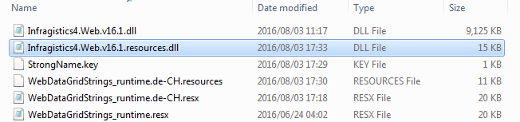
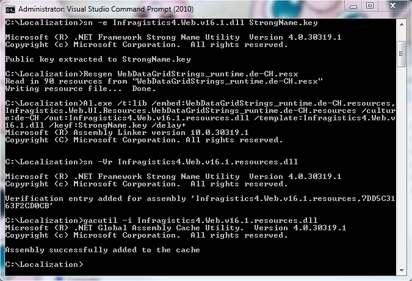
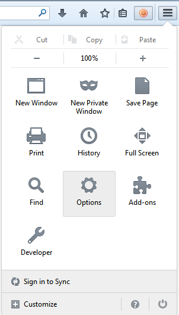
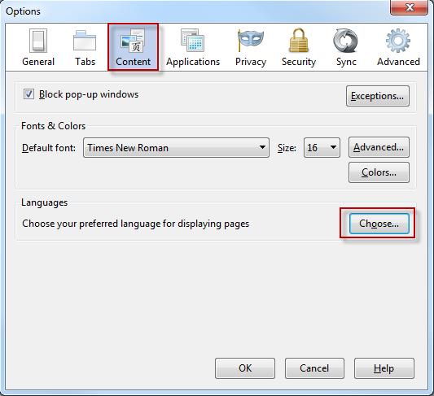
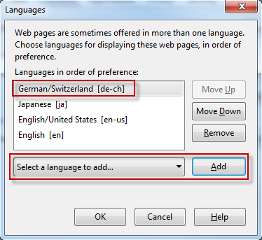

////

|metadata|
{
    "name": "customizing-the-localization-of-asp-net-ajax-controls",
    "controlName": [],
    "tags": [],
    "guid": "8ad706f4-5d9f-47d1-877b-367bb44cf3f0",  
    "buildFlags": [],
    "createdOn": "2014-11-05T09:40:26.7980841Z"
}
|metadata|
////

= Customizing the Localization of ASP.NET AJAX Controls

=== Introduction

This topic explains how to localize the ASP.NET AJAX controls to any language.

Infragistics provides control localizations in English and Japanese.  Other languages can be added by creating a custom satellite assembly and installing it in the GAC.

The steps below create a satellite assembly for the German (Switzerland) de-CH culture.  The steps can be used for any culture as long as "de-CH" is replaced with a valid link:http://msdn.microsoft.com/en-us/library/ms533052(v=vs.85).aspx[culture code].  The example uses the WebDataGrid, but the same approach applies to any Infragistics ASP.NET AJAX control.

=== Prerequisites

* The Infragistics ASP.NET product should be installed.
* In order to access the product source code, you will need an Infragistics account with the ASP.NET product registered under that account.

=== Preview

The following screenshot is a preview of the final result.

=== Steps

1. Create a new folder called *Localization*.  Putting all of the files in one place will simplify the command line steps.
2. Download the source code for the Infragistics ASP.NET product from the link:https://www.infragistics.com/my-account/keys-and-downloads[Keys and Downloads] section of the link:http://www.infragistics.com[Infragistics website].
3. Copy the `WebDataGridStrings_runtime.resx` file into the *Localization* folder created in step 1.  This file can be found in the source code under the `Infragistics.Web.UI/Resources` folder.
4. Copy the `Infragistics4.Web.v{ProductVersion}.dll` file into the *Localization* folder.  This file can be found in the product installation folder (defaults to `C:\Program Files (x86)\Infragistics\20{ProductVersion}\ASP.NET\CLR4.0\Bin`).
5. Open the *Localization* folder in Windows Explorer.
6. Make a copy of the `WebDataGridStrings_runtime.resx` file and rename that copy to `WebDataGridStrings_runtime.de-CH.resx`.

[start=7]
7. Open `WebDataGridStrings_runtime.de-CH.resx` in Visual Studio or another editor and provide translations for the strings. For the filter dropdown options, translate all strings starting with `LS_FilterRule_` and followed by the rule name (ex. `LS_FilterRule_After`, `LS_FilterRule_Before`, `LS_FilterRule_Equals`).
8. Run the Visual Studio Command Prompt as an administrator.

[start=9]
9. Navigate to the *Localization* folder that you created in step 1 with the `cd` command.

----
cd C:\Localization
----

[start=10]
10. Once in the *Localization* directory, create a `StrongName.key` file in the *Localization* folder by extracting the public key that was used to sign the  `Infragistics4.Web.v{ProductVersion}.dll`  assembly. You will use this key file to delay sign the satellite assembly.

----
sn -e Infragistics4.Web.v{ProductVersion}.dll StrongName.key
----

[start=11]
11. Create a `WebDataGridStrings_runtime.de-CH.resources` file in the *Localization* folder.

----
Resgen WebDataGridStrings_runtime.de-CH.resx
----

[start=12]
12. Create a `Infragistics4.Web.v{ProductVersion}.resources.dll`  file in the *Localization* folder, which is the satellite assembly.

----
Al.exe /t:lib /embed:WebDataGridStrings_runtime.de-CH.resources,Infragistics.Web.UI.Resources.WebDataGridStrings_runtime.de-CH.resources /culture:de-CH /out:Infragistics4.Web.v{ProductVersion}.resources.dll /template:Infragistics4.Web.v{ProductVersion}.dll /keyf:StrongName.key /delay+
----

[start=13]
13. Add strong name verification to the satellite assembly.  This will allow you to install the `Infragistics4.Web.v{ProductVersion}.resources.dll` file into the GAC without having it fully signed.

----
sn -Vr Infragistics4.Web.v{ProductVersion}.resources.dll
----

[start=14]
14. Install the satellite assembly into the GAC.

----
gacutil -i Infragistics4.Web.v{ProductVersion}.resources.dll
----

[start=15]
15. Open the .aspx page of your website.

Set the `Page` `UICulture` and `Culture` attributes to `Auto`.

*In ASPX:*

[source,html]
----
<%@ Page Language="C#" AutoEventWireup="true" UICulture="Auto" Culture="Auto"  CodeFile="Default.aspx.cs" Inherits="_Default" %>
----

Alternatively, this can be set in the web.config file between the `<system.web>` tags.

Set the `ScriptManager` `EnableScriptGlobalization` attribute to `true`.

*In ASPX:*

[source,html]
----
<asp:ScriptManager EnableScriptGlobalization="true" ID="ScriptManager1" runat="server"/>
----

=== Testing

If you are using a computer with a different language than your target language, and want to test that the satellite assembly is working, you can change the language that the browser uses.

The example shown is for Firefox on Windows 7, but this will vary based on OS and browser.  For example, in Chrome, access the advanced settings from the top right menu and click on "Language and input settings...".  On Windows 8, Internet Explorer will display the Control Panel, where you can set the language preferences.

[start=1]
1. Access the browser options dialog.

[start=2]
2. In the "Content" tab under Languages, click on the "Choose..." button.

[start=3]
3. Click "Add" to add the target language, if it is not already in the list.  Move the target language to the top of the list.  The top language is the one that will be used.

[start=4]
4. Close all instances of the browser to apply the language settings.
5. Now you can test your website in that browser using the preferred language.

=== Deployment considerations

Note that if you’ve built the assembly on your development machine and want to deploy it on another one you would need to do one of the following:

* Follow the above steps and build the satellite assembly on your server.
* Add the satellite assembly to the server's GAC using the gacutil.  If you don't have Visual Studio installed on the server, you can link:http://stackoverflow.com/questions/427686/how-do-you-install-files-in-the-assembly-in-windows-server-2008[copy and paste the required files].  You could also create an installer to install the satellite assembly into the server's GAC.

=== Related Links

* link:web-deployment-overview.html[Deployment Overview]
* link:http://msdn.microsoft.com/en-us/library/dd788548.aspx[Create a Strong-Name Key File]
* link:http://msdn.microsoft.com/en-us/library/k5b5tt23(v=vs.110).aspx[Strong Name Tool]
* link:http://msdn.microsoft.com/en-us/library/ccec7sz1(v=vs.110).aspx[Resource File Generator]
* link:http://msdn.microsoft.com/en-us/library/c405shex(v=vs.110).aspx[Assembly Linker]
* link:http://msdn.microsoft.com/en-us/library/ex0ss12c(v=vs.110).aspx[GAC]
