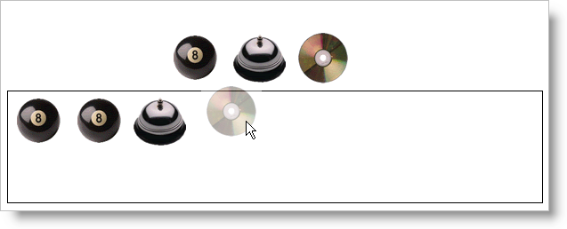

////
|metadata|
{
    "name": "draganddropframework-getting-started-with-drag-and-drop",
    "controlName": ["WebDragandDropFramework"],
    "tags": ["Extending","Getting Started","Patterns and Practices"],
    "guid": "{676CC529-3E69-4CE5-9955-58D5732C79AF}",
    "buildFlags": [],
    "createdOn": "0001-01-01T00:00:00Z"
}
|metadata|
////

= Getting Started with Drag and Drop

== Before You Begin

It is quite simple to add basic drag and drop functionality—moving an element from one place to another—using the Drag and Drop Framework. The process to enable drag and drop on an element involves the following key steps: setting the source element, the target element, and drop mode and action. The source element is allowed to be dragged and dropped onto the target element. The drag and drop mode determines the result of the drag and drop.

== What You Will Accomplish

You will learn how to enable drag and drop for images, allowing your end-users to drag and drop images into a Div.

== Follow these Steps

[start=1]
. Create an AJAX-enabled ASP.NET website.
[start=2]
. Reference the Infragistics4.Web.v{ProductVersion} assembly.
[start=3]
. Add the required script references to your page.

*In HTML:*

----
<asp:ScriptManager ID="ScriptManager1" runat="server">
    <Scripts>
        <asp:ScriptReference Assembly="Infragistics4.Web.v{ProductVersion}, Version={ProductVersion}.{ProductVersionFull}.1000, Culture=neutral, PublicKeyToken=7dd5c3163f2cd0cb" Name="Infragistics.Web.UI.SharedScripts.igDragDrop.js" />
        <asp:ScriptReference Assembly="Infragistics4.Web.v{ProductVersion}, Version={ProductVersion}.{ProductVersionFull}.1000, Culture=neutral, PublicKeyToken=7dd5c3163f2cd0cb" Name="Infragistics.Web.UI.Scripts.5_igObjects.js" />
        <asp:ScriptReference Assembly="Infragistics4.Web.v{ProductVersion}, Version={ProductVersion}.{ProductVersionFull}.1000, Culture=neutral, PublicKeyToken=7dd5c3163f2cd0cb" Name="Infragistics.Web.UI.SharedScripts.igAnimation.js" />
    </Scripts>
</asp:ScriptManager>
----

.Note:
[NOTE]
====
Modify the version number in the above code depending on your product.
====

[start=4]
. Add the following markup for the layout of the images and Divs.

*In HTML:*

----

    
    
    

----

[start=5]
. Add a script block anywhere on the page below the ScriptManager component.

*In HTML:*

----

----

[start=6]
. Add Javascript in the script block to implement the drag and drop functionality.

.. Handle the application's load event.

*In Javascript:*

----
Sys.Application.add_load(appLoaded);
function appLoaded() {
    // TODO: add code to set up drag and drop functionality.
}
----

.. Create the Drag and Drop Behavior to implement settings for drag and drop.

*In Javascript:*

----
var ddb = new $IG.DragDropBehavior();
----

.. Set the drop mode to Copy and the drop action to Append.

*In Javascript:*

----
ddb.set_defaultDropAction($IG.DragDropAction.Append);
ddb.set_dragDropMode($IG.DragDropEffects.Copy);
----

.. Set the images as the sources for the drag and drop by enumerating through the images inside the Div container.

*In Javascript:*

----
var list = $get("imageList");
var count = list.childNodes.length;
var child;
for (var i = 0; i < count; i++) {
    child = list.childNodes[i];
    // Set each IMG as a source for Drag and Drop
    if (child.getAttribute)
        ddb.addSourceElement(child);
    }
----

.. Set the target element.

*In Javascript:*

----
// Set target element as a Div
ddb.addTargetElement($get("cartAreaDIV"), true);
----

[start=7]
. Run the application. You can drag and drop images onto the Div area. Copies of the images are made and placed inside the div.

