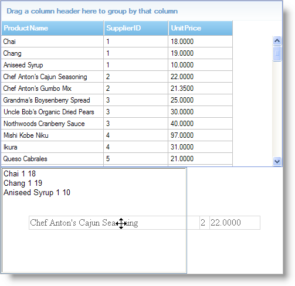

////
|metadata|
{
    "name": "draganddropframework-using-drag-and-drop-framework",
    "controlName": ["WebDragandDropFramework"],
    "tags": ["Extending","How Do I","Patterns and Practices"],
    "guid": "{7F38DFE5-F4C9-4803-AA45-FBD3E62E4083}",
    "buildFlags": [],
    "createdOn": "0001-01-01T00:00:00Z"
}
|metadata|
////

= Using Drag and Drop Framework

This section is your gateway to important task-based information that will help you to effectively use the various features and functionalities provided by Drag and Drop Framework.

== Set Distinct Drag and Drop Channels for Sources and Targets

If you have multiple drag and drop sources and targets in your application, but only certain sources may be dropped onto certain targets, you can specify this distinction using the Drag and Drop Framework. For example, if your application contains a shopping cart, an item list, and a garbage bin, you can set the drag and drop behavior to only allow your end-users to drag items from the item list into the shopping cart, and items from the shopping cart into the garbage bin, and restrict any other combinations.

To do this, you must create a drag and drop channel for each unique drag and drop operation. The channel is created with a key. Once a channel is specified a source object will only be allowed to be dragged onto a target that is listening on the same channel, or a target that is not listening on any channels.

The following code shows you how to add two unique drag and drop channels to differentiate between sources and targets.

*In Javascript:*

----
// Only sources and targets from db1 can participate in drag and drop with each other. 
// The same rule applies for db2 and no combinations drag and drop 
// can be performed between db1 and db2 sources.
// ddb1's sources could be items from an item list and its target could be the shopping cart.
var ddb1 = new $IG.DragDropBehavior();
// Channels are created using a key
ddb1.addDragChannels(["cart"]);
ddb1.addDropChannels(["cart"]);
// ddb2's sources could be items from the shopping cart and its target could be the garbage bin
var ddb2 = new $IG.DragDropBehavior();
ddb.addDragChannels(["trash"]);
ddb.addDropChannels(["trash"]);
----

== Setting Up Custom Drag and Drop

== Follow these Steps

[start=1]
. Create an AJAX-enabled ASP.NET website.
[start=2]
. Reference the Infragistics45.Web.v{ProductVersion} assembly.
[start=3]
. Add the required script references to your page.

*In HTML:*

----
<asp:ScriptManager ID="ScriptManager1" runat="server">
    <Scripts>
        <asp:ScriptReference Assembly="Infragistics45.Web.v{ProductVersion}, Version={ProductVersion}.{ProductVersionFull}.1000, Culture=neutral, PublicKeyToken=7dd5c3163f2cd0cb"  
Name="Infragistics.Web.UI.SharedScripts.igDragDrop.js" />
        <asp:ScriptReference Assembly="Infragistics45.Web.v{ProductVersion}, Version={ProductVersion}.{ProductVersionFull}.1000, Culture=neutral, PublicKeyToken=7dd5c3163f2cd0cb" 
Name="Infragistics.Web.UI.Scripts.5_igObjects.js" />
        <asp:ScriptReference Assembly="Infragistics45.Web.v{ProductVersion}, Version={ProductVersion}.{ProductVersionFull}.1000, Culture=neutral, PublicKeyToken=7dd5c3163f2cd0cb" 
Name="Infragistics.Web.UI.SharedScripts.igAnimation.js" />
    </Scripts>
</asp:ScriptManager>
----

[start=4]
. Add an link:{ApiPlatform}web{ApiVersion}~infragistics.web.ui.gridcontrols.webdatagrid.html[WebDataGrid] control to the page and connect it to data. For information on doing this, see link:webdatagrid-getting-started-with-webdatagrid.html[Getting Started with WebDataGrid].
[start=5]
. Add a ListBox control to the page.
[start=6]
. In the page's load event, add Javascript to set up the drag and drop behavior.

.. Instantiate the DragDropBehavior object.
.. Set all rows of WebDataGrid to be the source for drag and drop operations. The rows that are set as sources are the HTML representation of the GridRow objects in WebDataGrid.
.. Set the ListBox as the target for drag and drop operations.
.. Handle the Drop event of the DragDropBehavior object.
.. Handle the DragStart event.

*In Javascript:*

----
function pageLoad() {
        var ddb = new $IG.DragDropBehavior();
        var grid = $util.findControl("WebDataGrid1");
        var rows = grid.get_rows();
        var count = rows.get_length();
        // Set the source
        for (var i = 0; i < count; i++) {
                // Get the HTML rows of WebDataGrid
                var row = rows.get_row(i).get_element();
                ddb.addSourceElement(row);
        }
        // Set the target
        ddb.addTargetElement($get("ListBox1"), true);
        // Handle events
        ddb.get_events().addDropHandler(dropHandler);
        ddb.get_events().addDragStartHandler(dragStartHandler);
}
----

[start=7]
. In the Drop event handler, add Javascript to add items to the ListBox based on the dropped row values.

.. Get the row that was dropped.
.. Create a text string based on the cell values of the row.
.. Add the text as a list item.

*In Javascript:*

----
function dropHandler(sender, args) {
        // Get the dropped row
        var srcRow = args.get_manager().get_source().element;
        var grid = $util.findControl("WebDataGrid1");
        // Convert row to grid row
        var gridRow = grid.get_rows().get_row(srcRow.rowIndex - 1);
        var columns = grid.get_columns();
        // Create list item from cell values of the row
        var listItem = document.createElement("option");
        var txt = "";
        for (var i = 0; i < columns.get_length(); i++) {
                if (!columns.get_column(i).get_hidden()) {
                        txt += gridRow.get_cell(i).get_value() + " ";
                }
        }
        listItem.text = txt;
        listItem.value = txt;
        // Add list item
        var list = document.getElementById("ListBox1");
        list.options.add(listItem);
}
----

[start=8]
. In DragStart handler, add Javascript to customize the drag and drop behavior. You will need to create markup to make the source row visible when dragged since an HTML row by itself will not show up on the page.

.. Get source row.
.. Clone the row.
.. Add the row to a TBODY HTML element.
.. Add the TBODY element to an HTML table.
.. Set the markup to be the HTML table.
.. Set the opacity on the markup.

*In Javascript:*

----
function dragStartHandler(sender, args) {
        // Get the DragDropBehavior object
        var ddb = sender;
        var grid = $util.findControl("WebDataGrid1");
        var rows = grid.get_rows();
        // Get source row
        var srcRow = args.get_manager().get_source().element;
        // Clone the row
        var clonedRow = srcRow.cloneNode(true);
        clonedRow.className = "";
        // Create a table to put the row in
        var table = document.createElement("table");
        table.id = "row_table";
        table.cellSpacing = 0;
        table.className = "row_table";
        // Get the correct dimensions for the table from a grid row
        table.style.width = rows.getRow(0).Element.clientWidth;
        table.style.height = rows.getRow(0).Element.clientHeight;
        // Create a body for the table
        var tbody = document.createElement("tbody");
        // Add the row by appending the row to the body and the body to the table
        table.appendChild(tbody);
        tbody.appendChild(clonedRow);
        // Set the table as the HTML markup to use when the row is being dragged
        ddb.set_dragMarkup(table);
        ddb.set_dragMarkupOpacity(60);
}
----

[start=9]
. Add CSS styles to make the HTML markup look like its grid row counterpart.

*In CSS:*

----
.row_table
{
        border-right: solid 1px silver;
}
.row_table TBODY TR TD
{
        border: solid 1px silver; border-right: none; color: black;
}
.row_table TBODY TR TH
{
        display: none;
}
----

[start=10]
. Run the application. You can drag and drop WebDataGrid's rows into the ListBox displaying the rows' information.

