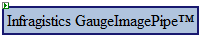

////

|metadata|
{
    "name": "gaugeimagepipe-about-gaugeimagepipe",
    "controlName": ["WebGauge"],
    "tags": ["How Do I"],
    "guid": "{2E66CC84-8B9C-47A1-9DB9-A1FDCA9FCFFA}",  
    "buildFlags": [],
    "createdOn": "0001-01-01T00:00:00Z"
}
|metadata|
////

= About GaugeImagePipe

The GaugeImagePipe™ control is used to stream images without touching the file system, instead using the Session State. When the WebGauge's™  pick:[asp-net="link:infragistics4.webui.ultrawebgauge.v{ProductVersion}~infragistics.webui.ultrawebgauge.webgaugedeploymentscenario~mode.html[DeploymentScenario.Mode]"]  property is set to Session, the GaugeImagePipe is used on a separate WebForm, through which the image is streamed to the client on each request.

For more information, please refer to the topic link:webgauge-session-deployment.html[WebGauge Session State Image Deployment].

