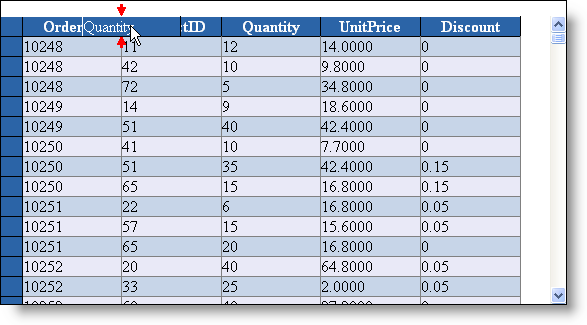
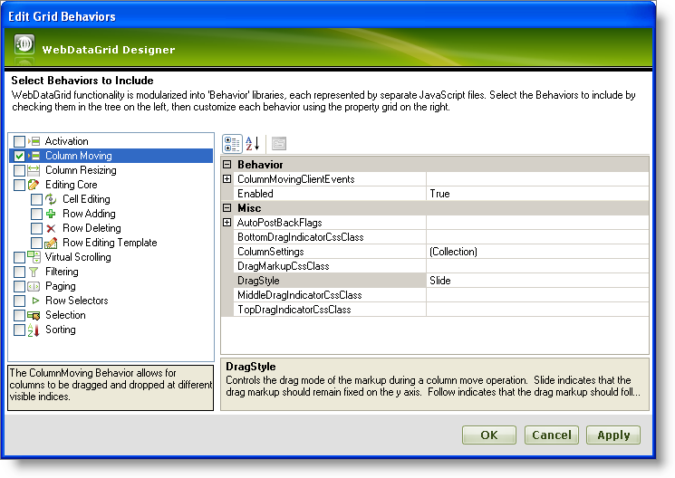
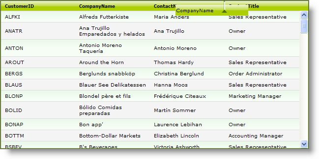

////

|metadata|
{
    "name": "gridmigrationcolumnmoving",
    "controlName": [],
    "tags": [],
    "guid": "4531db92-d23c-4dff-b168-e9c29122d312",  
    "buildFlags": [],
    "createdOn": "2016-03-01T11:29:39.292918Z"
}
|metadata|
////

= Grid Migration - Column Moving

== Column Moving

==== Description:

Column Moving allows developers and end users to rearrange the position of the grid columns in design time or in source code. With Column Moving feature the customization of the grid is increased and data presentation is enhanced. Column moving can be performed in both client and server side.

When a “WebGrid” is bound to a source of data the columns default to the order they are in the columns collection of the underlying data. The developer can move columns through the “Column Collections Editor” or through code with the “Move” method of the column.

The developer can use the “Column Collection Designer” to move columns in design time. Developer can also set the “DisplayLayout.AllowColumnMovingDefault” property to “OnServer/OnClient” to allow the end user to move columns at run time:

In “WebGrid” there are three main options that can be chosen for the “AllowColumnMovingDefault” property:

None (“AllowColumnMovingDefault.None”) - column moving is disallowed and all columns are stationary.

On Server (“AllowColumnMovingDefault.OnServer”) - all column moving is handled on the server and the control will perform a “PostBack” whenever the user moves a column to retrieve the new layout. However, the size of the “ViewState” will be increased to support column moving.

On Client (“AllowColumnMovingDefault.OnClient”) - the “OnClient” setting is available only when the “Browser” property of the grid is set to “Xml”. In this case the client side render engine transforms the Xml data that is already on the client to match the columns order desired by the user.

The “WebDataGrid” control’s columns are movable. To allow column moving, you must enable the “Column Moving” behavior. To move a column, the end-user should left click and drag the header to the desired position following the drag indicators.

Column Moving Behavior can be enabled trough the control “Smart Tag” in Visual Studio design mode:

Or can be set trough “.aspx” page source (note that behavior can be set for individual columns too):

*In ASPX:*

[source,html]
----
<Behaviors>
<ig:ColumnMoving DragStyle="Slide">
       <ColumnSettings>
        <ig:ColumnMoveSetting EnableMove=" ColumnKey="CustomerID" />
        <ig:ColumnMoveSetting EnableMove="true" ColumnKey="CompanyName" />
        <ig:ColumnMoveSetting EnableMove="true" ColumnKey="Contact" />
        <ig:ColumnMoveSetting EnableMove="true" ColumnKey="Address" />
        <ig:ColumnMoveSetting EnableMove="true" ColumnKey="City" />
        <ig:ColumnMoveSetting EnableMove="true" ColumnKey="PostalCode" />
        <ig:ColumnMoveSetting EnableMove="true" ColumnKey="Country" />
      </ColumnSettings>
</ig:ColumnMoving>
</Behaviors>
----

When application is started the columns can be moved by dragging them with the mouse and dropping them to the desired position:

==== Client side code snippets:

Server side code snippets:

UltraWebGrid Column Moving:

A recommended approach is to move columns on “InitializeLayout()” event:

*In C#:*

[source,csharp]
----
// Move OrderID to the left side of the grid
private void UltraWebGrid1_InitializeLayout(object sender, 
  Infragistics.WebUI.UltraWebGrid.LayoutEventArgs e)
{
     // Allows column moving to be executed on the client machine
         e.Layout.AllowColumnMovingDefault = AllowColumnMoving.OnClient; 
        // Can set the column moving to be executed on the server instead by setting:
        // e.Layout.AllowColumnMovingDefault = AllowColumnMoving.OnServer;
        // Move the OrderID column to the column index 0
    e.Layout.Bands[0].Columns.FromKey("OrderID").Move(0);
}
----

.Note:
[NOTE]
====
In order to perform column moving on the client your grid’s property “Browser” must be set to “Xml” and the “SelectTypeColDefault” property should be set to its default value. Otherwise you will have to also use the “CTRL” key in order to move Columns:
====

*In C#:*

[source,csharp]
----
using Infragistics.WebUI.UltraWebGrid;
...
this.UltraWebGrid1.Browser = BrowserLevel.Xml;
this.UltraWebGrid1.DisplayLayout.SelectTypeColDefault = SelectType.Single;
this.UltraWebGrid1.DisplayLayout.AllowColumnMovingDefault = AllowColumnMoving.OnClient;
----

==== WebDataGrid Column Moving:

To enable Column Moving in “WebDataGrid” control, add the following code to your event/method:

*In C#:*

[source,csharp]
----
// Enable column moving for the grid
WebDataGrid1.Behaviors.ColumnMoving.Enabled = true;
// Set drag style to “Follow” - the drag markup follows the mouse
WebDataGrid1.Behaviors.ColumnMoving.DragStyle = Infragistics.Web.UI.GridControls.HeaderDragStyle.Follow;
// Add new setting for the "ID" column that will make it unmovable
Infragistics.Web.UI.GridControls.ColumnMoveSetting mySetting = new Infragistics.Web.UI.GridControls.ColumnMoveSetting();
mySetting.ColumnKey = "ID";
mySetting.EnableMove = false;
WebDataGrid1.Behaviors.ColumnMoving.ColumnSettings.Add(mySetting);
----

If you want to change the position of the column in the grid you can use the following code:

*In C#:*

[source,csharp]
----
// Displaying the column with index “1” on the index “0” – making second column first 
WebDataGrid1.Columns[1].VisibleIndex = 0;
----

.Note:
[NOTE]
====
In order to change the position of the column “AutoGenerateColumns” property of the grid must be set to “false” and columns should be created in markup.
====

==== WebHierarchicalDataGrid Column Moving:

Not available (introduced in version 11.1).