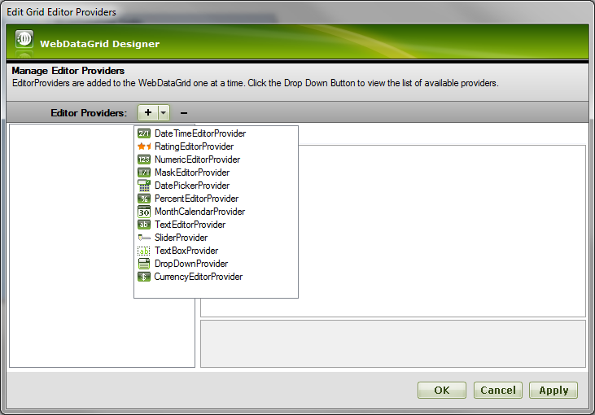
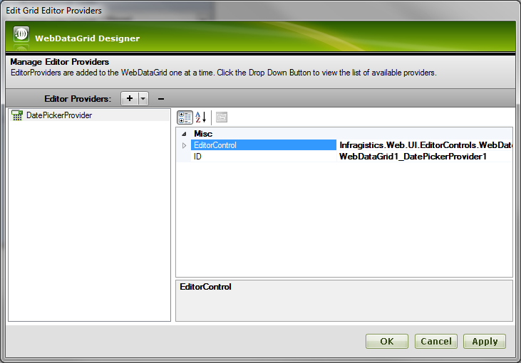
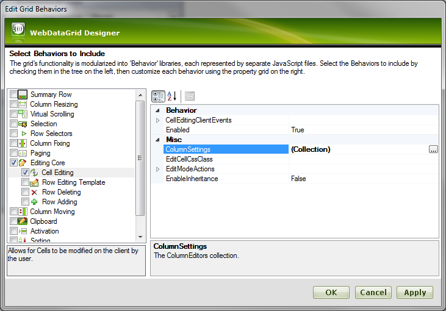
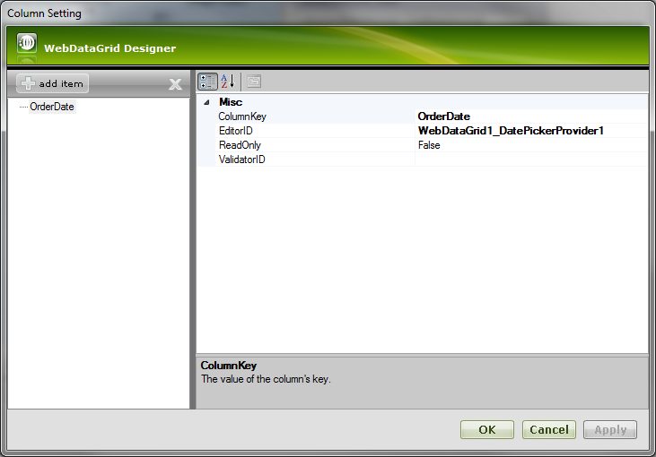
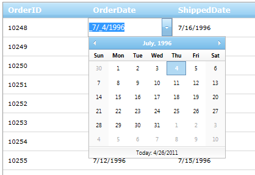

////

|metadata|
{
    "name": "gridmigrationeditorproviders",
    "controlName": [],
    "tags": [],
    "guid": "e99f11ca-920f-4d25-b6d1-9547f58e69b9",  
    "buildFlags": [],
    "createdOn": "2016-03-01T12:01:59.3733863Z"
}
|metadata|
////

= Grid Migration - Editor Providers

Editor provider is a special object that allows using an external editor inside of the WebDataGrid (WebHierarchicalDataGrid). Each Infragistics editor has an editor provider that can be used inside of the grid. Custom editor providers can be written for any of non-Infragistics editors.

To add an editor provider select “Edit Grid Editor Providers” from the smart tag. In the dialog that opens click the down arrow next to the “+” sign and choose the type of editor provider that you wish to add to the grid and configure:

After a provider is created it can be configured in the property window on the right. The EditorControl property is a reference to the editor control that the provider creates, and the ID property identifies this provider in the grid:

To remove a provider click the “-“ sign.

Associating an editor provider with columns can be down through the Behaviors dialog. From the Smart tag choose “Edit Behaviors” and enable “Cell Editing” behavior:

Add a new item to the ColumnSettings collection. Then chose the column key and editor provider’s ID for that column:

After saving these settings and running the web site, entering into edit mode in any cell of the column shows the editor that was chosen:

