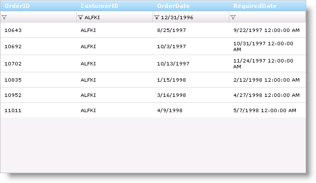

////

|metadata|
{
    "name": "gridmigrationfiltering",
    "controlName": [],
    "tags": [],
    "guid": "751bc4ae-c22e-49ba-b2f5-8cfdea2d03e0",  
    "buildFlags": [],
    "createdOn": "2016-03-01T12:44:31.504343Z"
}
|metadata|
////

= Grid Migration - Filtering

Filtering is the grid's ability to filter the data it is bound to. Filtering breaks the data into a smaller subset that matches your filter criteria and displays it. This makes the data more viewable and manageable to your end-users.

== UltraWebGrid

[start=1]
. Enable Row Filtering

UltraWebGrid allows row filtering and it can be enabled at different levels, depending upon the granularity you want.

* Enabling Row Filtering for All Rows in All Bands

You can enable row filtering off the DisplayLayout object by setting the AllowRowFiltering property off the FilterOptionsDefault object.

Enabling the functionality at this level allows applying a filter to any row in any level (as shown in the sample code below).

*In ASPX:*

[source,html]
----
<FilterOptionsDefault AllowRowFiltering="OnClient">
  </FilterOptionsDefault>
----

*In C#:*

[source,csharp]
----
protected void UltraWebGrid1_InitializeLayout(object sender, 
  Infragistics.WebUI.UltraWebGrid.LayoutEventArgs e)
{
this.UltraWebGrid1.DisplayLayout.FilterOptionsDefault.AllowRowFiltering = 
        RowFiltering.OnClient;
}
----

* Enabling Row Filtering at the Band Level

*In C#:*

[source,csharp]
----
private void UltraWebGrid1_InitializeLayout(object sender, 
  Infragistics.WebUI.UltraWebGrid.LayoutEventArgs e)
{
      this.UltraWebGrid1.Bands[0].FilterOptions.AllowRowFiltering = 
        RowFiltering.OnClient;
}
----

* Disabling Row Filtering at the Column Level

*In C#:*

[source,csharp]
----
protected void UltraWebGrid1_InitializeLayout(object sender, 
  Infragistics.WebUI.UltraWebGrid.LayoutEventArgs e)
{
this.UltraWebGrid1.DisplayLayout.FilterOptionsDefault.AllowRowFiltering = 
        RowFiltering.OnClient;
this.UltraWebGrid1.Bands[0].Columns.FromKey("ContactName").AllowRowFiltering = 
        false;
}
----

[start=2]
. Filter Conditions

The filter condition is used to determine what is being filtered for and how the filtering will be carried out (All, Empty, Equals, or NotEmpty). You can stop these conditions from being displayed to end user in the drop-down list by setting the associating "show" property. By default all of these boolean properties are set to True.

Setting filter condition from the code behind

*In C#:*

[source,csharp]
----
private void UltraWebGrid1_InitializeLayout(object sender, 
  Infragistics.WebUI.UltraWebGrid.LayoutEventArgs e)
{
      // Enable Filtering on the Band and setting the RowFilterMode
      this.UltraWebGrid1.Bands[0].FilterOptions.AllowRowFiltering = RowFiltering.OnClient;
      this.UltraWebGrid1.Bands[0].FilterOptions.RowFilterMode = 
        RowFilterMode.SiblingRowsOnly;
      // Create FilterCondition
      FilterCondition myConditions = new FilterCondition();
      myConditions.CompareValue = "HILAA";
      myConditions.ComparisonOperator = FilterComparisionOperator.Equals;
      // Adding a Column Filter to the ColumnFilters Collection returns a ColumnFilter.
      ColumnFilter myFilter = this.UltraWebGrid1.Rows.ColumnFilters.Add(
        this.UltraWebGrid1.Bands[0].Columns.FromKey("CustomerID"));
      myFilter.FilterConditions.Add(myConditions);
}
----

[start=3]
. Manipulating Filter

Creating a List for WebGrid's Drop-Down Filter

By default the WebGrid will populate the drop-down filter list for you with the values in that column's cells. You can provide WebGrid with a list of values to display in the drop-down filter list. There are two ways to do this depending on if the values are static or dynamic:

*Static* - If there are columns that contain data that does not change (e.g., a column displaying states, job titles, or countries), you can create this list statically and pass it to the grid. This way no processing is done because the grid already knows what to put into the filter.

This code initializes some properties on WebGrid (e.g., load-on-demand, row filtering enabled, row filter mode is set) and creates the list that will populate the drop-down filter values for the ContactTitle column.

*In C#:*

[source,csharp]
----
protected void UltraWebGrid1_InitializeLayout(object sender, 
  Infragistics.WebUI.UltraWebGrid.LayoutEventArgs e)
{
      // Initialize the WebGrid
      this.UltraWebGrid1.Browser = BrowserLevel.Xml;
      this.UltraWebGrid1.DisplayLayout.LoadOnDemand = LoadOnDemand.Xml;
      this.UltraWebGrid1.DisplayLayout.ViewType = ViewType.Flat;
      this.UltraWebGrid1.Bands[0].FilterOptions.AllowRowFiltering = 
        RowFiltering.OnServer;
      this.UltraWebGrid1.Bands[0].FilterOptions.RowFilterMode = 
        RowFilterMode.SiblingRowsOnly;
      // If you don't want to have the All, Empty, NonEmpty options showing in 
      // the drop-down filter lists, you will need to hide them.  You can 
      // also clear out the WorkingListValues in the FilterPopulating event instead 
      // of setting these properties.
      this.UltraWebGrid1.Bands[0].FilterOptions.ShowAllCondition = 
        ShowFilterString.No;
      this.UltraWebGrid1.Bands[0].FilterOptions.ShowEmptyCondition = 
        ShowFilterString.No;
      this.UltraWebGrid1.Bands[0].FilterOptions.ShowNonEmptyCondition = 
        ShowFilterString.No;
      // Don't allow row filtering on the CompanyName and ContactName columns
      this.UltraWebGrid1.Bands[0].Columns.
        FromKey("CompanyName").AllowRowFiltering = false;
      this.UltraWebGrid1.Bands[0].Columns.
        FromKey("ContactName").AllowRowFiltering = false;
      /* Create a Filter Statically * /      
      // The FilterCollectionValues will return the ArrayList so 
      // you can use that to added your values to
      ValueListItemsCollection myFilterList = this.UltraWebGrid1.Bands[0].Columns.
        FromKey("ContactTitle").FilterCollectionValues;
      myFilterList.Add("Accounting Manager","Accounting Manager");
      ….
      myFilterList.Add("Sales Representative","Sales Representative");
}
----

*Dynamic* - If there are columns containing large amounts of data that is not likely to change, you can create the list dynamically and keep using it so you don't have to recreate it every time (e.g., if you populated the list using a SQL SELECT command against your database).

.Note:
[NOTE]
====
This is due to the population not occurring for any other columns if you override one column's drop-down filter list.
====

*In C#:*

[source,csharp]
----
private void UltraWebGrid1_FilterPopulating(object sender,
  Infragistics.WebUI.UltraWebGrid.FilterDropDownEventArgs e)
    {
        /* Create a Filter Dynamically* /
        // Test to see what column we have clicked on
        if (e.Column.Key == "CustomerID")
        {
            string strInitialCommand = null;
            DataTable myDataTable = new DataTable("CustomerID");
            // Copy the original select statement to restore it later
            strInitialCommand = this.oleDbSelectCommand1.CommandText;
            // Create a select statement and fill the 
            // datatable with the values
            this.oleDbSelectCommand1.CommandText =
              "SELECT DISTINCT CustomerID FROM Customers";
            this.oleDbDataAdapter1.Fill(myDataTable);
            // Loop over DataTable and use values to populate WorkingListValues
            foreach (DataRow myRow in myDataTable.Rows)
            {
                // Add the values to the filter list that we want
                // to show in the drop-down
                e.WorkingListValues.Add(myRow.ItemArray[0].ToString(), myRow.ItemArray[0].ToString());
            }
            // Restore the original select statement
            this.oleDbSelectCommand1.CommandText = strInitialCommand;
            // Tell the WebGrid not to go looking for the data.  By setting this
            // flag to true, the WebGrid uses the provided list for it's data.
            e.Handled = true;
        }
    }
----

_In JavaScript:_

This code prevents the WebGrid from processing the column's cells to create the filter. It also checks to see if that column's filter list has already been populated; if true it simply reuses that list otherwise creates it.

.Note:
[NOTE]
====
Instead of returning True (the ContactTitle case) or setting the working filter list to the last known list(the CustomerID case), you can set the GatherFilterData property to False for each of these columns. By doing this you do not need to use the code above.
====

*In JavaScript:*

[source,js]
----
function UltraWebGrid1_BeforeFilterPopulated(gridName, oColumnFilter, oColumn, 
  workingFilterList, lastKnownFilterList){
      // This column is populated statically
      // By returning true, we stop the grid from going into data 
      // acquisition mode on the values and just use the values
      // in the working list property 
      if (oColumn.Key == "ContactTitle")
      {
            return true;
      }
      // This will be be populated dynamically the first time, 
      // but after that we can used the cached copy of the list
      if(oColumn.Key == "CustomerID")
      {
            if(lastKnownFilterList != null)
            {
                  oColumnFilter.setWorkingFilterList(lastKnownFilterList);
                  return true;
            }      
      }
}
----

Useful tips regarding filtering in UltraWebGrid:

*_Updating the footer after filter is applied_*

The recommended approach is to handle the client-side AfterFilterClose event:

link:http://help.infragistics.com/NetAdvantage/ASPNET/2010.3?page=WebGrid_Client_Side_Events_CSOM.html[http://help.infragistics.com/NetAdvantage/ASPNET/2010.3?page=WebGrid_Client_Side_Events_CSOM.html]

The footer elements can be referenced by passing their id's to the igtbl_getDocuemntElement utility function. IDs consists of the grid's ClientID + "_f_" + band.Index + "_" + column.Index.

Thus a top level footer for a third column would be something like "UltraWebGrid1_f_0_2".

Note that setting the element's style will override other styles.

var myFooter = igtbl_getDocuemntElement("UltraWebGrid1_f_0_2");

myFooter.style.backgroundImage = "url(none)";

myFooter.style.backgroundColor = "red";

*_Count of filtered rows_*

Note that setting the element's style will override other styles.

You need to go back to your data and apply the filter to obtain this value. This is due to how filtering and paging works with the grid. Filtering can be processed in different timing:

it can be either applied during the data retrieval (if the filter is available at that time, so the amount of data requested is limited), or during rendering, so that only filtered records will be displayed. Filtering at rendering time may result in incorrect number of rows displayed, since it will be applied on the data set for the current page only. To work around this one should implement a server side filtering via custom code.

*In C#:*

[source,csharp]
----
DataTable dt = (DataTable)this.UltraWebGrid1.DataSource;
        DataView dv = dt.DefaultView;
        StringBuilder sb = new StringBuilder();
        foreach (ColumnFilter cf in this.UltraWebGrid1.Rows.ColumnFilters)
        {
            if (cf.FilterConditions.ContainsAllCondition)
            {
            }
            else if (cf.FilterConditions[0].ComparisonOperator == FilterComparisionOperator.NotEmpty)
            {
                sb.Append("AND " + cf.Column.Key + " <> ''");
            }
            else if (cf.FilterConditions[0].ComparisonOperator == FilterComparisionOperator.Empty || cf.FilterConditions[0].ComparisonOperator == FilterComparisionOperator.Equals)
            {
                sb.Append("AND " + cf.Column.Key + " = '" + cf.FilterConditions[0].CompareValue.ToString() + "'");
            }
        }
        if (sb.Length != 0)
        {
            sb.Remove(0, 3);
        }
        dv.RowFilter = sb.ToString();
        this.Label1.Text = dv.Count.ToString();
----

This code updates a label's text with an id of Label1 to the total amount of rows based on the filter.

== WebDataGrid

[start=1]
. Enable Row Filtering

*In ASPX:*

[source,html]
----
<Behaviors>
                <ig:Filtering Enabled="true">
                </ig:Filtering>
            </Behaviors>
----

*In C#:*

[source,csharp]
----
 Filtering filtering = WebDataGrid1.Behaviors.CreateBehavior<Filtering>();
       filtering.Enabled = true;
----

* Disable Column filtering:

*In ASPX:*

[source,html]
----
<ig:Filtering Enabled="true">
                    <ColumnSettings>
                      <ig:ColumnFilteringSetting ColumnKey="ColumnKey" Enabled=" />
                    </ColumnSettings>                   
                </ig:Filtering>
----

*In C#:*

[source,csharp]
----
 ColumnFilteringSetting  columnSetting = new ColumnFilteringSetting (WebDataGrid1);
      columnSetting.ColumnKey = "ColumnKey";
      columnSetting.Enabled = false;
----

[start=2]
. Filter Conditions.

How to set the initial filter condition to filter values within a specific date range:

* Locate the ColumnFilters property and click the ellipsis (...) button to launch the Column Filter Editor Dialog.
* Add two Column Filters by clicking the Add Item button.
* Set one filter’s ColumnKey property as OrderDate and the other as CustomerID, to specify the columns to filter.
* Click the expansion indicator of the Condition property for the OrderDate column. The Rule and Value properties appear.
* Set the Rule to After and the Value to 12/31/1996.
* Click the expansion indicator of the Condition property for the CustomerID column. The Rule and Value properties appear.
* Set the Rule to Equals and the Value to “ALFKI”. WebDataGrid will now only display data for the customer ALFKI for order dates after 1996
* Click Apply then Ok to close the Column Filter Editor Dialog.
* Click Apply then Ok to close the Behaviors Editor Dialog.

.Note:
[NOTE]
====
In all cases, you must call the method to apply filter or WebDataGrid does not filter until the next postback. On the client side, when adding multiple filters, you must add them as an array of filters using the add_columnFilterRange method.
====

*In C#:*

[source,csharp]
----
// Set up column filter for OrderDate column
        RuleDateNode dateTimeCondition = new RuleDateNode(DateTimeFilterRules.After, new DateTime(1996, 12, 31));
        ColumnFilter columnFilter1 = new ColumnFilter();
        columnFilter1.ColumnKey = "OrderDate";
        columnFilter1.Condition = dateTimeCondition;
        // Set up column filter for CustomerID column
        RuleTextNode textCondition = new RuleTextNode(TextFilterRules.Equals, "ALFKI");
        ColumnFilter columnFilter2 = new ColumnFilter();
        columnFilter2.ColumnKey = "CustomerID";
        columnFilter2.Condition = textCondition;
        this.WebDataGrid1.Behaviors.Filtering.ColumnFilters.Add(columnFilter1);
        this.WebDataGrid1.Behaviors.Filtering.ColumnFilters.Add(columnFilter2);
        // Need to apply filter before results are shown
        this.WebDataGrid1.Behaviors.Filtering.ApplyFilter();
----

*In JavaScript:*

[source,js]
----
var grid = $find("WebDataGrid1");
// Set up column filter for OrderDate column
var columnFilter = grid.get_behaviors().get_filtering().create_columnFilter("OrderDate");
var condition = columnFilter.get_condition();
condition.set_rule($IG.DateTimeFilterRules.After);
condition.set_value("12/31/1996");
// Set up column filter for CustomerID column
var columnFilter2 = grid.get_behaviors().get_filtering().create_columnFilter("CustomerID");
var condition2 = columnFilter2.get_condition();
condition2.set_rule($IG.TextFilterRules.Equals);
condition2.set_value("ALFKI");
// Create an array for the two filters
var columnFilters = new Array(columnFilter, columnFilter2);
// Add array of filters
grid.get_behaviors().get_filtering().add_columnFilterRange(columnFilters);
// Call apply filter
grid.get_behaviors().get_filtering().applyFilters();
----

[start=3]
. Manipulating Filter

Using Editor Providers for the Filter Box in WebDataGrid

Follow these Steps:

[start=1]
. From the Microsoft® Visual Studio® Toolbox, drag and drop a ScriptManager component and a WebDataGrid control onto the form.
[start=2]
. Bind WebDataGrid to a SqlDataSource component and configure it to retrieve OrderID , OrderDate and CustomerID from the Orders table of the Northwind database. For more information on doing this, see the Binding WebDataGrid to a SQL Data Source topic.
[start=3]
. From the properties window, locate the Behaviors property of the WebDataGrid and click the ellipsis (…) button to launch the Behaviors Editor Dialog.
[start=4]
. Check the checkbox for the Filtering behavior from the list on the left to enable it.
[start=5]
. Locate the ColumnSettings property and click the ellipsis (…) button to launch the Column Setting dialog.
[start=6]
. Add a ColumnSetting by clicking the add item button.
[start=7]
. Set the ColumnKey property to OrderDate from the drop-down list.
[start=8]
. Click the EditorID property and select Add/Modify EditorProviders list from the drop-down list.
[start=9]
. Click the + button and select the MonthCalendarProvider from the drop-down list. This will add the MonthCalendarProvider as an EditorProvider to the WebDataGrid control.
[start=10]
. Click Apply and OK to close the Edit Grid Editor Providers dialog.
[start=11]
. In the Column Setting dialog set the EditorID property to WebDataGrid1_MonthCalendarProvider1.
[start=12]
. Click Apply and OK to close the Column Setting dialog.
[start=13]
. Click Apply and OK to close the Edit Grid Behaviors dialog.

*In C#:*

[source,csharp]
----
//Create a Filtering Behavior 
       this.WebDataGrid1.Behaviors.CreateBehavior<Filtering>();
        //Create a MonthCalendarProvider and add it to the EditorProviders of the WebDataGrid
        MonthCalendarProvider WebDataGrid1_MonthCalendarProvider1 = new MonthCalendarProvider();
        WebDataGrid1_MonthCalendarProvider1.ID = "WebDataGrid1_MonthCalendarProvider1";
        this.WebDataGrid1.EditorProviders.Add(WebDataGrid1_MonthCalendarProvider1);
        //Create a ColumnFilteringSetting 
        ColumnFilteringSetting settingColumn1 = new ColumnFilteringSetting();
        //Set the ColumnKey
        settingColumn1.ColumnKey = "OrderDate";
        //Set the EditorID
        settingColumn1.EditorID = WebDataGrid1_MonthCalendarProvider1.ID;
        //Add the created ColumnSetting
        this.WebDataGrid1.Behaviors.Filtering.ColumnSettings.Add(settingColumn1);
----

[start=4]
. Clear the filtering

Removing applied filter values in a button click

*In JavaScript:*

[source,js]
----
var grid = $find("<%=WebDataGrid1.ClientID %>");
              var filtering = grid.get_behaviors().get_filtering();
              grid.get_behaviors().get_filtering().clearColumnFilters();
and using server code like this:
WebDataGrid1.Behaviors.Filtering.ColumnFilters.Clear();
            WebDataGrid1.Behaviors.Filtering.ApplyFilter();
----

[start=5]
. Visibility Property

Used to determine whether the user interface is visible for Filtering behavior.

Hidden - filter row will not be visible

Visible - filter row will be visible

[start=6]
. Changing filter icon path

.. Configure the styling of your application in the web.config file. Insert the following code at the top of the configuration file:

*In XML:*

[source,xaml]
----
<configuration>
    <configSections>
        <section name="infragistics.web" type="System.Configuration.SingleTagSectionHandler,System, Version=1.0.3300.0, Culture=neutral, PublicKeyToken=b77a5c561934e089"/>
    </configSections>
    <infragistics.web enableAppStyling="true" styleSetPath="~" styleSetName="MyStyle"/>
----

In this way you are saying that you are looking for images in the ~/MyStyle/images/$$*$$.gif.

By default it is:

*In XML:*

[source,xaml]
----
<infragistics.web enableAppStyling="true" styleSetPath="~ig_res/" styleSetName="Default"/>
----

That's why the default Infragistics styling directory is ~ig_res/Default/images/$$*$$.gif.

But when customizing it in this way remember that you should have the same name of the pictures like the default ones!

.. Use the following attributes of the WDG filtering tag:

*In ASPX:*

[source,html]
----
<ig:Filtering FilteringCssClass="css-class1" 
                          FilterButtonCssClass="css-class2">
</ig:Filtering>
----

Then you can customize the look of your filter button using css and also you can put a background image.

You can customize the look of the button element with the following code:

*In JavaScript:*

[source,js]
----
<ig:Filtering FilterButtonCssClass="filter-button" >

----

Then if you inspect the HTML that is rendered in the browser, you will see the following code:

*In ASPX:*

[source,html]
----
<button tabIndex="-1" class="igg_MyStyleFilterButton filter-button" type="button">
      
</button>
----

You are right that the image inside the button is displayed and when it cannot find the picture, an error is displayed. That's why you can use the following CSS trick to hide the background picture.

*In CSS:*

[source,css]
----
 .filter-button img
        {
            display: none;
        }
----

[start=2]
. Add Text Next To Filter Icon

Use Initialize client event of the WebDataGrid in order to achieve the desired result.

*In JavaScript:*

[source,js]
----
function WebDataGrid1_Grid_Initialize(sender, eventArgs) {
            var filtering = sender.get_behaviors().get_filtering();
            var filterRow = filtering._row;
            var cellCount = filterRow.get_cellCount();
            var i = 0;
            for (i = 0; i < cellCount; i++) {
                // checks if the filtering is enabled for that column 
                if (filtering._row.get_cell(i).get_element().children[0] != null) {
                    var filterImage = filtering._row.get_cell(i).get_element().children[0];
                    filterImage.innerHTML += "Filter by";
                }
            }
        }
----

[start=7]
. Display total row count and current row indexes

To retrieve the total number of records in the WebDataGrid, you have to retrieve the number of records in the DataSource which the grid is bound to. When filtering or paging the WebDataGrid, the current rows count will only return the number of rows currently in the viewstate.

To get the number of filtered rows, you can use the WebDataGrid server-side DataFiltered event to retrieve the current number of filtered rows from the WebDataGrid.Rows.Count.

If Paging is enabled, disable the Paging in the DataFiltered event as shown in the following code sample.

This will work for your requirement to retrieve the number of WebDataGrid Filtered Rows with Paging enabled:

*In C#:*

[source,csharp]
----
protected void _dg_DataFiltered(object sender, Infragistics.Web.UI.GridControls.FilteredEventArgs e)
    {
        // Cast the WebDataGrid DataSource to a DataTable 
        DataTable dt = this._dg.DataSource as DataTable;
        // Disable WebDataGrid Paging
        _dg.Behaviors.Paging.Enabled = false;
        // Retrieve DataTable Rows Count to display in Label
        label1.Text = "Total Rows in DataTable = " + dt.Rows.Count;
        // Retrieve WebDataGrid1 Rows Count displayed
        label2.Text = "Total Rows in WebDataGrid = " + _dg.Rows.Count;
        // Enable WebDataGrid Paging
        _dg.Behaviors.Paging.Enabled = true;
    }
----

Clearing the filter reverts the grid back to the original number of rows in the DataTable.

[start=8]
. Localizing the filter conditions

Modifying WebDataGridStrings.resx file in Visual Studio and provide translations to the strings. (In case of the filter dropdown opinions that would be all strings starting with “LS_FilterRule_” and followed by the rule name: eg LS_FilterRule_After, LS_FilterRule_Before, LS_FilterRule_Equals …)

link:http://community.infragistics.com/forums/p/24594/90116.aspx#90287[http://community.infragistics.com/forums/p/24594/90116.aspx#90287]

== WebHierarchicalDataGrid

==== _Filtering Hierarchical Data_

Each band in WebHierarchicalDataGrid can be assigned a Filtering behavior. You can set the EnableInheritance property of a band to enable child bands to inherit the setting. This allows you to customize filtering behavior in each band of data. For example, if you want filtering for all bands in WebHierarchicalDataGrid, just enable the Filtering behavior at the root level and set EnableInheritance to True. If you want to disable the behavior for a specific child band, disable the behavior for that specific band.

==== _Filtering Child Bands_

When you enable filtering for child bands, the child container grids display filter icons that your end-users can click on to filter the child data. The data is only filtered for that particular container grid; i.e., child data is filtered by the data islands it belongs to, not by the band.

If you filter out all the child rows for a row, you can still expand and collapse the row; however, the container grid will be blank.

You can also filter data from code-behind without relying on the UI. This is useful when you have data that you want to filter on load of the WebHierarchicalDataGrid control. Keep in mind that since the control displays an expansion indicator only if the row has child data, this may result in parent rows that are not expandable since their entire child rows may be filtered out.

==== _Enable Filtering_

[start=1]
. Bind WebHierarchicalDataGrid to a WebHierarchicalDataSource component retrieving data from the Customers and Orders tables of Northwind. For more information on doing this, see Binding WebHierarchicalDataGrid to a WebHierarchicalDataSource.
[start=2]
. In the Microsoft® Visual Studio™ property window, locate the Behaviors property and click the ellipsis (...) button to launch the Behaviors Editor Dialog.
[start=3]
. Check the check box for the Activation behavior from the list on the left to enable it.
[start=4]
. Check the Filtering behavior and set Enable and EnableInheritance to True.
[start=5]
. Set the initial filtering condition for the Customer band so that WebHierarchicalDataGrid only filters in data for Sales Representatives.

.. Locate the ColumnFilters property and click the ellipsis (...) button to launch the Column Filter Editor Dialog.
.. Add a Column Filter by clicking the Add Item button.
.. Set the filter’s ColumnKey property to ContactTitle.
.. Select RuleTextNode in the drop-down for the Condition property.
.. Click the expansion indicator of the Condition property for the column. The Rule and Value properties appear.
.. Set the Rule to Equals and the Value to Sales Representative.
.. Click Apply then OK to close the Column Filter Editor Dialog.
.. Click Apply then OK to close the Behaviors Editor Dialog.

[start=6]
. Set the initial filtering condition for the child Order band so that WebHierarchicalDataGrid only filters in data with dates after 12/31/1996.

[start=1]
. Locate the Bands property and click the ellipsis (…) button. The Edit Bands dialog displays.
[start=2]
. Add a child band to the root band by clicking the Add Child button.
[start=3]
. Change the Key to Orders.
[start=4]
. Set DataMember to AccessDataSource2_Orders.
[start=5]
. Set DataKeyFields to OrderID.
[start=6]
. Click the ellipsis (…) button for the Behaviors property.
[start=7]
. Check the checkbox for the Filtering behavior.
[start=8]
. Click the ellipsis (…) button for the ColumnFilters property.
[start=9]
. Add a Column Filter like you did in step 5, this time setting ColumnKey to OrderDate and the Condition to RuleDateNode.
[start=10]
. Set the Rule to After and the Value to 12/31/1996.
[start=11]
. Click OK to close the Edit Behaviors dialog.
[start=12]
. Click OK to close the Edit Bands dialog.

You can also do the above steps using the code below.

.Note:
[NOTE]
====
Note: In certain cases, you must call the ApplyFilter method to apply the filter or WebHierarchicalDataGrid does not filter until the next postback. On the client side, when adding multiple filters, you must add them as an array of filters using the add_columnFilterRange method. The code-behind shown below assumes you have defined your bands in the markup and handled the InitializeBand server-side event.
====