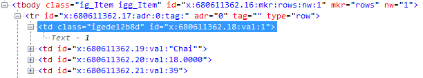
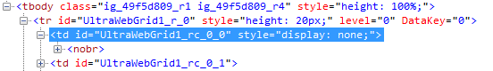

////

|metadata|
{
    "name": "gridmigrationhiddencolumns",
    "controlName": [],
    "tags": [],
    "guid": "0221bfa5-d0a6-409e-8ac9-1eee96c50675",  
    "buildFlags": [],
    "createdOn": "2016-03-01T12:47:37.6862443Z"
}
|metadata|
////

= Grid Migration - Hidden Columns

== Hidden Columns

Hidden columns are used to bring information from the server into the client and have them available in the grid object model, but invisible to a user. Generally hidden columns contain information that is not informative to the user, for example data key field.

Both UltraWebGrid and WebDataGrid (WebHierarchicalDataGrid) have ability to render hidden columns.

The difference is that WebDataGrid does it faster, relying on the browser speed, not on the speed of the iterating through all of the cells in the column. WebDataGrid dynamically creates a CSS class with *display:none;* setting in it and this class name is assigned to each TD of the column:

*In CSS:*

[source,css]
----
.igede12b8d{
 display:none;
}
----

Hiding and showing columns on the client becomes as easy as setting one attribute in one style sheet class.

For this reason it is also recommended for those columns in WebDataGrid that can potentially be hidden by JavaScript on the client to set the  _Hidden_  property to *false* . That way the CSS class is generated and assigned to each TD of the column and hiding on the client happens in a blink. If this step is omitted the class is created on the client and first attempt to hide a column can be slow, depending on the number of rows in the grid.

UltraWebGrid uses simpler approach to hiding columns. Each TD of the hidden column gets a style attribute with *display:none;* setting in it:

Hiding and showing columns on the client is done through iterating all of the cells with each operation. His can be very time consuming if the grid has many rows.

==== Server side code

To hide a column on the server, simply set the  _Hidden_  property to *true* .

UltraWebGrid:

*In C#:*

[source,csharp]
----
this.UltraWebGrid1.Columns[0].Hidden = true;
----

WebDataGrid:

*In C#:*

[source,csharp]
----
this.WebDataGrid1.Columns[0].Hidden = true;
----

==== Client side code

On the client hiding and showing column is different for these two grids.

UltraWebGrid:

*In JavaScript:*

[source,js]
----
function UltraWebGrid1_InitializeLayoutHandler(gridName)
{
      var ultraWebGrid = igtbl_getGridById(gridName);
      ultraWebGrid.Bands[0].Columns[0].setHidden(true);
}
----

WebDataGrid:

*In JavaScript:*

[source,js]
----
function WebDataGrid1_Grid_Initialize(webDataGrid, eventArgs)
{
      ///<param name="webDataGrid" type="Infragistics.Web.UI.WebDataGrid"></param>
      ///<param name="eventArgs" type="Infragistics.Web.UI.EventArgs"></param>
      webDataGrid.get_columns().get_column(0).set_hidden(true);
}
----