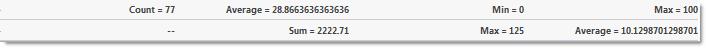

////

|metadata|
{
    "name": "gridmigrationmultirowsummaries",
    "controlName": [],
    "tags": [],
    "guid": "68f8c45b-9292-4228-b162-38e44110068f",  
    "buildFlags": [],
    "createdOn": "2016-03-01T12:48:34.9705754Z"
}
|metadata|
////

= Grid Migration - Multi-Row summaries

== UltraWebGrid

Not supported.

==== WebDataGrid

WebDataGrid allows you and your end users to display a summary of the numeric data in any column.

The summaries can be:

* Count
* Sum
* Average
* Min
* Max
* Custom summaries

The standard summaries are available for numeric data only. An exception is Count SummaryType, which is always available. They can be shown all simultaneously.

When enabled, the behavior adds a summary button to each header. When the button is pressed, a drop-down with available summaries appears.

==== Enabling Summary Row

*In ASPX:*

[source,html]
----
<Behaviors>
    <ig:SummaryRow AnimationType="Linear">
        <ColumnSummaries>
            <ig:ColumnSummaryInfo ColumnKey="UnitPrice">
                <Summaries>
                    <ig:Summary SummaryType="Average" />
                    <ig:Summary SummaryType="Max" />
                </Summaries>
            </ig:ColumnSummaryInfo>
        </ColumnSummaries>
    </ig:SummaryRow>
</Behaviors>
----

To add a summary row from the code-behind, add the following code:

*In C#:*

[source,csharp]
----
WebDataGrid1.Behaviors.CreateBehavior<SummaryRow>();
ColumnSummaryInfo unitPriceSummary = new ColumnSummaryInfo();
unitPriceSummary.ColumnKey = "UnitPrice";
unitPriceSummary.Summaries.Add(SummaryType.Average);
unitPriceSummary.Summaries.Add(SummaryType.Max);
WebDataGrid1.Behaviors.SummaryRow.ColumnSummaries.Add(unitPriceSummary);
----

*CompactRendering*

Specifies how compact the summaries are rendered. On indicates that the summaries may be rendered compactly, even mixing different summaries on the same line. Off ensures that each summary type is occupying a separate line. Auto will use Off if the maximum number of visible summaries is one or less and On otherwise.

The Summary Row behavior has a property called CompactRendering, which specifies how the summaries are rendered. There are three available options:

* Auto (default) – if the maximum number of summaries is one or less, the summaries will be rendered compactly. Otherwise each summary occupies a separate line.

* On – the summaries are rendered compactly, even mixing different summaries on the same line.

* Off – each summary type is rendered on a separate line.

== WebHierarchicalDataGrid

The Summary Row feature of WebDataGrid is available in WebHierarchicalDataGrid. The behavior allows adding standard summaries (Count; Sum; Average; Min; Max) as well as custom ones.

Each band in WebHierarchicalDataGrid can be assigned a Summary Row behavior. You can set the EnableInheritance property of a band to enable child bands to inherit the setting. This allows you to customize summary row behavior in each band of data. For example, if you want summaries for all bands in WebHierarchicalDataGrid, just enable the SummaryRow behavior at the root level and set EnableInheritance to True. If you want to disable the behavior for a specific child band, disable the behavior for that specific band.

When enabled, the behavior adds a summary button to each header. When the button is pressed, a drop-down with available summaries appears.

==== Enabling Summary Row

*In ASPX:*

[source,html]
----
<ig:WebHierarchicalDataGrid ID="WebHierarchicalDataGrid1" runat="server" DataSourceID="WebHierarchicalDataSource1" 
 Height="400px" Width="750px" DataKeyFields="ProductID" >
<Bands>
                <ig:Band Height="100" DataMember="AccessDataSource1_Orders" DataKeyFields="OrderID">
                    <Behaviors>
                        <ig:SummaryRow>
                            <ColumnSummaries>
                                <ig:ColumnSummaryInfo ColumnKey="Quantity">
                                    <Summaries>
                                        <ig:Summary SummaryType="Sum"></ig:Summary>
                                        <ig:Summary SummaryType="Max"></ig:Summary>
                                    </Summaries>
                                </ig:ColumnSummaryInfo>
                            </ColumnSummaries>
                        </ig:SummaryRow>
                    </Behaviors>
                </ig:Band>
            </Bands>
            <Behaviors>
                <ig:SummaryRow EnableInheritance="true">
                    <ColumnSummaries>
                        <ig:ColumnSummaryInfo ColumnKey="UnitPrice">
                            <Summaries>
                                <ig:Summary SummaryType="Average"></ig:Summary>
                            </Summaries>
                        </ig:ColumnSummaryInfo>
                    </ColumnSummaries>
                </ig:SummaryRow>
            </Behaviors>
        </ig:WebHierarchicalDataGrid>
----

*In C#:*

[source,csharp]
----
protected void WebHierarchicalDataGrid1_InitializeBand(object sender, BandEventArgs e)
{
    if (e.Band.Key == "Products")
    {
        e.Band.Behaviors.CreateBehavior<SummaryRow>();
        e.Band.Behaviors.SummaryRow.EnableInheritance = true;
        ColumnSummaryInfo unitPriceSummary = new ColumnSummaryInfo();
        unitPriceSummary.ColumnKey = "UnitPrice";
        unitPriceSummary.Summaries.Add(SummaryType.Average);
        e.Band.Behaviors.SummaryRow.ColumnSummaries.Add(unitPriceSummary);
        this.WebHierarchicalDataGrid1.RefreshBehaviors();
    }
    else if (e.Band.Key == "Orders")
    {
        e.Band.Behaviors.CreateBehavior<SummaryRow>();
        e.Band.Behaviors.SummaryRow.EnableInheritance = true;
        ColumnSummaryInfo quantitySummary = new ColumnSummaryInfo();
        quantitySummary.ColumnKey = "Quantity";
        quantitySummary.Summaries.Add(SummaryType.Sum);
        quantitySummary.Summaries.Add(SummaryType.Max);
        e.Band.Behaviors.SummaryRow.ColumnSummaries.Add(quantitySummary);
        this.WebHierarchicalDataGrid1.RefreshBehaviors();
    }
}
----