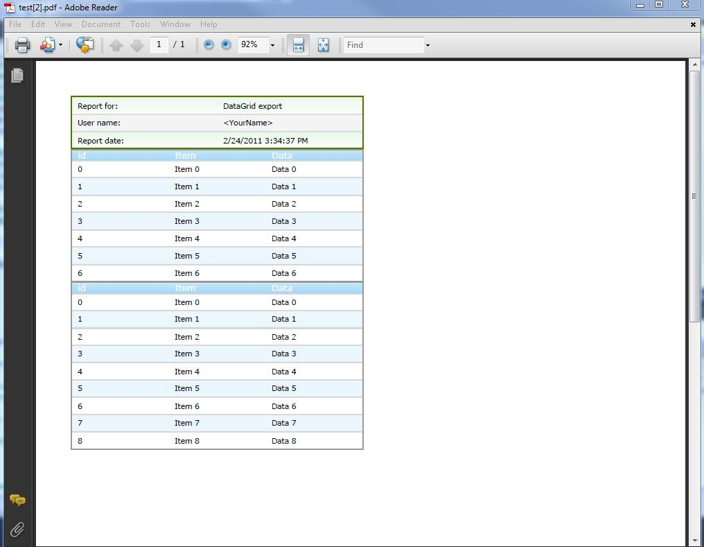
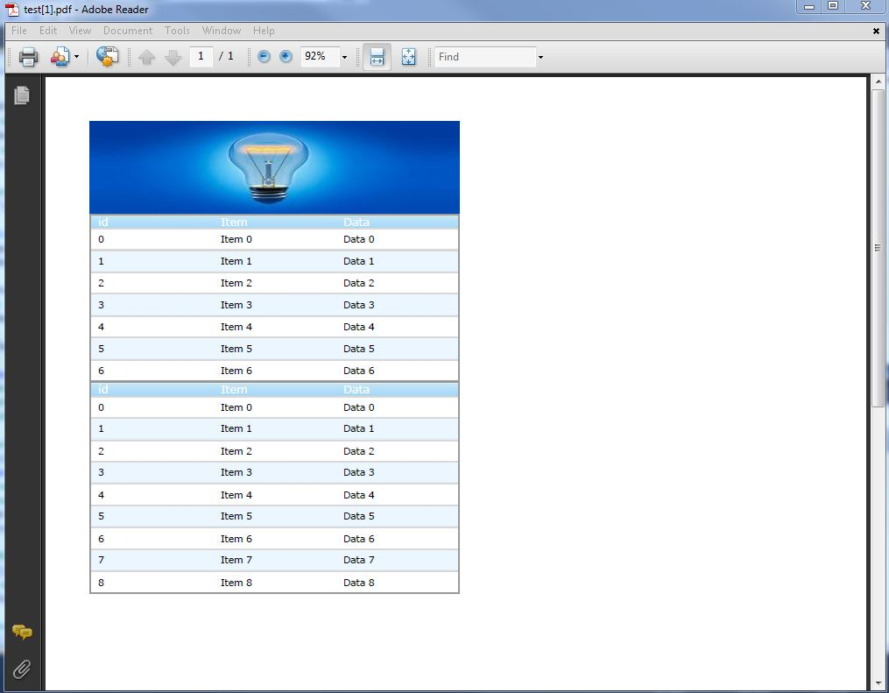

////

|metadata|
{
    "name": "gridmigrationpdfexport",
    "controlName": [],
    "tags": [],
    "guid": "bbfeb800-8a07-477a-893b-51fc244c1f7b",  
    "buildFlags": [],
    "createdOn": "2016-03-01T12:49:00.9923111Z"
}
|metadata|
////

= Grid Migration - PDF Export

== Export to PDF

Grid PDF file exporting allow users to export their grid data to the formatted .pdf file that can be later used as archive or visual representation of the received from the grid data.

In the WebGrid the WebGridDocumentExporter component is used to allow PDF file exporting for the grid. When Export method is called WebGridDocumentExporter will display a Save As dialog box that will allow end user to select where in their local machine to save the composed PDF file. The name of the downloadable file can be changed by setting the DownloadName property to a string which represents the name of the PDF file. WebGridDocumentExporter also exposes an ExportMode property which allows you to either open the PDF (or XPS) file directly in the end user's web browser or to prompt the end user with a Save As dialog box.

WebDataGrid and WebHierarchicalDataGrid both use the WebDocumentExporter control that allows automated export of the grid data in a document file format (PDF for example). WebDocumentExporter control has the following main features:

* Files can be either sent to the browser for automatic downloading, or just saved to a document instance, so you decide what to do with the result (ExportMode property).
* Exporting only grid data (when you have Paging or VirtualScrolling enabled) or the whole data in data source (DataExportMode property).
* Exporting into XPS or PDF document file formats (Format property).
* Exporting styles, so you don’t lose the look and feel of your application (EnableStylesExport property).
* Customizing the page layout that the grid will be exported to (Margins, TargetPaperSize and TargetPaperOrientation properties).
* Server events, which you can handle to apply your custom logic before or after the data is exported, as well as on each exported row (CellExporting, CellExported, RowExporting, events).

== Server side code snippets:

==== UltraWebGrid PDF exporting:

[start=1]
. Add Document Exporter to your .aspx page:

*In ASPX:*

[source,html]
----
<igdocX:UltraWebGridDocumentExporter ID="UltraWebGridDocumentExporter1" runat="server"
OnBeginExport="UltraWebGridDocumentExporter1_BeginExport">
</igdocX:UltraWebGridDocumentExporter>
----

[start=2]
. Add a link or button that will start PDF file exporting:

*In ASPX:*

[source,html]
----
<asp:LinkButton ID="LinkButton2" runat="server" OnClick="LinkButton2_Click">PDF</asp:LinkButton>
----

[start=3]
. Handle BeginExport() event of the DocumentExporter to customize the appearance of the report:

*In C#:*

[source,csharp]
----
protected void UltraWebGridDocumentExporter1_BeginExport(object sender, Infragistics.WebUI.UltraWebGrid.DocumentExport.DocumentExportEventArgs e)
    {
        // Add a title to the report
        ReportText.IText heading = e.Section.AddText();
        ReportText.Style headingStyle = new ReportText.Style(new Font(Resources.Grid.Exporting_Data_Font, 16), Brushes.Crimson);
        heading.AddContent(String.Format(Resources.Grid.Exporting_Data_ActiveCustomers, DateTime.Now.Year), headingStyle);
        heading.Margins.Bottom = 15;
        // Add a caption with some more information
        ReportText.IText caption = e.Section.AddText();
        ReportText.Style captionStyle = new ReportText.Style(new Font(Resources.Grid.Exporting_Data_Font, 10), Brushes.Black);
        caption.AddContent(String.Format(Resources.Grid.Exporting_Data_Listing, DateTime.Now.Year), captionStyle);
        caption.Margins.Bottom = 15;
        // customize the grid for export
        UltraWebGrid1.Columns.FromKey("CustomerID").Hidden = true;
        UltraWebGrid1.Columns.FromKey("Address").Hidden = true;
        UltraWebGrid1.Columns.FromKey("Region").Hidden = true;
        UltraWebGrid1.Columns.FromKey("PostalCode").Hidden = true;
        UltraWebGrid1.Columns.FromKey("Fax").Hidden = true;
    }
----

[start=4]
. Handle the LinkButton Click() event in order to initiate the PDF file exporting:

*In C#:*

[source,csharp]
----
protected void LinkButton2_Click(object sender, EventArgs e)
    {
        // configure exporter
        UltraWebGridDocumentExporter1.Format = FileFormat.PDF;
        UltraWebGridDocumentExporter1.DownloadName = "report.pdf";
        UltraWebGridDocumentExporter1.TargetPaperOrientation = PageOrientation.Landscape;
        // trigger export
        UltraWebGridDocumentExporter1.Export(UltraWebGrid1);
    }
----

[start=5]
. When the user click on the link button the browser will open prompt window that will allow end user to save a PDF file with name “report.pdf” to his local drive.

PDF export to File Stream:

In order to save PDF file without displaying Save As box in the users browser the developer can use Custom export mode and save the file directly to the server.

*In C#:*

[source,csharp]
----
// Set the export mode to custom so the PDF file
// doesn't get displayed in the browser
this.UltraWebGridDocumentExporter1.ExportMode =
      Infragistics.WebUI.UltraWebGrid.Exporter.ExportMode.Custom;
// Create a string of the application's server
// path including the file name.
string s = Server.MapPath(".") + @"\WebGrid.pdf";
// Create a file stream that will either create
// or open the file with the path specified above.
FileStream fileStream = File.OpenWrite(s);
// Export WebGrid into the file stream and close it.
this.UltraWebGridDocumentExporter1.Export(
      this.UltraWebGrid1,
      fileStream,
      true);
----

== WebDataGrid/WebHierarchicalDataGrid PDF exporting:

==== Plain PDF document export:

[start=1]
. Add WebDocumentExporter control to the .aspx page:

*In ASPX:*

[source,html]
----
<ig:WebDocumentExporter runat="server" ID="dExporter" ExportMode="Download" />
----

[start=2]
. Add a Text Box (for file name entry) and a Button to initialize PDF file export:

*In ASPX:*

[source,html]
----
<asp:Button ID="btnExport" runat="server" Text="Export" OnClick="btnExport_Click"/>
<asp:TextBox ID="tbFileName" runat="server" Text="WebDataGridExport"></asp:TextBox>
----

[start=3]
. Add reference directive for the exporter in the code behind page:

using Infragistics.Documents.Report;

[start=4]
. Handle the “btnExport_Click” event on the server side and add the following code:

*In C#:*

[source,csharp]
----
void btnExport_Click(object sender, EventArgs e)
    {
         // get the text from the text box, format it and set it as PDF file name
        string fileName = HttpUtility.UrlEncode(this.tbFileName.Text);
        fileName = fileName.Replace("+", "%20");
        this.dExporter.DownloadName = fileName;
                // format of the file that should be saved
        dExporter.Format = Infragistics.Web.UI.GridControls.FileFormat.PDF;
        // export mode - data that are visible in the grid or all data in the grid
        dExporter.DataExportMode = Infragistics.Web.UI.GridControls.DataExportMode.DataInGridOnly;
        // orientation of the page exported - Landscape or Portrait
        dExporter.TargetPaperOrientation = Infragistics.Documents.Report.PageOrientation.Portrait;
        // specify page margins
        dExporter.Margins = PageMargins.Normal;
        // specify the size of the page exported
        dExporter.TargetPaperSize = PageSizes.A4;
        // export the grids from the page - if you want to export more than two grid add them in WebControl[] array
        dExporter.Export((WebDataGrid1, WebDataGrid2);
    }
----

[start=5]
. When the user click on the Export button the browser will open prompt window that will allow end user to save a PDF file with name entered in the TextBox to his local drive.

==== Exporting of PDF document with summary grid as header:

[start=1]
. Follow steps from 1 to 3 from the previous example.
[start=2]
. Add new WebDataGrid control on the page and make it hidden:

*In ASPX:*

[source,html]
----
<ig:WebDataGrid ID="WebDataGrid2" runat="server" Height="350px" Width="400px" 
            Visible=" ShowHeader=" StyleSetName="Appletini">
</ig:WebDataGrid>
----

[start=2]
. Create the data source for the hidden grid and put your data in it:

*In C#:*

[source,csharp]
----
// use this method to create banner as data table
    private DataTable CreateBanner()
    {        
        DataTable table = new DataTable();
        // Declare variables for DataColumn and DataRow objects.
        DataColumn column;
        DataRow row;
        column = new DataColumn();
        column.DataType = System.Type.GetType("System.String");
        column.ColumnName = "BannerTitle";
        column.ReadOnly = true;
        table.Columns.Add(column);
        column = new DataColumn();
        column.DataType = System.Type.GetType("System.String");
        column.ColumnName = "BannerText";
        column.ReadOnly = true;
        table.Columns.Add(column);
        DataColumn[] PrimaryKeyColumns = new DataColumn[1];
        PrimaryKeyColumns[0] = table.Columns["BannerTitle"];
        table.PrimaryKey = PrimaryKeyColumns;
        row = table.NewRow();
        row["BannerTitle"] = "Report for:";
        row["BannerText"] = "DataGrid export";
        table.Rows.Add(row);
        row = table.NewRow();
        row["BannerTitle"] = "User name:";
        row["BannerText"] = "<YourName>";
        table.Rows.Add(row);
        row = table.NewRow();
        row["BannerTitle"] = "Report date:";
        row["BannerText"] = DateTime.Now.ToString();
        table.Rows.Add(row);        
        return table;
    }
----

[start=3]
. Handle the “btnExport_Click” event on the server side and add the following code:

*In C#:*

[source,csharp]
----
// event is fired when export button is clicked
    protected void btnExport_Click(object sender, EventArgs e)
    {
        // if file name is not empty
        if (txtFileName.Text != "")
        {
            string fileName = HttpUtility.UrlEncode(this.txtFileName.Text); // get filename
            fileName = fileName.Replace("+", "%20"); // format filename
            WebDocumentExporter1.DownloadName = fileName; // setting name of file that will be saved
            WebDocumentExporter1.Format = Infragistics.Web.UI.GridControls.FileFormat.PDF; // seting type of the document
            // setting export mode - to export all data in grid
            WebDocumentExporter1.DataExportMode = Infragistics.Web.UI.GridControls.DataExportMode.AllDataInDataSource;
            WebDocumentExporter1.TargetPaperSize = PageSizes.A4; // sets size of the exported page
            WebControl [] ar =  new WebControl [3]; // creating Web control array to store grids
            this.WebDataGrid2.DataSource = CreateBanner(); // data source for the banner
            this.WebDataGrid2.DataBind();
            this.WebDataGrid2.Width = WebDataGrid1.Width; // sets widht of banner = width of first grid 
            // adding grids to array
            ar[0] = this.WebDataGrid2;
            ar[1] = this.WebDataGrid1;
            ar[2] = this.WebHierarchicalDataGrid1;            
            WebDocumentExporter1.Export(ar); // exporting report, section and two grids 
        }
    }
----

[start=4]
. When the user click on the Export button the browser will open prompt window that will allow end user to save a PDF file with name entered in the TextBox to his local drive. The report exported will have the supplied from the user data as document header:

== Exporting of PDF document with image banner as header:

[start=1]
. Follow steps from 1 to 3 from the previous example.
[start=2]
. Handle the “btnExport_Click” event on the server side and add the following code:

*In C#:*

[source,csharp]
----
// event is fired when export button is clicked
    protected void btnExport_Click(object sender, EventArgs e)
    {
        // if file name is not empty
        if (tbFileName.Text != "")
        {
            string fileName = HttpUtility.UrlEncode(this.txtFileName.Text); // get filename
            fileName = fileName.Replace("+", "%20"); // format filename
            WebDocumentExporter1.DownloadName = fileName; // setting name of file that will be saved
            WebDocumentExporter1.Format = Infragistics.Web.UI.GridControls.FileFormat.PDF; // seting type of the document
            // setting export mode - to export all data in grid
            WebDocumentExporter1.DataExportMode = Infragistics.Web.UI.GridControls.DataExportMode.AllDataInDataSource;
            WebDocumentExporter1.TargetPaperSize = PageSizes.A4; // sets size of the exported page
            WebControl [] ar =  new WebControl [3]; // creating Web control array to store grids
            // create new bitmap with your server image (banner)
            Bitmap bm = new Bitmap(Server.MapPath("~/Images/test_banner.jpg"));
            bm = new Bitmap(bm, new Size(Convert.ToInt32(WebDataGrid1.Width.Value), bm.Height)); // resize the image to match the grid size
           // adding grids to array 
            ar[1] =  this.WebDataGrid1;
            ar[2] = this.WebHierarchicalDataGrid1;
            // create report for PDF document
            Report r = new Report();
            // create section and add it to the report
            ISection s = r.AddSection();    
            // add your image (banner) to the section
            s.AddImage(new Infragistics.Documents.Graphics.Image(bm));     
            WebDocumentExporter1.Export(r, s , ar); // exporting report, section and two grids 
        }
    }
----

[start=2]
. When the user click on the Export button the browser will open prompt window that will allow end user to save a PDF file with name entered in the TextBox to his local drive. The report exported will have the supplied from the user image as document header:

