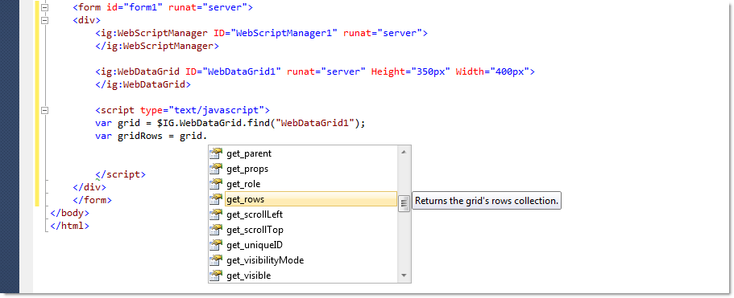
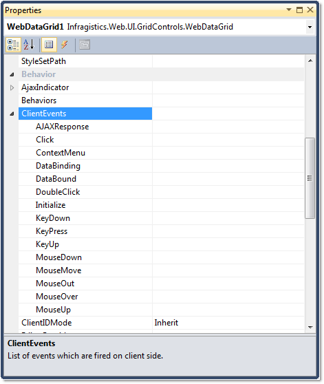
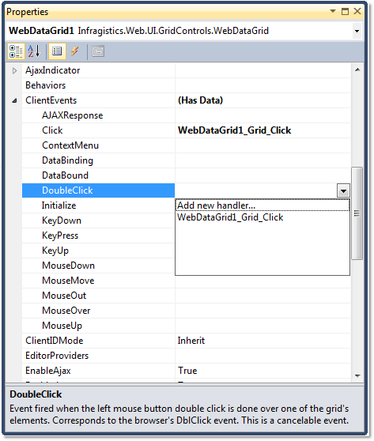
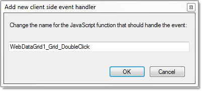

////

|metadata|
{
    "name": "javascript-intellisense-support",
    "controlName": [],
    "tags": ["Design Environment","How Do I"],
    "guid": "f9cb48ec-b94e-4c61-91a0-478eb17af14f",  
    "buildFlags": [],
    "createdOn": "2010-06-01T14:45:17.8879234Z"
}
|metadata|
////

= JavaScript IntelliSense Support

== JavaScript IntelliSense in VS 2008/2010

With the 2010 Vol. 2 release comes the JavaScript IntelliSense support for all ASP.NET AJAX controls. Now you can easily use all client-side properties, methods and events without even looking at API documentation.

== How to enable JavaScript IntelliSense

To enable JavaScript IntelliSense just add the link:{ApiPlatform}web{ApiVersion}~infragistics.web.ui.webscriptmanager.html[WebScriptManager] component to your page. It holds the needed references to ASP.NET AJAX controls, and the client-side functionality that they provide.

== How to use JavaScript IntelliSense

Once you’ve added link:{ApiPlatform}web{ApiVersion}~infragistics.web.ui.webscriptmanager.html[WebScriptManager], you can get a reference to any Infragistics AJAX control. To do this, use the $IG..find method, where is the type of control that you need to cast to. This way the IntelliSense will directly expose its properties, methods and events.

*In Javascript:*

----
var grid = $IG.WebDataGrid.find("WebDataGrid1");var tree = $IG.WebDataTree.find("WebDataTree1");
----

== Adding client-side events

Adding client events has never been easier – you can now add them from the designer’s property window. Here is an example of how to do that:

[start=1]
. In Design view, drop any Infragistics AJAX control onto the web form.
[start=2]
. Right-click on the control and select Properties. When the Properties window appears, under Behavior properties you can find the ClientEvents property node.

[start=3]
. From the suggestion drop-down list choose “Add new handler.”

[start=4]
. A dialog for the client-side event name handler appears. Here you can type your own JavaScript function name or leave the suggested one.

[start=5]
. Clicking OK switches to Source view and inserts the client-side event handler. The generated JavaScript code looks like this:

*In Javascript:*

----

----