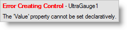
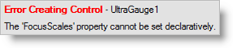
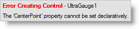
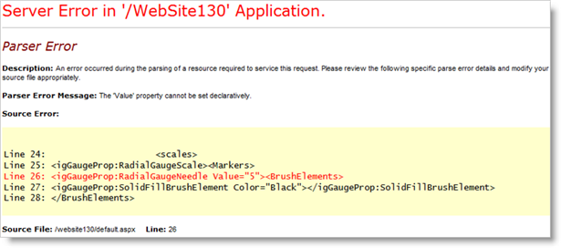
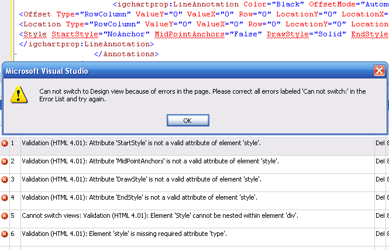

////

|metadata|
{
    "name": "known-issues-known-issues-and-breaking-changes-revision-history",
    "controlName": [],
    "tags": ["Known Issues"],
    "guid": "{96AF3FAE-F5CC-4603-9197-7DB68113E0FC}",  
    "buildFlags": [],
    "createdOn": "0001-01-01T00:00:00Z"
}
|metadata|
////

= Revision History

When using the Infragistics ASP.NET product, be sure to take note of the known issues and breaking changes.

The following list take you to the list for known issues and different versions of Infragistics ASP.NET that first introduced the breaking changes.

== 2015 Volume 1

In the 2015.1 version of the Infragistics ASP.NET product, the following controls have been retired from the product, samples, and help:

* WebSpellChecker
* WebSpellCheckerDialog

== Where Did My ASP.NET Controls Go ?

In the 2011.2 version of the Infragistics ASP.NET product, the following controls have been retired from the product, samples, and help:

* WebGrid
* WebCombo
* WebDateChooser
* WebPanel
* WebListBar
* WebCalendar
* WebNavBar
* WebToolbar
* UltraWebTab
* WebDataInput

** WebTextEdit
** WebMaskEdit
** WebNumericEdit
** WebDateTimeEdit
** WebPercentEdit
** WebCurrencyEdit

* WebMenu
* WebTree
* Web Async Refresh Panel (WARP)
* WebGridExcelExporter
* WebGridDocumentExporter

The classic controls have been replaced by our newer, reengineered controls built upon our Infragistics ASP.NET AJAX framework and also in jQuery. For more information on which control should be used to replace any of the controls listed above, see the link:classic-control-migration-guide.html[Infragistics ASP.NET Classic Control Migration Guide].

== 2011 Volume 2

=== Infragistics Document Libraries

==== Issues/Limitations Chart

The following tables list limitations that are either not supported with the controls or are external limitations.

=== Legend

- image:images\workaround.png[alt="Workaround"] - Workaround available
- image:images\noworkaround.png[alt="No Workaround"] - No known workaround
- image:images\fix.png[alt="Fix Planned"] - Fix planned

[cols="a,a,a"]
|====
|Issue
|Description
|Workaround?

|<<aspnetjQuery,Using Document Engines from Infragistics ASP.NET and Ignite UI® together>>
|Using both the Infragistics ASP.NET and Ignite UI® documents assemblies together will cause namespace conflict exceptions.
|image::Images/workaround.png[]

|====

=== Using Document Engines from Infragistics ASP.NET and Ignite UI® together

Using both the Infragistics ASP.NET and Ignite UI® documents assemblies together will cause namespace conflict exceptions. This is the list of conflicting assemblies:

[cols="a,a"]
|====
|ASP.NET
|jQuery

|Infragistics.WebUI.Documents.Core.dll
|Infragistics.Web.MVC.Documents.Core.dll

|Infragistics.WebUI.Documents.IO.dll
|Infragistics.Web.MVC.Documents.IO.dll

|Infragistics.WebUI.Documents.Reports.dll
|Infragistics.Web.MVC.Documents.Reports.dll

|Infragistics.WebUI.Documents.Excel.dll
|Infragistics.Web.MVC.Documents.Excel.dll

|Infragistics.WebUI.Documents.Word.dll
|Infragistics.Web.MVC.Documents.Word.dll

|====

.Note:
[NOTE]
====
For ASP.NET, the assemblies can begin with Infragistics2, Infragistics35, or Infragistics4 if not using the version-less assemblies.
====

=== Workaround

To resolve this issue, reference either the documents assemblies from Infragistics ASP.NET or the documents assemblies from Ignite UI® in your application. The document libraries within these assemblies are the same and can be used in place of each other.

=== Aikido™ Touch Support

[cols="a,a,a"]
|====
|Issue
|Description
|Workaround?

|*Multiple selection is not supported for WebDataGrid, WebHierarchicalDataGrid, and WebDataTree*
|Multiple selection is not supported for WebDataGrid, WebHierarchicalDataGrid, or WebDataTree when used with touch.
|image::Images/noworkaround.png[]

|*Drag and Drop functionality is not supported for WebDataGrid, WebHierarchicalDataGrid, and WebDataTree*
|Drag and drop functionality is not supported for WebDataGrid, WebHierarchicalDataGrid, or WebDataTree when used with touch. This includes features that rely on dragging and dropping such as column moving in the grid controls.
|image::Images/noworkaround.png[]

|*WebDataGrid and WebHierarchicalDataGrid Filtering loses focus*
|When using the filtering feature in Apple^®^Safari^®^, the filtering criteria box loses focus due to a bug in that browser.
|image::Images/noworkaround.png[]

|====

==== Related Topics

Following are some other topics you may find useful.

* link:touch-support-in-netadvantage-for-aspnet.html[Touch Support in Infragistics ASP.NET]

== WebDataGrid™

[cols="a,a,a"]
|====
|Issue
|Description
|Workaround?

|*Sorting and Filtering New Rows*
|Adding rows does not add them to the grid in a sorted or filtered state. The end user should sort or filter again after rows are added.
|image::Images/noworkaround.png[]

|*New Row and Paging*
|When adding rows, it is possible to have more rows on the client than the page count allows for.
|image::Images/noworkaround.png[]

|<<create_templated,Create a Templated cell on the Client>>
|Templated cells are not created on the client when a new row is added to the grid.
|image::Images/workaround.png[]

|*Data key field is not set on the client*
|If the data key field is not set on the client, a temporary one is generated and prefixed with the string `emptyKeyIG_`. With auto-generated keys, the rows selected with these keys are not persisted on the server.
|image::Images/noworkaround.png[]

|*Undo functionality*
|The built-in undo functionality for editing and adding rows is only available to end users when activation is enabled. The undo button is always available for deleted rows. As the developer, you can use the client-side API to undo these operations even if Activation is disabled.
|image::Images/noworkaround.png[]

|*Post backs duration*
|It is possible for postbacks to take a significant amount of time to process when there are many operations batched at one time. This is also affected by server performance and network connectivity.
|image::Images/noworkaround.png[]

|*Adding Rows Animation*
|For adding rows, CSS animations are used. These will not display in IE 9 or below because the browser does not support this CSS standard.
|image::Images/noworkaround.png[]

|*Copying templated columns*
|Templated columns are omitted during clipboard operations.
|image::Images/noworkaround.png[]

|*Clipboard browsers support*
|Different browsers have varying degrees of support for allowing a web page access to the clipboard. Please see below for details on using an Adobe Flash® object to access the clipboard in all browsers.
|image::Images/workaround.png[]

|<<pasting_data,Pasting data containing line breaks>>
|When copying cell data from the WebDataGrid or WebHierarchicalDataGrid that contains <br/> tags, this data is pasted into Excel® where each new line is pasted as a new spreadsheet row.
|image::Images/workaround.png[]

|====

== Create a Templated Cell on the Client

Templated cells are not created on the client when a new row is added to the grid.

== Workaround

You can create a client-side control for the template in the row added client-side event. Server controls will be added for the row after the next postback.Clipboard browsers support

Different browsers have varying degrees of support for allowing a web page access to the clipboard.

[cols="a,a,a,a"]
|====
|Copy
|Paste

|Internet Explorer®
|*Yes*
|*Yes*

|Firefox®
|*Yes* (loose security)
|*Yes* (loose security)

|Chrome™
|*No*
|*Yes*

|Safari®
|*No*
|*Yes*

|Opera™
|*No*
|*No*

|====

== Workaround

Copying data into the clipboard can be supported cross-browser using an Adobe Flash® plug-in. The JavaScript library found here: link:http://zeroclipboard.org[http://zeroclipboard.org] can be used to provide this access. The example below uses this library to show this approach. Prior to running it, please download and extract the ZeroClipboard library.

== Example: Accessing the clipboard using a Flash object

[cols="a"]
|====
|In HTML and ASPX:

|
```
<script type="text/javascript" src="ZeroClipboard/ZeroClipboard.js"></script> 

<style type="text/css"> 

#d_clip_button { 

text-align:center; 

border:1px solid black; 

background-color:#ccc; 

margin:10px; padding:10px; 

} 

#d_clip_button.hover { background-color:#eee; } 

#d_clip_button.active { background-color:#aaa; } 

</style> 

<script type="text/javascript" id="igClientScript"> 

var clip; 

var copyButton; 

function onLoad() 

{ 

ZeroClipboard.setMoviePath('ZeroClipboard/ZeroClipboard.swf'); 

clip = new ZeroClipboard.Client(); 

clip.setText(""); 

clip.glue('d_clip_button'); 

copyButton = document.getElementById("d_clip_button"); 

clip.hide(); 

copyButton.style.display = "none"; 

clip.addEventListener('complete', function (client, text) 

{ 

clip.hide(); 

copyButton.style.display = "none"; 

}); 

} 

function WebDataGrid1_Clipboard_Copied(sender, eventArgs) 

{ 

///<summary> 

/// 

///</summary> 

///<param name="sender" type="Infragistics.Web.UI.WebDataGrid"></param> 

///<param name="eventArgs" type="Infragistics.Web.UI.ClipboardEventArgs"></param> 

if (eventArgs.get_error()) 

{ 

eventArgs.set_exceptionHandled(true); 

clip.setText(eventArgs.get_clipboardText()); 

copyButton.style.display = ""; 

clip.show(); 

} 

} 

</script> 

<div id="d_clip_button" >Copy To Clipboard</div> 

<ig:WebDataGrid ID="WebDataGrid1" runat="server" Height="350px" Width="400px" 

AutoGenerateColumns=" DataSourceID="SqlDataSource1" 

onrowupdating="WebDataGrid1_RowUpdating" DataKeyFields="ProductID" > 

<Behaviors> 

<ig:Clipboard> 

<ClipboardClientEvents Copied="WebDataGrid1_Clipboard_Copied" /> 

</ig:Clipboard>
```

|====

== Pasting data containing line breaks

When copying cell data from the WebDataGrid or WebHierarchicalDataGrid that contains <br/> tags, this data is pasted into Excel® where each new line is pasted as a new spreadsheet row.

== Workaround

All <br/> tags are converted to carriage returns, ‘\n’, in the clipboard. You can handle the Pasting client-side event to replace the carriage returns with something else like a space ‘ ‘ to prevent the data from pasting into multiple rows in Excel.

== WebHierarchicalDataGrid™

[cols="a,a,a"]
|====
|Issue
|Description
|Workaround?

|*All Limitations from WDG*
|All limitations of the WebDataGrid exist with the WebHierarchicalDataGrid
|image::Images/noworkaround.png[]

|*Adding Rows to a grouped WHDG with batch updating enabled*
|With batch updating enabled, newly added rows to a grouped grid are added to the last group. If there are no group rows in the case of an empty grid, newly added rows are added as data rows and no groups are created until the next postback. After subsequent postbacks, the newly added rows are grouped consistently with the other data rows and any necessary new groups are created.
|image::Images/noworkaround.png[]

|*Adding Child Bands*
|Child bands are created after the first postback of a newly added parent row. You should have the adding functionality enabled for the child band to support adding child rows.
|image::Images/noworkaround.png[]

|*Delete an expanded row with Batch Updating enabled*
|If you delete an expanded row, it is collapsed and prevented from expanding until the update is undone. This is so that an AJAX postback cannot occur from one of its child rows. Also `row.get_rowIslands()` will return null while the row is marked for deletion.
|image::Images/noworkaround.png[]

|*Adding several rows when batch updating and paging are enabled*
|If you add several rows when batch updating and paging are enabled, the rows will be added on the current page. If a row is then expanded to fetch its child rows from the server, it is possible the expanded row is on a new page, and is no longer shown.
|image::Images/noworkaround.png[]

|*Copying templated columns*
|Templated columns are omitted during clipboard operations.
|image::Images/noworkaround.png[]

|*Custom Groupby comparers and grouping multiple columns*
|There is a known issue where if a custom group comparer is used to group a column and it does not apply a sorted order to the column’s data, any subsequent columns grouped after this column may not group correctly.
|image::Images/noworkaround.png[]

|====

== WebWordExporter™

[cols="a,a,a"]
|====
|Issue
|Description
|Workaround?

|<<export_complex,Export Complex text tempates>>
|The exporter exports only simple text templates.
|image::Images/noworkaround.png[]

|====

=== Export Complex text templates

The exporter exports only simple text templates. The following template will be exported:

<ItemTemplate>

Name: <%# Eval("FirstName") %> <%# Eval("LastName") %>

</ItemTemplate>

The following template will NOT be exported:

<ItemTemplate>

<asp:TextBoxID="txtTemp"runat="server"Text="Temppp"></asp:TextBox>

</ItemTemplate>

== 2011 Volume 1

== WebDataGrid™

* The “tag” attribute is not available on the rows of the grid when  pick:[asp-net="link:infragistics4.web.v{ProductVersion}~infragistics.web.ui.gridcontrols.webdatagrid~enableclientrendering.html[EnableClientRendering]"]  property is set to true.
* Actions performed on the client are not guaranteed to propagate to the server and after postback/callback (i.e. if the  pick:[asp-net="link:infragistics4.web.v{ProductVersion}~infragistics.web.ui.gridcontrols.ipaging~pageindexchanging_ev.html[PageIndexChanging]"]  event was handled by the developer and the page index was changed by rebinding on the client, after postback/callback the grid will lose this change).
* If the  pick:[asp-net="link:infragistics4.web.v{ProductVersion}~infragistics.web.ui.gridcontrols.webdatagrid~enableclientrendering.html[EnableClientRendering]"]  property set to true:

** Assigning an individual CSS class to a particular cell or row will not work.
**  pick:[asp-net="link:infragistics4.web.v{ProductVersion}~infragistics.web.ui.gridcontrols.boundcheckboxfield.html[BoundCheckBoxField]"]  and  pick:[asp-net="link:infragistics4.web.v{ProductVersion}~infragistics.web.ui.gridcontrols.unboundcheckboxfield.html[UnboundCheckBoxField]"]  columns will only work with Boolean or nullable Boolean type columns.

== WebHierarchicalDataGrid™

* Columns need to be defined on the bands in order for column moving and resizing to work on a band level. Otherwise, it will work on a row island basis.
* If a value is changed in an unbound cell, no databinding occurs. Therefore with sorting and filtering behaviors you need to databind once to get the rows so values can be set, but the rows are already ordered. Databinding then needs to be done again to filter or sort based on an unbound field.

== WebVideoPlayer™

* In Microsoft® Internet Explorer™ 9

** The video’s sound is played for a second when video was first muted while it is paused and then it is played again.
** The poster image is not shown in Internet Explorer 9. It is shown only if the video source is not loaded by the video tag. The browser shows the first video frame as poster instead.
** Dragging the volume slider’s handle doesn’t work smoothly when using jQuery UI version 1.8.5 or earlier. This issue is not observable with versions 1.8.6 or later.

* In Google® Chrome™

** When the user switches from normal screen to full screen or vice versa, the custom browser controls shrink and expand which looks like a flicker effect. This is due to browser rendering issues specific only for Chrome.

* In Opera™ 11.10 or lower

** The buffered progress doesn’t update in Opera 11.10 or lower.

* With jQuery 1.4.2 or lower

** Specifying width/height with strings like ‘400’ doesn’t work prior jQuery version 1.4.3. You should either use numbers like 400 or strings with ‘px’ inside like ‘400px’.

* Control Layout

** When the control is placed in a table container the custom Infragistics controls are affected by the table’s default properties. In order to fix this issue you should put “border-spacing: 0;” on its parent

== WebUpload™

* It’s recommended when you set the option  pick:[asp-net="link:infragistics4.web.jquery.v{ProductVersion}~infragistics.web.ui.editorcontrols.webupload~maxsimultaneousfilesuploads.html[MaxSimultaneousFilesUploads]"]  its value to be maximum two. When you are uploading more than one file at the same time you are making requests equal to the count of uploaded files. This is why when two files are uploaded simultaneously you have two requests for the current browser’s tab. There is a limitation for the different browsers of the concurrent request for a tab. For Internet Explorer, version 6 and 7, it’s two, for Firefox it is three. That’s why if you don’t want to receive exception in the control it’s recommended to set MaxSimultaneousFilesUploads with value not bigger than two.
* WebUpload doesn’t support keyboard navigation, except that the control is focusable and gets a part in the tab sequence. When using the TAB key, you can navigate through the control and its elements.
* When you want to upload files and the browser displays a popup window to select item from your local drives, you are able to select only one file. For multiple uploads you can upload multiple files by adding them individually.

== Assembly and Namespace Changes

In this release, there are name changes in the Infragistics.Excel and Infragistics.Documents following assemblies, as shown in the tables below.

====== Table 1: Changed names in the Infragistics.Excel and Infragistics.Documents assemblies

[options="header", cols="a,a"]
|====
|Old Name|New Name

|Infragistics2.Excel.v11.1.dll
|Infragistics2.Documents.Excel.v11.1.dll

|Infragistics35.Excel.v11.1.dll
|Infragistics35.Documents.Excel.v11.1.dll

|Infragistics2.Documents.v11.1.dll
|Infragistics2.Documents.Reports.v11.1.dll

|Infragistics.Excel.dll
|Infragistics.Documents.Excel.dll

|Infragistics.Documents.dll
|Infragistics.Documents.Reports.dll

|====

====== Table 2: Changed namespace names under the Infragistics.Excel assembly

[options="header", cols="a,a"]
|====
|Old Name|New Name

|Infragistics.Excel
|Infragistics.Documents.Excel

|Infragistics.Excel.CalcEngine
|Infragistics.Documents.Excel.CalcEngine

|Infragistics.Excel.Serialization.Excel2007
|Infragistics.Documents.Excel.Serialization.Excel2007

|====

====== Table 3: Changed namespace names under the Infragistics.Documents assembly

[options="header", cols="a,a"]
|====
|Old Name|New Name

|Infragistics.Documents
|Infragistics.Documents.Reports

|Infragistics.Documents.Graphics
|Infragistics.Documents.Reports.Graphics

|Infragistics.Documents.HTML
|Infragistics.Documents.Reports.HTML

|Infragistics.Documents.PDF
|Infragistics.Documents.Reports.PDF

|Infragistics.Documents.Report
|Infragistics.Documents.Reports.Report

|Infragistics.Documents.Report.Band
|Infragistics.Documents.Reports.Report.Band

|Infragistics.Documents.Report.Bookmarks
|Infragistics.Documents.Reports.Report.Bookmarks

|Infragistics.Documents.Report.Flow
|Infragistics.Documents.Reports.Report.Flow

|Infragistics.Documents.Report.Grid
|Infragistics.Documents.Reports.Report.Grid

|Infragistics.Documents.Report.Index
|Infragistics.Documents.Reports.Report.Index

|Infragistics.Documents.Report.List
|Infragistics.Documents.Reports.Report.List

|Infragistics.Documents.Report.Preferences
|Infragistics.Documents.Reports.Report.Preferences

|Infragistics.Documents.Report.Preferences.PDF
|Infragistics.Documents.Reports.Report.Preferences.PDF

|Infragistics.Documents.Report.Preferences.Printing
|Infragistics.Documents.Reports.Report.Preferences.Printing

|Infragistics.Documents.Report.Preferences.XPS
|Infragistics.Documents.Reports.Report.Preferences.XPS

|Infragistics.Documents.Report.Projection
|Infragistics.Documents.Reports.Report.Projection

|Infragistics.Documents.Report.QuickList
|Infragistics.Documents.Reports.Report.QuickList

|Infragistics.Documents.Report.QuickTable
|Infragistics.Documents.Reports.Report.QuickTable

|Infragistics.Documents.Report.QuickText
|Infragistics.Documents.Reports.Report.QuickText

|Infragistics.Documents.Report.Section
|Infragistics.Documents.Reports.Report.Section

|Infragistics.Documents.Report.Segment
|Infragistics.Documents.Reports.Report.Segment

|Infragistics.Documents.Report.Shapes
|Infragistics.Documents.Reports.Report.Shapes

|Infragistics.Documents.Report.Table
|Infragistics.Documents.Reports.Report.Table

|Infragistics.Documents.Report.Text
|Infragistics.Documents.Reports.Report.Text

|Infragistics.Documents.Report.TOC
|Infragistics.Documents Reports.Report.TOC

|Infragistics.Documents.Report.Tree
|Infragistics.Documents.Reports.Report.Tree

|Infragistics.Documents.RTF
|Infragistics.Documents.Reports.RTF

|Infragistics.Documents.Utils
|Infragistics.Documents.Reports.Utils

|Infragistics.Documents.XPS
|Infragistics.Documents.Reports.XPS

|====

== Infragistics Excel

The projects containing a reference to the Excel assembly will now require a reference to the new Infragistics.Documents.Core assembly as well. This new Infragistics.Documents.Core assembly is shared by the Excel and Word DOM assemblies.

== 2010 Volume 3

== WebExcelExporter™

* When exporting WebHierarchicalDataGrid™ with parent row islands with more than 30 rows, summaries are exported as plain text for Max, Min, Sum and Average functions.

== WebDocumentExporter™ / WebExcelExporter™

* The exporters export only simple text templates.

For example, the following template will be exported:

*In HTML:*

----
<ItemTemplate >
     Name: <%# Eval("FirstName") %> <%# Eval("LastName") %>
</ItemTemplate >
----

The following template will NOT be exported:

*In HTML:*

----
<ItemTemplate>
    <asp:TextBox ID="txtTemp" runat="server" Text="Temppp"></asp:TextBox>
</ItemTemplate>
----

== WebDataMenu™

* SubMenuClosingDelay property default value changes from 1000ms to 0\.
* SubMenuClosingDelay is now applied to context menus as well. In 10.2 the context menus have fixed the closing delay of 100ms.
* DataMenuItem.GroupSettings no longer inherits its values from the upper level. The only properties that are inheritable are the EnableAnimation, AnimationType, AnimationDuration and AnimationEquationType.
* Hover style has a visually distinct value from the active and selected styles. Previously they all had the same visual style.
* When an item is clicked it will become selected. When the mouse is moved over the other items, the selected item will lose its selected style, but not its selected state. When the menu is left, the selected item will return its visual style and will look selected after the control loses the focus.

== 2010 Volume 2

== Side-by-side Microsoft® Visual Studio® documentation

In this version of Infragistics ASP.NET, it is not possible to have multiple versions of the same product documentation installed together, side-by-side on the same computer. For example, it is not possible to have the product documentation for Infragistics [Product Name] 2010.1 installed along with the product documentation for Infragistics [Product Name] 2010.2 on the same computer. To install the newer version of the product documentation, you must first uninstall the old documentation and then install the new documentation.

== WebDataTree™

Drag and Drop feature limitations:

* The feature is not supported when the tree is configured with load on demand.

== WebDropDown™

* Numeric pager expands the width and height of dropdown's container.
* The  pick:[asp-net="link:infragistics4.web.v{ProductVersion}~infragistics.web.ui.listcontrols.dropdownitem.html[DropDownItem]"]  object's  pick:[asp-net="link:infragistics4.web.v{ProductVersion}~infragistics.web.ui.listcontrols.dropdownitem~activated.html[Activated]"]  property is now a read-only property.
* The  pick:[asp-net="link:infragistics4.web.v{ProductVersion}~infragistics.web.ui.listcontrols.webdropdown.html[WebDropDown]"]  object's  pick:[asp-net="link:infragistics4.web.v{ProductVersion}~infragistics.web.ui.listcontrols.webdropdown~selecteditem.html[SelectedItem]"]  property is now a read-only property.

== WebCaptcha™

* When the same value is generated by the captcha two times consecutively, the captcha validation fails the second time even when the user submits the form with the correct value.
* Captcha audio is not supported when the randomly generated text code contains just one character.
* Captcha audio is supported only with link:http://en.wikipedia.org/wiki/Alphanumeric[alphanumeric] characters. Audio is not supported when the generated text code contains characters like: '$$* $$'; '@'; '#'; etc..

== WebSchedule™

* Two new events  pick:[asp-net="link:infragistics4.webui.webschedule.v{ProductVersion}~infragistics.webui.webschedule.webscheduleinfo~reminderdismissing_ev.html[ReminderDismissing]"]  and  pick:[asp-net="link:infragistics4.webui.webschedule.v{ProductVersion}~infragistics.webui.webschedule.webscheduleinfo~reminderdismissed_ev.html[ReminderDismissed]"]  are added to  pick:[asp-net="link:infragistics4.webui.webschedule.v{ProductVersion}~infragistics.webui.webschedule.webscheduleinfo.html[WebScheduleInfo]"]  class.

== WebDialogWindow™

The following new properties are added :

*  pick:[asp-net="link:infragistics4.web.v{ProductVersion}~infragistics.web.ui.layoutcontrols.webdialogwindow~usebodyasparent.html[UseBodyAsParent]"]  -- If the property is enabled, then html element of dialog on client is moved into . That allows to keep WebDialogWindow on top of other elements regardless of its original container. However, that option can not be used if WebDialogWindow is located inside of UpdatePanel or other asynchronous-postback container.
*  pick:[asp-net="link:infragistics4.web.v{ProductVersion}~infragistics.web.ui.layoutcontrols.webdialogwindow~modaltabindices.html[ModalTabIndices]"]  -- This property allows to avoid changing of tabIndex attributes of elements located outside of modal WebDialogWindow. It can bring minor side effects related to behavior of tab key, but it speeds up performance and fixes problems which occurred when dialog got closed.

== WebHtmlEditor™

* A new property, EnableSharePointCompatibility is added which can be used if the editor is located in a WebPart of the SharePoint Server 2010. This allows to improve the appearance and get around the special css selectors used by SharePoint.

== 2010 Volume 1

== WebDropDown™

The AutoPostBack property is obsolete and have to use AutoPostBackFlags for ValueChanged and SelectionChanged events in the future.

== WebExplorerBar™

* Groups not expanding in IE8 when MaxGroupHeight>0 and AnimationDuration$$<=$$30\.
* If EnableExpandButtons is set to false and GroupExpandAction is set to ButtonClick you cannot expand or collapse groups.
* When UpdatePanel is used inside the ItemTemplate, error occurs when rendering the control at design-time.

== WebTab™

* VerticalTextMode.IETransformation has effect only for TabOrientation.Vertical and supported only by IE.
* ContentTabItem.TabSize is supported for TabOrientation.Horizontal only.
* AddNewTabItem.Enabled is not supported for DisplayMode.MultiRow and MultiRowAuto.
* TabItemCssClasses which contain "Mirror" like MirrorCssClass are used only for TabOrientation.Vertical.
* *ContentPane*

.. MaxHeight/MinHeight/MaxWidth/MinWidth may fail for browsers which do not support corresponding attributes (for example IE6).
.. If AutoSize is enabled and size (width/height) of content is smaller than size of control, then size of control is not reduced.

*PostBackOptions*

.. If EnableAjax is enabled, then value false for EnableDynamicUpdatePanels has no effect.
.. If EnableReloadingOnTabClick and EnableReloadingUnselectedTab are not supported for ContentUrl which points to external website.
.. If both properties of PostBackOptions EnableAjax and EnableLoadOnDemand are enabled and EnableLoadOnDemandViewState is disable, then while asynchronous postback all previously selected tabs are reloaded. However, on full postback only content of selected tab is loaded (as that combination supposed to work). That is a limitation of AJAX framework used by dot-net.

* *ClientEvents* -- UrlSubmitting and UrlSubmitted are supported only for ContentUrl which points to local page.
* *TabLocation* -- TopRight and BottomRight are supported for DisplayMode.Single row only

== 2009 Volume 2

== WebDataGrid™

=== Editor Providers

The following Editor Providers for WebDataGrid are now obsolete and are replaced by the new lightweight ASP.NET AJAX editor controls:

* WebCalendarProvider
* WebDateChooserProvider
* WebCurrencyEditProvider
* WebDateTimeEditProvider
* WebMaskedEditProvider
* WebNumericEditProvider
* WebPercentEditProvider
* WebTextEditProvider

The new Editor controls are as follows:

* MonthCalendarProvider
* DatePickerProvider
* CurrencyEditorProvider
* DateTimeEditorProvider
* MaskEditorProvider
* NumericEditorProvider
* PercentEditorProvider
* TextEditorProvider
* TextBoxProvider
* SliderProvider
* DropDownProvider

For more information, see link:webdatagrid-editor-providers.html[Editor Providers].

== WebDataMenu™

The following methods of the NavItemCollection and DataMenuItemCollection within Infragistics.Web.UI.NavigationControls namespace have been changed:

[start=1]
. NavItemCollection :

a. FindItemByText (string text) $$->$$ changed to FindNavItemByText (string text)

b. FindItemByValue( string value) $$->$$changed to FindNavItemByValue (string value)
[start=2]
. DataMenuItemCollection:

a. FinditemByText (string text) $$->$$changed to FindDataMenuItemByText (string text)

b. FinditemByValue (string value) $$->$$changed to FindDataMenuItemByValue (string value)

== WebDataTree™

* The following methods of the NavItemCollection within Infragistics.Web.UI.NavigationControls namespace have been changed:

.. NavItemCollection :

*** FindItemByText (string text) $$->$$changed to FindNavItemByText (string text)
*** FindItemByValue( string value)$$->$$changed to FindNavItemByValue (string value)

=== DataLoadingMessage Property

The Default value of the DataLoadingMessage property has been changed from Loading… to an empty string. From now on, by default the tree will display the AJAX Indicator while performing load on demand. For more information on AJAX Indicator, see the link:web-ajax-indicator.html[AJAX Indicator] topic.

== WebDropDown™

The Default value of DropDownContainerHeight property has changed from 0 to 200px.
* The following changes are made to the DropDownItem class :

.. The DesignerSerializationVisibility attribute of the Disabled property is set to Hidden and the default value is set to false.
.. The DesignerSerializationVisibility attribute of the IsCustom property is set to Hidden and the default value is set to false.This property shouldn't be used in the designer at all.

== WebSchedule™

The stored procedures for the SQL data base have changed. If you are using data from the WebSchedule2.sql data file prior to 2009.2, the WebSchedule controls and components will not function correctly. You need to update the stored procedure for your existing data base. For more information on updating the SQL data base, see link:webschedule-update-data-and-stored-procedures.html[Update Data and Stored Procedures].

== 2009 Volume 1

== Infragistics® CLR 2.0 Toolbox Tools do not install correctly in Microsoft® Visual Studio™ 2008

[start=1]
. After you have installed Infragistics ASP.NET, install the ASP.NET 2.0 AJAX extensions with Visual Studio closed. The AJAX extensions installer is located here:{InstallPath}\ASPAJAXExtSetup.msi
[start=2]
. Open Visual Studio 2008. The Toolbox Tools should now appear.

== WebDataGrid™

* If you use WebProgressBar or WebSlider™ in the WebDataGrid item template, the EnableRelativeLayout property must be set to True, otherwise the WebProgressBar/WebSlider will be shown overflowing the grid.
* Multiple column selection will not work after the columns have been moved, if you try to Shift+Click to select a range of columns but Ctrl+Click will still work.
* AutoScrolling(the feature where you can drag a column header outside of the grid and cause the grid to scroll either to the left or right during a column move operation) has been disabled in Opera. Opera fires up the mouseUp event when you set the scroll position on the grid's container div, which causes the drag/move operation to immediately end.

== WebDataMenu™

* When handling the ItemClick event on the server, the WebDataMenu will generate an auto-postback on every item click. So, it is not appropriate to combine server-side ItemClick event with the EnableOnClick property set to True.
* The ItemSelected event will not fire on the server when the ItemClick event is handled on the server as it causes a full postback. To handle the ItemSelected event correctly, the ItemClick event should not be handled. You should handle either one event or the other.
* The menu does not currently support “scrolling menus”. This means that if there are too many menu items that cannot be displayed within visible area of the window, automatically generated scrollbars will not be created. For this version, it is up to you the developer to manage the size of menu items so that they all fit within the visible area of your page.

== WebDataTree™

* If you have two (or more) server-side events (auto postback for them is "On" or "Async"),which are fired with one tree action (let's say you click on a tree node and this causes a "NodeClick" and "SelectionChanging" server events to be fired) the second event may not be executed properly or may not be executed at all.
* When load-on-demand is enabled, if you expand a node with the keyboard to load its children; pressing RIGHT ARROW does not take you to the first child. However,you can still click on the nodes with the mouse and then navigate normally with the keyboard or you can press the DOWN ARROW (it goes to the node's sibling instead of child),then press UP ARROW and then RIGHT ARROW to end up at the child.

== WebDropDown™

* Load-on-demand cannot be used with paging. If both load-on-demand and paging are enabled, unexpected results will occur.
* Load-on-demand with client-side filtering is not supported.
* Enabling both AutoCompleteFirstMatch and client-side only filtering can sometimes filter the full input value in advance(as if part of it is not highlighted).
* Setting both EnableMarkingMatchedText and AutoCompleteFirstMatch properties to True at the same time is not currently supported.

== WebProgressBar™

* WebProgressBar should always be relatively positioned within the page to display and function correctly. If you want to use absolute positioning for the control, then use it inside of an absolutely positioned container.
* There is no limit on the value that can be set on the WebProgressBar based on the maximum and minimum values set on the control. So if your maximum value is 100 and you set the value to 200, an exception is not thrown.

== 2008 Volume 3

*Issue with Microsoft Visual Studio 2008 Service Pack 1*

If a control has a collection and it is placed inside of a container control, the collection's items are not serialized when you use the designer to add them. For more information, see a description at Microsoft Connect.

*Known Issue with Infragistics for ASP.NET Installer*

While you are installing the Infragistics for ASP.NET product, you may see the following error:

_Installer requires Administrator privileges for folder `InetPub\wwwroot\aspnet_client\Infragistics`_

even though you are currently logged in as administrator. This occurs because you may have previously uninstalled the product and IIS has a lock on that folder. To release the lock, restart IIS or restart your machine.

== WebDataGrid™

*Row Deleting*

WebDataGrid may throw a "Maximum Length Exceeded" exception when deleting a row in a very large data source when EnableAjax is set to True. The reason is that for certain behaviors such as paging, a large amount of data has to be passed as WebDataGrid has to reload its view. With an increasingly large number of rows, the amount of data may be too much to successfully pass asynchronously. There is no issue with deleting when EnableAjax is False.

*Paging*

WebDataGrid's pager area does not display all of the page links if the numbers of pages exceed the viewable area of the pager area. The pager will only display enough links to fit the area. To show scrollbars so that all of the page links can be seen, use the following style for the pager:

----
.pager
    {
      height:30px;
      overflow:auto;
    }
----

* When you enable Paging in WebDataGrid with the default settings and your data source is extremely large, you may experience performance problems. This is because many pager links are being rendered therefore causing Microsoft® Internet Explorer® to apply the CSS classes to each link. In this scenario, it is recommended that you use Quick Pages or a Template for Paging. For more information, see link:webdatagrid-using-custom-paging-template.html[Using Custom Paging Template].

*Item Template*

If you are using templates for a column, certain behaviors may not work as expected. Editing will be on the html of the cell. Behaviors that operate on the data source such as sorting or filtering are not supported since the column is unbound. With a template column, you must handle the behaviors that you require manually.

*DataSource and EnableDataViewState Properties*

If you set the data source of WebDataGrid using the DataSource property, there are several things you must keep in mind.

[start=1]
. Setting the DataSource property in the page load event on every postback initiates a request for data on every postback, regardless of the EnableDataViewState property. To avoid this behavior, set the DataSourceID property of WebDataGrid, preferably at design-time.
[start=2]
. Setting the DataSource property in the page load event on initial load will disable AutoCRUD functionality when EnableDataViewState is True. The reason is that all of WebDataGrid's data is put into ViewState but there is no actual connection with the data source, hence no data requests will be made on subsequent postbacks, therefore eliminating the AutoCRUD functionality. Again, the way around this is to use the DataSourceID property.

*Column Resizing*

In Internet Explorer there is an issue that may cause cells to not clip their text when the column is resized smaller than the text (the text wraps to a new line). To get around this issue, either set a percentage on the column or use a template column with <nobr> around the text.

*Color Property Settings Using Smart Tag*

There is a known issue in Microsoft Visual Studio® that restricts setting color properties of elements in WebDataGrid through the use of the smart tag. The Visual Studio Property Window should be used to configure color properties. We are working with Microsoft to resolve this issue.

*Filtering*

Currently, multiple filtering conditions on a single column is not supported.

== 2008 Volume 2

== Application Styling Framework™

=== Style Placement

In Infragistics ASP.NET 2008.2 the placement of style and link tags within the head tag have been changed from being placed at the end to the beginning. The purpose of this is to allow you to overwrite styles of a control with your own styles within the header, which was previously not possible.

An issue that may arise in your application due to this change is if you are using the base tag to set a base URL for your application. Since the styles and links are placed at the beginning of the head tag now, the base URL will not be used by these links as you intended them to.

A way around this issue is to use the absolute path of the styles and links instead of specifying a base URL. To do this, set the StyleSetPath to `http://ServerName/ig_res` instead of the default `~/ig_res/` path.

== 2008 Volume 1

== Breaking Changes for Multiple Controls

If you are upgrading your existing ASP.NET projects to 2008 Volume 1, take note of the following breaking changes that impact at least two or more controls.

== SystemTrayReminderNotification Starter Kit Removed

The SystemTrayReminderNotification starter kit is removed from the ASP.NET installer.

== Mint Theme Removed

Starting in the Infragistics ASP.NET 2008 volume 1 release. the mint theme will no longer be available. Any projects created before the Infragistics ASP.NET 2008 volume 1 release that use the mint theme will not be affected as long as they are referencing previous version style libraries.

== WebGauge™

If you are upgrading your existing ASP.NET projects to 2007 Volume 3 (APTC) or 2008 Volume 1 a breaking change has been introduced to allow the WebGauge control run in a partial trust environment.

The following screen shots display some of the errors you will receive in design time and run time if you run an existing project with the WebGauge control.









These exceptions occur because each property of the WebGauge control has its own custom TypeConverter. One of the functions of a TypeConverter is to create InstanceDescriptors for the objects that they represent.

The InstanceDescriptor class is defined as:

*In C#:*

----
PermissionSet(SecurityAction.LinkDemand.Name="FullTrust"), 
  HostProtection(SecurityAction.LinkDemand, SharedState=true)
----

This means that it is not possible to create an InstanceDescriptor in a partial trust environment. For this reason, certain properties that were serialized in WebGauge Infragistics ASP.NET 2007 Volume 1, 2, and 3 can no longer be serialized in Infragistics ASP.NET 2008 Volume 1, and for serialization purposes they have been replaced with string properties. These properties can still be set in code, but in XML, the string properties must be used instead.

This is only an upgrade issue; new projects created in Infragistics ASP.NET 2008 Volume 1 or later will not be affected.

The following is a list of the affected properties as well as the corresponding markup:

* Gauge.Margin
* <ig:GaugeProp:Gauge Margin>
* GaugeMarker.Value
* <ig:GaugeProp:GaugeMarker Value>
* GaugeMarker.Precision
* <ig:GaugeProp:GaugeMarker Precision>
* GaugeRange.StartValue
* <ig:GaugeProp:GaugeRange StartValue>
* GaugeRange.EndValue
* <ig:GaugeProp:GaugeRange EndValue>
* RadialGradientBrush.CenterPoint
* <ig:GaugeProp:RadialGradientBrush CenterPoint>
* RadialGradientBrush.FocusScales
* <ig:GaugeProp:RadialGradientBrush FocusScales>
* SegmentedDigitalGauge.InnerMargin
* <ig:GaugeProp:SegmentedDigitalGauge InnerMargin>

*To resolve this problem:*

From the Source View, change the affected properties to as shown below:

* Gauge.MarginString
* <ig:GaugeProp:Gauge MarginString>
* GaugeMarker.ValueString
* <ig:GaugeProp:GaugeMarker ValueString>
* GaugeMarker.PrecisionString
* <ig:GaugeProp:GaugeMarker PrecisionString>
* GaugeRange.StartValueString
* <ig:GaugeProp:GaugeRange StartValueString>
* GaugeRange.EndValueString
* <ig:GaugeProp:GaugeRange EndValueString>
* RadialGradientBrush.CenterPointString
* <ig:GaugeProp:RadialGradientBrush CenterPointString>
* RadialGradientBrush.FocusScalesString
* <ig:GaugeProp:RadialGradientBrush FocusScalesString>
* SegmentedDigitalGauge.InnerMarginString
* <ig:GaugeProp:SegmentedDigitalGauge InnerMarginString>

=== Obsolete Properties Removed

In the Infragistics ASP.NET 2008 Volume 1 release, properties that have been obsolete since the Infragistics ASP.NET 2006 Volume 3 release have been removed.

The following is a list of the removed properties:

* The FilterCollection property from the Column object has been removed in favor of the FilterCollectionValues property.
* The WorkingList property from the FilterDropDownEvenArgs object has been removed in favor of the WorkingListValues property.

== WebResizingExtender™

=== Assembly Name Change

The assembly name that contains the WebResizingExtender has been changed from Infragistics2.Web to Infragistics2.WebUI.WebResizingExtender.

== WebSchedule™

If you are upgrading your existing ASP.NET project to 2008 Volume 1, take note of the following breaking change that was made to WebSchedule.

=== WebSchedule Presets and Visual Studio 2008

A breaking change has occurred within Visual Studio 2008 design surface. In order to allow for this change, the default tag-prefix for two of the WebSchedule controls had to be adjusted. The presets will only work with WebSchedule controls that are added to the design surface using the Infragistics ASP.NET 2008 volume 1 release.

== Known Issues

== Application Styling Framework™

=== Controls Not Supported

* WebHtmlEditor™
* WebImageButton™

=== Medium-Trust Environment

If you are using Infragistics AppStylist® for ASP.NET with the AllowPartiallyTrustedCallersAttribute (APTCA) assemblies in a medium-trust environment, a security exception will be thrown.

To avoid the exception being thrown, add the "requirePermission" attribute to the Web.config file, and set it to False, as shown in the XML excerpt below.

*In XML:*

----
<configSections>
  <section name="infragistics.web" requirePermission="false" 
   type="System.Configuration.SingleTagSectionHandler,System, 
   version=1.0.3300.0, Culture=neutral, PublicKeyToken=b77a5c561934e089"/>
</configSections>
----

=== Trial Issue on Vista Operating System

If you have installed a trial version of Infragistics ASP.NET, you may receive a licensing error when you run the Infragistics AppStylist for ASP.NET application on Windows® Vista™ with User Account Control (UAC) enabled. To work around this problem, you can do either of the following:

* run Infragistics AppStylist as an administrator (i.e., with elevated privileges)
* run Microsoft Visual Studio® and place an instance of one of the Infragistics controls on the page designer to initiate the trial period

== Internet Explorer 8 Issues

In IE8 browser, clicking and/or dragging table cells makes the cells to shrink for the number of pixels defined by padding-left and padding-top. This issue affects the Grid cells.

As a workaround you should remove padding-left and padding-right from the ItemCSSClass.

This issue has been logged with Microsoft. You can refer to the forum post link for future updates:

link:http://social.msdn.microsoft.com/Forums/en-US/iewebdevelopment/thread/f265c5b1-a45d-4949-85b2-86a97a884dc1[http://social.msdn.microsoft.com/Forums/en-US/iewebdevelopment/thread/f265c5b1-a45d-4949-85b2-86a97a884dc1]
* Performance drop when CSS classes are used in conjunction with nested tables. The problem becomes noticeable when either Active cell/row or selected cells/rows have a CSS style that is different from the default look, and selection and/or activation is performed.

This affects the Grid with many rows (500+) on one paging, and when fixing columns.

As a workaround you could do one of the following:

** Enable paging, so as to reduce the number of rows per page.
** Enable Virtual scrolling.

== Document Engine

.Note:
[NOTE]
====
To the best of our knowledge, Microsoft® doesn't forbid third-party companies from developing a product for the XPS document generation. However, according to the XML Paper Specification Patent License, we need to provide the following notice for your information: This product may incorporate intellectual property owned by Microsoft Corporation. The terms and conditions upon which Microsoft is licensing such intellectual property can be found at http://www.microsoft.com/whdc/XPS/XpsLicense.mspx.
====

Due to pending government approval regarding export limitations, encryption-related functionality has been disabled for the 2007 Volume 2 release. We expect to enable this functionality in a future release.

The following is a list of properties that are affected by this limitation:

* Infragistics.Documents.Reports.PDF.IPermissions.Add
* Infragistics.Documents.Reports.PDF.IPermissions.Copy
* Infragistics.Documents.Reports.PDF.IPermissions.Modify
* Infragistics.Documents.Reports.PDF.IPermissions.Print
* Infragistics.Documents.Reports.Report.Preferences.PDF.IPassword.Owner
* Infragistics.Documents.Reports.Report.Preferences.PDF.IPassword.User

== Visual Studio 2005

=== All ASP.NET Controls

When upgrading a Visual Studio 2002/2003 project to a Visual Studio 2005 (.NET Framework 2.0) project via the Infragistics .NET Upgrade Utility, you must close Visual Studio 2005 when the upgrade is complete, then re-open your upgraded project. Failure to do so will result in errors in the ASPX page and will prevent you from switching to Design view. This issue affects all ASP.NET controls.

=== WebChart

Due to a compatibility issue with Visual Studio 2005's HTML Validation feature, some developers may encounter the following error when upgrading ASP.NET pages to Visual Studio 2005:

"Can not switch to Design view because of errors in the page. Please correct all errors labeled 'Can not switch:' in the Error List and try again."

"Cannot switch view: Validation (XHTML 1.0 Transitional): Element 'style' cannot be nested within element 'div'."



To resolve this problem, simply remove the element representing the LineAnnotation's "Style" property, switch to design view, and set these properties using the property grid, or set them in the run-time code.

The persistence mode of the Style property has been changed: instead of persisting as an inner element, the LineAnnotation.Style property will persist as a series of attributes on the LineAnnotation element. This will prevent the Validation error from happening in the future.

== Visual Studio 2008

=== Controls that Load Default Images

Within Visual Studio 2008, all controls that load default images will not have their images display in the Quick Designer preview pane. When there are not any images specified in the preset file, the control tries to load the default image as an embedded resource;however, the URL returned using Visual Studio 2008 is invalid.

A workaround is available for this where you set the image URLs in the preset files instead of leaving them blank.

=== WebResizingExtender

Visual Studio 2008 does not support dragging Extenders from the toolbox on to your page in design view.

This change affects our WebResizingExtender control. However, you can drag the WebResizingExtender from the toolbox on to your page in source view. From this view, Visual Studio 2008 will generate the text for the new instance of the control and also the "@ Register Assembly.." text at the top of the page. After you add the WebResizingExtender through the source view, you can switch back to design view and set the properties of the WebResizingExtender control.

=== WebApplication Projects

There is a known issue with Visual Studio 2008 and the Infragistics ASP.NET controls. When you create a WebApplication Project in Visual Studio 2008, dragging the ASP.NET controls from the tool box on to your page will not automatically add all the dependant references of the control to the project references. The control will appear correctly at design time but it will not compile at runtime.

A workaround to this known issue is to add the dependant references manually.

Click the following link for a list of all the ASP.NET controls and components included in each assembly.

* link:web-assemblies.html[ASP.NET Assemblies]

== WebGauge

In certain cases under Visual Studio 2008, it has been determined that repeatedly invoking the Gauge designer in multiple successive iterations may cause unpredictable behavior. We recommend that you save your work frequently.

=== No Property Serialization When Control is within an Editable Designer Region

Visual Studio 2008 fails to update the markup when the control that is being edited is another container. For more information on this, see link:http://connect.microsoft.com/VisualStudio/feedback/ViewFeedback.aspx?FeedbackID=386027[http://connect.microsoft.com/VisualStudio/feedback/ViewFeedback.aspx?FeedbackID=386027] .

=== WebChart™

==== Manually Upgrading to 2005 Volume 2

In the Infragistics ASP.NET 2005 Volume 2 release, you may encounter an issue if you manually upgrade a project from an older volume.

.Note:
[NOTE]
====
If you use the .NET Project Upgrade Utility to upgrade your project, this problem should not occur.
====

In the 2005 Volume 2 release, all the WebChart™ assemblies were merged into one assembly. In previous Infragistics ASP.NET volume releases, there was an assembly named Infragistics.UltraChart.Resources.v5.1. In the 2005 Volume 2 release, this assembly was merged into the Infragistics.WebUI.UltraChart.v5.2 assembly.

At the top of the Web form, in HTML view, the Register tag looked similar to the following:

[source]
----
<%@ Register TagPrefix="igchartprop" Namespace="Infragistics.UltraChart.Resources.Appearance" Assembly="Infragistics.UltraChart.Resources.v5.1, Version=5.1.20051.10, Culture=neutral, PublicKeyToken=7dd5c3163f2cd0cb" %>
----

In the 2005 Volume 2 release, the line should be changed to the following text:

[source]
----
<%@ Register TagPrefix="igchartprop" Namespace="Infragistics.UltraChart.Resources.Appearance" Assembly="Infragistics.WebUI.UltraWebChart.v5.2, Version=5.2.20052.10, Culture=neutral, PublicKeyToken=7dd5c3163f2cd0cb" %>
----

If you manually upgrade your project, you need to modify the Register tag to reflect this merge of the assemblies; otherwise, you will receive the following error message in your web browser when you attempt to run your project.

image::Images/WebChart_Migration_Issue_20052_01.png[]

==== Designer Not Persisting Changes

In specific cases, changes that you make in WebChart's link:chart-webchart-smart-tag.html[Designer] will not be serialized, and can result in settings being lost when running your project or closing the Microsoft Visual Studio® IDE.

Either of the following scenarios will cause changes made in the Quick Design or changes made by the Default Preset not to be serialized:

* Rather than dragging the WebChart's control from the Visual Studio Toolbox to your form, you typed <%@ Register TagPrefix...%> and <igtbl:UltraWebGrid runat="server"> in the Source view. Then, you switched to Design view where the Default Preset is loaded. This causes the Quick Design to be displayed automatically.
* A WebChart project with a version prior to v5.2 was upgraded to v6.2. This causes the Default Preset to load and the Quick Design to display automatically when you switch to Design view.

===== Workaround

If you encounter the problem of settings not being serialized as a result of either of the above-mentioned scenarios, a workaround is available. After the Default Preset or Quick Design is loaded for the first time, change any property in the Properties window of the Visual Studio IDE. This will cause the WebGrid control to be fully serialized.

<%@Register Tagprefix...%>

==== Histogram Chart within Composite Chart

In the Infragistics ASP.NET 2007 Volume 3, the histogram chart can not be rendered in a composite chart.

== WebDataGrid™

=== Code Blocks in Javascript

When using server ASP code blocks <%...%> in the aspx page, the WebDataGrid or WebHierarchicalDataGrid may lose default editors. The same is applicable to the WebDatePicker when default calendar is used. The following lists the workaround options:

* For WDG/WHDG configure Editor Providers for each editable column. For WebDatePicker create an instance of WebMonthCalendar in aspx and attach it to the date picker.
* If code blocks are used in JavaScript only, this JavaScript should be placed inside of the BODY but outside of the FORM in the aspx.
* Javascript could also be wrapped by an html element with its runat attribute set to "server".

=== Column Fixing

Resizing will not look good as the height of unfixing rows will not be the same as the height of the fixed rows. The workaround is to do one of the following:

* Setting white-space to nowrap on all columns.
* Setting the AutoAdjust property to true; but this will slow down the behavior.

=== Virtual Scrolling

* Limitation on length of string of JavaScriptSerializer: For example, if you have 10,000 rows in a datasource with 10 visible rows on the grid; at runtime if you set RowCacheFactor property to 1000, you will get an exception saying "Error during serialization or deserialization using the JSON JavaScriptSerializer. The length of the string exceeds the value set on the maxJsonLength property.". The workaround is to set smaller value in RowCacheFactor property so that the length of the string in Row Cache does not exceed the maximum length of the string in JavaScriptSerializer.
* Virtual Scrolling cannot be used with template columns, in case where the template is not used just for display, but contains element(s) like a button that has an event attached.

== XHTML Compliance

* The WebDataGrid generate HTML markup that are not always XHTML compliant.

== WebDatePicker™

=== Code Blocks in Javascript

When using server ASP code blocks <%...%> in the aspx page, the WebDataGrid or WebHierarchicalDataGrid may lose default editors. The same is applicable to the WebDatePicker when default calendar is used. The following lists the workaround options:

* For WDG/WHDG configure Editor Providers for each editable column. For WebDatePicker create an instance of WebMonthCalendar in aspx and attach it to the date picker.
* If code blocks are used in JavaScript only, this JavaScript should be placed inside of the BODY but outside of the FORM in the aspx.
* Javascript could also be wrapped by an html element with its runat attribute set to "server".

== WebHierarchicalDataGrid™

=== Code Blocks in Javascript

When using server ASP code blocks <%...%> in the aspx page, the WebDataGrid or WebHierarchicalDataGrid may lose default editors. The same is applicable to the WebDatePicker when default calendar is used. The following lists the workaround options:

* For WDG/WHDG configure Editor Providers for each editable column. For WebDatePicker create an instance of WebMonthCalendar in aspx and attach it to the date picker.
* If code blocks are used in JavaScript only, this JavaScript should be placed inside of the BODY but outside of the FORM in the aspx.
* Javascript could also be wrapped by an html element with its runat attribute set to "server".

=== Row Adding

* In order to render Add New Row for empty row islands, child bands must have AutoGenerateColumns property set to False and Columns defined prior to data binding. This is related to WebHierarchcialDataSource and IEnumerable data sources with empty child row islands.
* Entering edit mode on key press would not send pressed key into the editor due to the browsers limitation.
* The WebHierarchicalDataGrid must have bands and columns defined in order to display the Add New Row.

=== Row Deleting

* Only rows within the container grid that is in focus at the moment get deleted when the Delete key is pressed. All of the other selected rows remain in the hierarchy.
* When all rows in a child grid is selected and the Delete key is pressed, the child rows get deleted, but an empty grid with headers will still remain in the hierarchy. As a result of this behavior, with Activation enabled, you will not be able to navigate through the empty child row island.

=== Templates

* Complex controls (the ones with an external Java Script file and/or initialization script, including Infragistics controls) cannot be used for templates (header, footer, item, and alternate item) on band levels greater than 0, if load on Demand is on. As a work around for this limitation, you can disable load on Demand by setting the InitialDataBindDepth property to -1.

=== XHTML Compliance

* The WebHierarchicalDataGrid generate HTML markup that are not always XHTML compliant.

== WebHtmlEditor™

== Runtime Properties are Not Persisted

In the WebHtmlEditor control some properties set at run time do not persist during a postback. The TextWindow and TabStrip are examples of two properties that do not persist.

== No Application Style Framework Support

WebHtmlEditor is currently not supported by the Application Style Framework™. WebHtmlEditor will not be styled when Application Styling is enabled at the page or application level.

== WebHierarchicalDataSource™

WebHierarchicalDataSource currently has a known issue with its view state. If data views are added at runtime and the component is bound to WebGrid, on postback, you will see an exception that WebHierarchicalDataSource does not have any views. Add views at design time to avoid this issue.

== WebImageButton™

=== Rendering Type

The are known issues with the  pick:[asp-net="link:infragistics4.webui.webdatainput.v{ProductVersion}~infragistics.webui.webdatainput.buttonroundedcorners~renderingtype.html[RoundedCorners.RenderingType]"]  property.

If FileImages is used (which is automatically enabled with all defaults), then Internet Explorer 6 may fail to load and background images and buttons become transparent.

If BordersByTableCells is used and a particular browser fails to create a TD-html-element with the size of 1x1 pixels, then borders of button can be distorted and have increased width.

=== No Application Style Framework Support

WebImageButton is currently not supported by the Application Style Framework™. WebImageButton will not be styled when Application Styling is enabled at the page or application level.

== WebMaskEditor™

* WebMaskEditor under IME mode will not have access to keys entered by the end user, it can not adjust displayed string, cannot maintain mask while editing, and cannot control location of caret. Hence best usage cannot be guaranteed when WebmaskEditor is used under IME mode.

== WebSchedule™

=== Limitations in Safari Browser

The following are the limitations or known issues for the WebSchedule control in the Apple® Safari™ Web Browser:

* No keyboard support
* You need to disable pop-up blocker so that the reminder and appointment dialogs always show.

=== Functionality Currently Not Available

The following lists the functionality currently not available in the WebSchedule controls and components.

* Meetings are not supported in this release also, Notes and Holidays are not supported in this release
* No DataProvider for MS Exchange in this release
* iCalendar/xCalendar import/export not in this release
* Only data providers in dynamic SQL mode (UseStoredProcedures = False) support automatic adaptation to a custom data model through Data Bindings. You must modify and rebuild stored procedures to fit a custom data model when using stored procedures.
* Individual days and weeks cannot be directly styled (unless they are Today or the ActiveDay).
* When the WebMonthView is in Compressed Weekend display format, there may not be enough space to display appointment information on weekend days.
* Appointment information may be truncated in WebMonthView™ because of the width of each column of days.

=== Multi Day Event Banner

The following are known issues with the Multi Day Event Banner feature.

* When the multi day event banner is enabled using the WebMonthView control, you may notice the appearance of horizontal and vertical scrollbars. This happens when the banner spans multiple rows.
* The AllDayEventAreaStyle property is applied to every event banner row, instead of TD column. This occurs when EnableMultiDayEventBanner is true (which is default). If it is False, this class applies to columns.
* The AllDayEventAreaSelectedStyle property is ignored when EnableMultiDayEventBanner is True. This selected area is not defined when using multi day event banner.

=== Preset Issue

The WebSchedule Preset images do not get displayed in design time when applying a preset on any WebSchedule View after dropping the control on the form.

This is caused by the IDE design view not refreshing the background images when the image files have the same name.

The work arounds to this issue are:

* They can select the VS2005 menu option, View | Refresh, after applying a preset.
* They can switch between Design view, Source view, and then back to the Design view, after applying a preset.

Both of these techniques will cause the IDE to release the cached images and repaint the background images on the screen.

.Note:
[NOTE]
====
This issue should not cause the preset images from not being displayed at runtime. This is just a design time issue.
====

=== Updating Variance Information

Currently, Variance information can be updated only once when bound to a data source control. Any subsequent updates reset the Variance's values to the original Activity's values.

== WebSplitter™

=== The SetCollapsedMethod has No Effect

If you change a pane's collapsed state with the setCollapsed client-side method while cancelling the  pick:[asp-net="link:infragistics4.web.v{ProductVersion}~infragistics.web.ui.layoutcontrols.splitterclientevents~expanding.html[Expanding]"]  client-side event, you will not see the expand and collapse affect.

== WebDataMenu™

* When handling the ItemClick event on the server, the WebDataMenu will generate an auto-postback on every item click. So, it is not appropriate to combine server-side ItemClick event with the EnableOnClick property set to True.
* The ItemSelected event will not fire on the server when the ItemClick event is handled on the server as it causes a full postback. To handle the ItemSelected event correctly, the ItemClick event should not be handled. You should handle either one event or the other.
* The menu does not currently support “scrolling menus”. This means that if there are too many menu items that cannot be displayed within visible area of the window, automatically generated scrollbars will not be created. For this version, it is up to you the developer to manage the size of menu items so that they all fit within the visible area of your page.

== WebDataTree™

* If you have two (or more) server-side events (auto postback for them is "On" or "Async"),which are fired with one tree action (let's say you click on a tree node and this causes a "NodeClick" and "SelectionChanging" server events to be fired) the second event may not be executed properly or may not be executed at all.
* When load-on-demand is enabled, if you expand a node with the keyboard to load its children; pressing RIGHT ARROW does not take you to the first child. However,you can still click on the nodes with the mouse and then navigate normally with the keyboard or you can press the DOWN ARROW (it goes to the node's sibling instead of child),then press UP ARROW and then RIGHT ARROW to end up at the child.

== WebDropDown™

* Load-on-demand cannot be used with paging. If both load-on-demand and paging are enabled, unexpected results will occur.
* Load-on-demand with client-side filtering is not supported.
* Enabling both AutoCompleteFirstMatch and client-side only filtering can sometimes filter the full input value in advance(as if part of it is not highlighted).
* Setting both EnableMarkingMatchedText and AutoCompleteFirstMatch properties to True at the same time is not currently supported.
* When filtering is enabled, either DropDownContainerHeight or DropDownContainerMaxHeight properties of WebDropDown class should be set.
* Slow script message occurs on postback when EnableAutoFiltering is set to Client on IE only -- When AutoFiltering is set to Client all of the items get created at once, and there is no lazy loading. The workarounds for this is to limit the number of records that are sent and loaded to the client using paging or to use Server-side filtering.

== WebProgressBar™

* WebProgressBar should always be relatively positioned within the page to display and function correctly. If you want to use absolute positioning for the control, then use it inside of an absolutely positioned container.
* There is no limit on the value that can be set on the WebProgressBar based on the maximum and minimum values set on the control. So if your maximum value is 100 and you set the value to 200, an exception is not thrown.

== WebExcelExporter™

* Font properties set on control do not get Exported -- Currently WebExcelExporter supports loading styles from CSS only.
* When the user has Microsoft Office 2007 installed, ExportMode=InBrowser will always open a new Excel window. For more information see this link:http://support.microsoft.com/kb/927009[KB article].