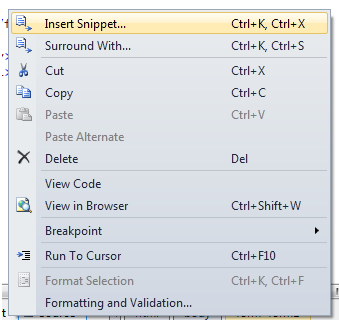
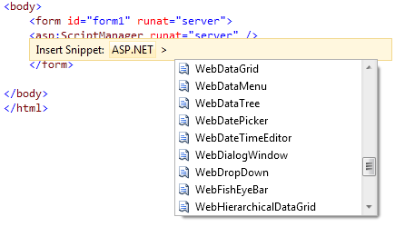

////

|metadata|
{
    "name": "markup-snippet-support",
    "controlName": [],
    "tags": ["API","Design Environment"],
    "guid": "18630360-c451-409f-b858-dfb6533034d9",  
    "buildFlags": [],
    "createdOn": "2010-06-03T15:12:11.246445Z"
}
|metadata|
////

= Markup Snippet Support

== Markup Code snippets

Our new release supports markup code snippets in Infragistics ASP.NET controls.

== How to Use Markup Snippets

Right-click on the desired aspx form and select Insert Snippet$$->$$ASP.Net, and then choose the desired snippet by double-clicking it.

When you double-click, for example, on WebDataTree™, the following markup code is generated:

<ig:WebDataTree runat="server" Height="300px" Width="200px">

</ig:WebDataTree>  

There is also a shortcut for every control, as a time-saving feature. For example, if you type “igdt” and hit TAB, you receive the same code as shown above.