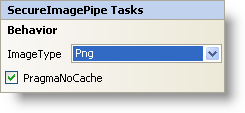

////

|metadata|
{
    "name": "secureimagepipe-smart-tag",
    "controlName": ["WebChart"],
    "tags": ["Design Environment"],
    "guid": "{C3E78067-487B-4B0F-8157-D1E7A8528D8B}",  
    "buildFlags": [],
    "createdOn": "2007-05-02T07:56:25Z"
}
|metadata|
////

= SecureImagePipe Smart Tag

In Visual Studio 2005 (.NET Framework 2.0), each Infragistics ASP.NET control/component is equipped with a Smart Tag. By simply selecting the control/component, a Smart Tag anchor appears. When you click this anchor, a pop-up panel appears, providing you with quick and easy access to the most common properties and settings of the control/component.

The SecureImagePipe™ Smart Tag contains the following sections:

* Behavior -- Provides easy access to common properties such as AllowPaging. You can also edit templates from this section.

See below for a description of the item (e.g., field, drop-down list, checkbox) in each section, as well as the item's corresponding property in the properties grid.

[options="header", cols="a,a,a"]
|====
|Behavior|Description|CorrespondingProperty

|ImageType
|Specifies the image file format used to stream the chart.
| pick:[asp-net="link:{ApiPlatform}webui.ultrawebchart{ApiVersion}~infragistics.webui.ultrawebchart.secureimagepipe~imagetype.html[ImageType]"] 

|PragmaNoCache
|Cache setting of the chart image in the browser.
| pick:[asp-net="link:{ApiPlatform}webui.ultrawebchart{ApiVersion}~infragistics.webui.ultrawebchart.secureimagepipe~pragmanocache.html[PragmaNoCache]"] 

|====