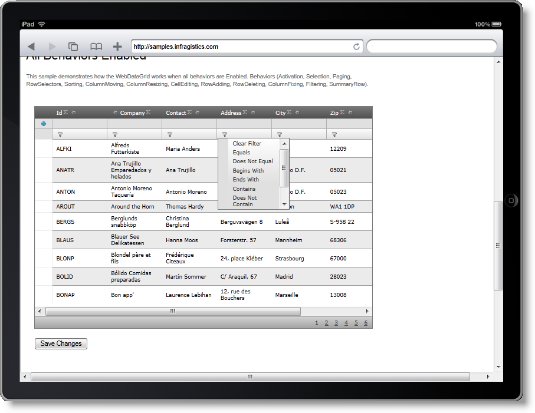

////

|metadata|
{
    "name": "touch-support-in-netadvantage-for-aspnet",
    "controlName": [],
    "tags": ["Application Scenarios","FAQ","Getting Started","How Do I"],
    "guid": "4ac8de04-66c0-4c4b-a062-159aae0d2135",  
    "buildFlags": [],
    "createdOn": "2011-10-25T08:39:46.751839Z"
}
|metadata|
////

= Touch Support in Infragistics ASP.NET

== Topic Overview

== Purpose

This topic explains the touch support of Infragistics ASP.NET controls and details the changes and limitations of the controls’ features with regards to this support.

== In this topic

This topic contains the following sections:

* <<tablet_programming_overview,Tablet Programming Overview>>

** <<general_programming_requirements,General programming requirements of the tablet platforms>>
** <<event_handling,Event handling in tablet platforms>>

* <<touch_support_overview,Infragistics ASP.NET {ProductVersion} Touch Support Overview>>

** <<supported_controls,Supported controls>>
** <<touch_support_scope,Touch support scope>>

* <<control_specific_information,Control-Specific Information About Touch Support>>

** <<wdg_whdg_touch_support,WebDataGrid and WebHierarchicalDataGrid touch support>>
** <<wdt_touch_support,WebDataTree touch support>>
** <<wdm_touch_support,WebDataMenu touch support>>
** <<wvp_touch_support,WebVideoPlayer touch support>>

* <<related_topics,Related Topics>>
* <<related_articles,Related Articles>>

== Introduction

Infragistics ASP.NET {ProductVersion} pack expands the supported platforms to cover tablets as well. Now you can use the same functionalities that ASP.NET controls have, except drag-and-drop.

The Infragistics touch support includes scrolling, which is vital for running them under tablets. The controls that have it (see <<supported_controls,Supported Controls>> below) have been redesigned: they feature special styles, the clickable area has been enlarged, the rendering follows the tablet requirements, and interacting with the controls on such platforms is easy.

== Tablet Programming Overview

== General programming requirements of the tablet platforms

Tablets differ from PCs in the way the user interacts with the device. The user uses only their fingers to touch and navigate the tablet screen. They also employ different architecture for showing web page content and getting the user’s response. That’s why for any site to run on a tablet platform, it needs to be redesigned according to tablets’ requirements. In most cases, this means the new touch client events (ontouchstart, ontouchmove, ontouchend, ontouchcancel), as well as redesigning the site content to make it easier to work with. These requirements vary across browsers and platforms.

As getting into details about tablet programming is beyond the scope of this topic, for further details refer to link:http://developer.apple.com/library/safari/#documentation/AppleApplications/Reference/SafariWebContent/Introduction/Introduction.html[Development in Safari].

== Event handling in tablet platforms

Running controls on tablets mandates the support of events that are specific for these platforms, namely:

* One-finger events – fired when using one finger, e.g. scrolling a page or clicking anywhere on the page
* Two-finger events – fired when using two fingers, e.g. zooming in and out
* Orientation events – fired when the device is being rotated

These kinds of events reflect the nature of user interaction and the way it is recognized by the tablet. For detailed information about handling events and gestures, refer to link:http://developer.apple.com/library/safari/#documentation/AppleApplications/Reference/SafariWebContent/HandlingEvents/HandlingEvents.html[Handling Events] in the Safari Developer Library.

== Infragistics ASP.NET {ProductVersion} Touch Support Overview

== Supported controls

The controls from the Infragistics ASP.NET suit are available for tablet platforms. In this document we will make review for the following controls, that have been modified to fully support tablet platforms:

* WebDataGrid
* WebHierarchicalDataGrid
* WebDataTree
* WebDataMenu
* WebVideoPlayer

== Touch support scope

The full support of these controls means that they:

* are visible on tablet platforms
* support all touch-specific events
* fit the required sizes

Because of the specific limitations of tablets, drag-and-drop behavior is not supported. Some of the features that have drag-and-drop behavior can achieve the same effect under tablets using the code behind. For example, you can initially group the WebDataGrid columns from the code behind, but cannot do it dynamically at run time.

== Control-Specific Information About Touch Support

The blocks below provide detailed touch support information for each supported control.

== WebDataGrid and WebHierarchicalDataGrid touch support

*Figure : An implementation of the WebHierarchicalGrid viewed in iPad Safari browser*

Either the WebDataGrid and WebHierarchicalDataGrid render the same on a tablet browsers as they do on PC browsers, as the picture above testifies. There are a few differences however that come about when the user interacts with these controls.

Table 1 describes the tablet-specific behavior of the controls’ features noting some special cases and differences from the “normal” PC-based browser behavior.

*Table 1: WebDataGrid/WebHierarchicalDataGrid feature behavior for tablets*

Legend:

 - Feature works the same as on PCs.

! – Feature works with some limitations.

– Feature works somewhat differently than on PC due to the specifics of the tablet environment.

– Feature not available.

 – Feature not available, but a workaround exists.

[options="header", cols="a,a,a"]
|====
|Feature|Availability|Behavior Description

|Activation
|image::images/workaround.png[]
|Same as on PCs.

|Column Fixing
|image::images/workaround.png[]
|Same as on PCs. You need to click on the feature image column fix icon.

|Column Moving
|image::images/noworkaround.png[] 

|Not available at run time, because drag-and-drop is not supported, but can be set from code behind.

|Column Resizing
|image::images/noworkaround.png[] 

|Not available at run time, because drag-and-drop is not supported, but can be set using client or server code.

|Drag-and-drop
|image::images/noworkaround.png[]
|Not available.

|Editing Core
|image::images/workaround.png[]
|Same as on PCs. (Adding, updating and deleting rows.)

|Expand/Collapse (WebHiearchicalDataGrid only)
|image::images/workaround.png[] 

|The whole HTML TD element that contains the expanding image is a link, so in order to make it’s easier to be tap on it with the a finger.

|Filtering
|image::images/workaround.png[] 

!
|When entering the filter input, filter loses focus due to a Safari bug. That’s why you will need to tap on it manually to re-gain on the focus. This bug is presented in iOS4 version and lower.

|Group by
|image::images/noworkaround.png[] 

|Because drag- and- drop is not supported, you can implement grouping only group by using the code behind.

|Paging
|image::images/workaround.png[] 

|Same as on PCs. The paging behavior is working, but the user needs to be precise when pressing touching the paging icons.

|Scrolling
|image::images/workaround.png[]
|You can use scrolling including inertia support.

|Selection (single)
|image::images/workaround.png[]
|Same as on PCs. User can make a single selection, either in a grid row or cell, or a tree node.

|Selection (multiple)
|image::images/noworkaround.png[]
|Not available.

|Sorting
|image::images/workaround.png[]
|Same as on PCs. You need to tap on the header of the column to sort it.

|Summaries
|image::images/workaround.png[]
|Summaries are working. Clicking anywhere within the HTML LI element unmarks the checkbox, that toggles the summary enabled/disabled.

|====

== WebDataTree touch support

*Figure : An implementation of the WebDataTree viewed in iPad's browser*

The WebDataTree renders the same on tablet browsers as it does on PC browsers, but there are some differences in the way the user interacts with the tree. Table 2 describes the tablet-specific behavior of the controls’ features noting some special cases and differences from the “normal” PC-based browser behavior.

*Table 2: WebDataTree feature behavior on tablets*

Legend:

 - Feature works the same as on PCs.

! – Feature works with some limitations.

– Feature works somewhat differently than on PC due to the specifics of the tablet environment.

– Feature not available.

 – Feature not available, but a workaround exists.

[options="header", cols="a,a,a"]
|====
|Feature|Availability|Description

|Activation
|image::images/workaround.png[]
|Same as on PCs. Works the same as in PC browsers.

|Checkboxes
|image::images/workaround.png[] 

|Working Works in both Bi-State and Tri-State modes.

|Drag-and-drop
|image::images/noworkaround.png[]
|Not available.

|Expand/Collapse
|image::images/workaround.png[]
|Same as on PCs. Works the same as in PC browsers.

|Node editing
|image::images/workaround.png[] 

|To enable note editing,, when the WebDataTree is run underon a tablet, the EnableOnSingleClickWhenActive is enabled. That’s This enables editing nodes why by clicking the note caption you will be able to edit nodes in WebDataTree.

|Selection (multiple)
|image::images/noworkaround.png[] 

|Because multiple selections are not possible, use checkboxes for selection.

|Selection (single)
|image::images/workaround.png[]
|Same as on PCs.

|====

== WebDataMenu touch support

*Figure : Image representing how the WebDataMenu looks under iPad's Safari*

The WebDataMenu renders the same on tablet browsers as it does on PC browsers, but there are some differences in the way the user interacts with the menu. Table 3 describes the tablet-specific behavior of the controls’ features noting some special cases and differences from the “normal” PC-based browser behavior.

*Table 3: WebDataMenu feature behavior on tablets*

Legend:

 - Feature works the same as on PCs.

! – Feature works with some limitations.

– Feature works somewhat differently than on PC due to the specifics of the tablet environment.

– Feature not available.

[options="header", cols="a,a,a"]
|====
|Feature|Availability|Description

|Selection
|image::images/workaround.png[]
|Same as on PCs. Works the same as in PC browsers.

|Scrolling
|image::images/workaround.png[] 

|When the scroll buttons are tapped, the menu starts scrolling until the end of the list. If the user wants to stop before the end, they have to tap anywhere inside the browser to make the scrolling to stop.

|Close menu on click
|image::images/workaround.png[]
|Same as on PCs. Works the same as in PC browsers.

|Activation
|image::images/workaround.png[]
|Same as on PCs. Works the same as in PC browsers.

|Expand/Collapse
|image::images/workaround.png[]
|Same as on PCs. Works the same as in PC browsers.

|Expand/Collapse of 

Submenus
|image::images/workaround.png[] 

|The first tapping on an item with a submenu opens the submenu and the second tapping selects the underlying option in the submenu.

|Resizing
|image::images/workaround.png[] 

|Same as on PCs. The scroll bar is shown when the screen size becomes too small to display the entire content.

|====

== WebVideoPlayer touch support

When running WebVideoPlayer on a mobile device, the default device video player controls are rendered, unless the link:http://modernizr.com/[Modernizr] JavaScript library is undefined. If for some reason you do not have the Modernizr library available on your page, then the igVideoPlayer control is rendered, which in some cases may have fewer touch capabilities than the default device video player. That is why when Modernizr library is available igVideoPlayer falls back to the default device video player.

== Related Topics

link:web-whats-new.html[What’s New]

link:known-issues-known-issues-and-breaking-changes-revision-history.html[Known Issues]

link:webdatagrid-api-overview.html[WebDataGrid Overview]

link:webhierarchicaldatagrid-api-overview.html[WebHierarchicalDataGrid Overview]

link:webdatatree-api-overview.html[WebDataTree Overview]

link:webdatamenu-api-overview.html[WebDataMenu Overview]

== Related Articles

link:http://developer.apple.com/library/safari/#documentation/AppleApplications/Reference/SafariWebContent/HandlingEvents/HandlingEvents.html[Handling Events]

link:http://modernizr.com/[Modernizr]