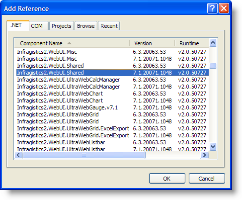

////

|metadata|
{
    "name": "web-adding-an-assembly-to-a-project",
    "controlName": [],
    "tags": ["FAQ","Getting Started"],
    "guid": "{95A46BFB-7D61-47F0-8F18-C6FB6D114BA2}",  
    "buildFlags": [],
    "createdOn": "0001-01-01T00:00:00Z"
}
|metadata|
////

= Adding an Assembly to a Project

Normally, manually adding Infragistics ASP.NET assembly references to your project is not required, since Visual Studio® is able to automatically add the appropriate references to the project as you place Infragistics ASP.NET tools onto the design surface. However, there will be times when you want or need to manually add a reference to an assembly to your project. Adding an assembly to your Visual Studio project is simple.

.Note:
[NOTE]
====
For information on deploying Infragistics ASP.NET assemblies used in your application, see link:web-deploying-your-application.html[Deploying Your Application].
====

*To add an assembly to your project:*

[start=1]
. In the Solution Explorer, right-click the Web site and select Add Reference…. Alternatively, you can select Add Reference from the Website menu.

[start=2]
. Locate the assembly that you want to add, and click OK. The assembly reference is added.

The Add Reference dialog box allows you to select and add multiple references at the same time. To learn more about adding references to your project. See the following topics in the MSDN Library:

* link:http://msdn.microsoft.com/en-us/library/ez524kew(v=vs.80).aspx[Project References]
* link:http://msdn.microsoft.com/en-us/library/wkze6zky(v=vs.80).aspx[Adding and Removing References]
* link:http://msdn.microsoft.com/en-us/library/ftcwa60a(v=vs.80).aspx[Add Reference Dialog Box]