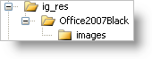

////

|metadata|
{
    "name": "web-enabling-application-styling-using-the-appstylingmanager",
    "controlName": [],
    "tags": ["How Do I","Styling"],
    "guid": "{9E47F912-6489-4155-BD22-E33C8C31D54B}",  
    "buildFlags": [],
    "createdOn": "2006-01-12T08:32:11Z"
}
|metadata|
////

= Enabling Application Styling Using the AppStylingManager

In some scenarios, you may want to enable Application Styling at run time instead of design time. You can accomplish this by using the AppStylingManager component (located in Infragistics.WebUI.Shared assembly). However, you will need to create the necessary directories/sub-directories in your project and copy all the necessary files (CSS and images) for Application Styling to be applied properly.

.Note:
[NOTE]
====
The following approach will work for a single Web Form. If you want to enable Application Styling for your entire Web site, see link:web-enabling-application-styling-using-the-web-config-file.html[Enabling Application Styling Using the web.config File].
====

*To enable Application Styling using the AppStyleMananger component:*

[start=1]
. In the Solution Explorer, right-click the Web site you want to enable for Application Styling and select New Folder. Name the folder "ig_res".
[start=2]
. Create a sub-folder for the ig_res folder by right-clicking the ig_res folder, selecting New Folder and naming it "Office2007Black".
[start=3]
. Create a sub-folder for the Office2007Black folder by right-clicking the Office2007Black folder, selecting New Folder and naming it "images" as shown in the following screen shot.

[start=4]
. Right-click the ig_res folder and select Add Existing Item…. Navigate to the following folder where the StyleSets are installed by default: {InstallPathXP}\ASP.NET\StyleLibraries. Copy all the CSS files and images, and paste them into the corresponding folders created in the preceding steps.

.Note:
[NOTE]
====
Alternatively, in Windows Explorer, navigate to the default installation path specified in step 4. Find the folder with the desired StyleSet (i.e. Office2007Black), then copy and paste it into the ig_res folder. Microsoft® Visual Studio® will create the necessary sub-folders and copy all files.
====

[start=5]
. Open your Web site's Web.config file. Near the top of the file, find the opening <configuration> tag and place the following XML excerpt underneath it. This XML excerpt enables Application Styling for the Web site.

*In XML:*

----
<configSections>
        <section name="infragistics.web" 
          type="System.Configuration.SingleTagSectionHandler,System, 
          Version=1.0.3300.0, Culture=neutral, PublicKeyToken=b77a5c561934e089" />
</configSections>
----

In the ASPX code-behind, place the following example code in the Page_Load event. This code enables Application Styling for the page and sets the StyleSet to Office2007Black.

.Note:
[NOTE]
====
Make sure StyleSetName's value has the correct casing when setting it in code or in the Web.config file. By default, Visual Studio 2005 and Visual Studio 2008 sets the DOCTYPE to XHTML. If the Web Form's DOCTYPE is set to XHTML, it enforces case-sensitivity even though the property accepts a string. For example, if you type "office2007black" or "Office2007black" instead of "Office2007Black", the style will not display correctly. However, this is not a problem if the Web Form's DOCTYPE is set to HTML.
====

*In Visual Basic:*

----
Private Sub Page_Load(ByVal sender As System.Object, _ ByVal e As System.EventArgs) Handles MyBase.Load
'Application Styling for ASP.NET Controls
Infragistics.WebUI.Shared.AppStyling.AppStylingManager.Settings.EnableAppStyling = true
Infragistics.WebUI.Shared.AppStyling.AppStylingManager.Settings.StyleSetName = "Office2007Black"
'Application Styling for Infragistics ASP.NET AJAX Controls
Infragistics.Web.UI.AppStylingManagerDesign.Settings.EnableAppStyling = true
Infragistics.Web.UI.AppStylingManagerDesign.Settings.StyleSetName = "Office2007Black"
End Sub
----

*In C#:*

----
private void Page_Load(object sender, System.EventArgs e) 
{
//Application Styling for ASP.NET Controls
Infragistics.WebUI.Shared.AppStyling.AppStylingManager.Settings.EnableAppStyling = true;
Infragistics.WebUI.Shared.AppStyling.AppStylingManager.Settings.StyleSetName = "Office2007Black";
//Application Styling for Infragistics ASP.NET AJAX Controls
Infragistics.Web.UI.AppStylingManagerDesign.Settings.EnableAppStyling = true;
Infragistics.Web.UI.AppStylingManagerDesign.Settings.StyleSetName = "Office2007Black";
 }
----

.Note:
[NOTE]
====
Setting the properties of either AppStylingManager or AppStylingManagerDesign will result in styling all Infragistics ASP.NET controls.
====

[start=6]
. Run your application. You will now see the Office2007Black style applied to all the Infragistics ASP.NET controls in your project.