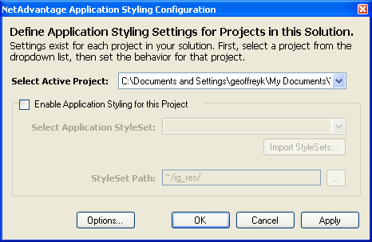
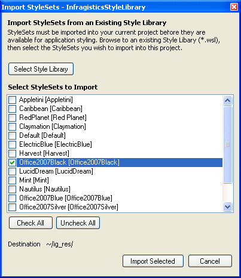

////

|metadata|
{
    "name": "web-enabling-application-styling-using-the-netadvantage-application-styling-configuration-tool",
    "controlName": [],
    "tags": ["Design Environment","Styling"],
    "guid": "{027AF003-843A-4C6C-BF59-A777C56A1E80}",  
    "buildFlags": [],
    "createdOn": "2006-07-12T11:48:09Z"
}
|metadata|
////

= Enabling Application Styling Using the Infragistics Application Styling Configuration Tool

.Note:
[NOTE]
====
Add-ins are deprecated since Visual Studio 2015. If you want to style your projects directly from within Microsoft® Visual Studio® 2015 you can use Infragistics AppStyling Extension. The whole functionality from the add-in is preserved and you can use this topic as a reference. To run the extension, open the *Tools* menu and select ‘Infragistics AppStyling Extension 16.2’. If you use previous version of Microsoft® Visual Studio®, you can still use the add-in.
====

Separate .vsix instalator is provided for 2015.2 and 2015.1.

Application Styling can be enabled at design time using the Infragistics Application Styling Configuration, which is a Microsoft® Visual Studio® add-in. This add-in allows you to control various aspects of Application Styling from one simple console. For more information, see link:web-netadvantage-application-styling-configuration-tool.html[Infragistics Application Styling Configuration Tool].

*To enable Application Styling using the Infragistics Application Styling Configuration Tool:*

[start=1]
. Open the project for which you want to enable Application Styling.

[start=2]
. In the Tools menu, select Infragistics Application Styling Configuration. The configuration tool opens.

[start=3]
. Select the "Enable Application Styling for this Project" check box to turn on Application Styling. This enables all the options below this check box.
[start=4]
. Click Import StyleSets. The Import StyleSets dialog box opens.
[start=5]
. In the dialog box, select the StyleSets you want to import into your project, and click OK.

.Note:
[NOTE]
====
The StyleSets shown in the Import StyleSets dialog box are the same ones that are available for selection in the Default App Style Source Path. For information on how to change this path, see link:web-netadvantage-application-styling-configuration-tool.html[Infragistics Application Styling Configuration Tool].
====

[start=6]
. From the Application Style Set drop-down list, select the newly imported StyleSet you want to use.
[start=7]
. Click Apply, then click OK.
[start=8]
. Your project is now configured to use Application Styling, and will apply the StyleSet you have selected to all Infragistics ASP.NET controls.