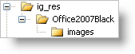

////

|metadata|
{
    "name": "web-enabling-application-styling-using-the-web-config-file",
    "controlName": [],
    "tags": ["How Do I","Styling"],
    "guid": "{612CB7D1-2DF3-4701-9C30-D84F1DAE6A40}",  
    "buildFlags": [],
    "createdOn": "2006-01-12T08:33:09Z"
}
|metadata|
////

= Enabling Application Styling Using the web.config File

The Infragistics Application Styling Configuration design-time tool enables Application Styling by placing the necessary XML tags in the project's Web.config file. For more information, see link:web-netadvantage-application-styling-configuration-tool.html[Infragistics Application Styling Configuration Tool].

If you want to enable Application Styling for your entire Web application without using the Application Styling Configuration Tool, you can add these XML tags manually. However, you will need to create the necessary directories/sub-directories in your project and copy all the necessary files (CSS and images) to apply Application Styling properly.

*To enable Application Styling using the Web.config file:*

[start=1]
. In the Solution Explorer, right-click the Web site you want to enable for Application Styling and select New Folder. Name the folder "ig_res".
[start=2]
. Create a sub-folder for the ig_res folder by right-clicking the ig_res folder, selecting New Folder and naming it "Office2007Black".
[start=3]
. Create a sub-folder for the Office2007Black folder by right-clicking the Office2007Black folder, selecting New Folder and naming it "images" as shown in the following screen shot.

[start=4]
. Right-click the ig_res folder and select Add Existing Item…. Navigate to the following folder where the StyleSets are installed by default: {InstallPathXP}\ASP.NET\StyleLibraries. Copy all the CSS files and images, and paste them into the corresponding folders created in the preceding steps.

.Note:
[NOTE]
====
Alternatively, in Windows Explorer, navigate to the default installation path specified in step 4. Find the folder with the desired StyleSet (i.e. Office2007Black), then copy and paste it into the ig_res folder. Microsoft® Visual Studio® will create the necessary sub-folders and copy all files.
====

[start=5]
. Open your Web site's Web.config file. Near the top of the file, find the opening <configuration> tag and place the following XML excerpt underneath it. This XML excerpt enables Application Styling for the Web site.

*In XML:*

----
<configSections>
        <section name="infragistics.web" 
          type="System.Configuration.SingleTagSectionHandler,System, 
          Version=1.0.3300.0, Culture=neutral, PublicKeyToken=b77a5c561934e089" />
</configSections>
<infragistics.web enableAppStyling="true" 
  styleSetName="Office2007Black" styleSetPath="~/ig_res/" />
----

[start=6]
. Run the application. You will see that the Office2007Black style has been applied to all the Infragistics ASP.NET controls in your project.