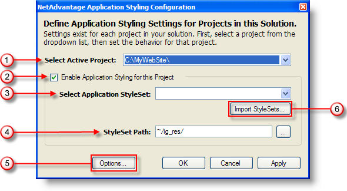
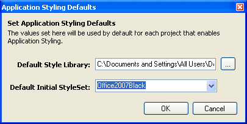

////

|metadata|
{
    "name": "web-netadvantage-application-styling-configuration-tool",
    "controlName": [],
    "tags": ["Design Environment","Styling"],
    "guid": "{88CB50AF-A6DC-4F17-B63A-F5DFC81A10C3}",  
    "buildFlags": [],
    "createdOn": "2006-01-12T08:39:53Z"
}
|metadata|
////

= Infragistics Application Styling Configuration Tool

.Note:
[NOTE]
====
Add-ins are deprecated since Visual Studio 2015. If you want to style your projects directly from within Microsoft® Visual Studio® 2015 you can use Infragistics AppStyling Extension. The whole functionality from the add-in is preserved and you can use this topic as a reference. To run the extension, open the *Tools* menu and select ‘Infragistics AppStyling Extension 16.2’. If you use previous version of Microsoft® Visual Studio®, you can still use the add-in.
====

Separate .vsix instalator is provided for 2015.2 and 2015.1.

The Infragistics Application Styling Configuration Tool offers you a convenient way to style your projects directly from within Microsoft® Visual Studio® with Application Styling Framework™ (ASF) StyleSet libraries created using Infragistics AppStylist® for ASP.NET.

The tool is an add-in accessible from within Visual Studio. It allows you to apply any ASF StyleSet (libraries of consistently themed CSS files and graphic images) you have installed. The Infragistics ASP.NET product includes a number of predefined ASF StyleSets created by visual designers for Infragistics ASP.NET controls. Using Infragistics AppStylist, your visual designers can create additional ASF StyleSets for your ASP.NET applications.

Using the Infragistics Application Styling Configuration Tool, you can also toggle ASF support on or off in the Infragistics ASP.NET controls that appear in your application by selecting the "Enable Application Styling for this Project" check box. The configuration tool saves you time by configuring ASF default settings, which are automatically saved in your Web application's Web.Config file.

See below for an explanation of each option in the Infragistics Application Styling Configuration Tool.

[start=1]
. *Select Active Project* -- Application Styling is enabled on a per-project basis; if your solution contains more than one project you can use this drop-down list to switch between projects.
[start=2]
. *Enable Application Styling for this Project* -- Select this check box if you want to enable Application Styling for the specified project. When this check box is selected, the necessary code is added to the Web.Config file.
[start=3]
. *Select Application StyleSet* -- Specifies the StyleSet that the project will use, if Application Styling is enabled.
[start=4]
. *StyleSet Path* -- Specifies the location where Application Styling will look for the StyleSet's files in the local project.
[start=5]
. *Options* -- Opens the Application Styling Options dialog box. See the "Application Styling Options Dialog Box" section below for more information.
[start=6]
. *Import StyleSets* -- Allows you to import StyleSets into your project, so that you can select the StyleSet from the Application Style Set drop-down list.

== Application Styling Options Dialog Box

See below for an explanation of each option in the dialog box.

[start=1]
. *Default Style Library* -- Specifies the location from which you can import StyleSets into your project after clicking the Import StyleSets button in the Infragistics Application Styling Configuration Tool.
[start=2]
. *Default Initial StyleSet* -- Specifies the StyleSet that will be applied to any project for which Application Styling is enabled. The drop-down list does not specify StyleSets that are in the Application Style Set drop-down list.