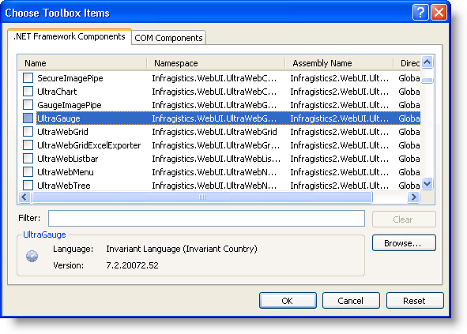
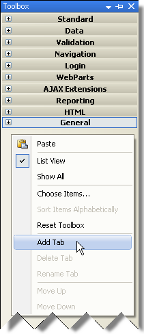

////

|metadata|
{
    "name": "web-netadvantage-web-client-aspnet",
    "controlName": [],
    "tags": ["Getting Started"],
    "guid": "{B5128545-997D-4005-9F8C-A9F8452E6F1A}",  
    "buildFlags": [],
    "createdOn": "0001-01-01T00:00:00Z"
}
|metadata|
////

= Infragistics ASP.NET 20{ProductVersion}

Before you start using Infragistics ASP.NET, be sure to read through the topics in this section to ensure that you are getting the most of out of the product.

* <<ASP_Using_The_Help,Using the Help>>
* link:web-application-styling-framework-asf.html[Application Styling Framework (ASF)]
* <<ASP_Installing_NetAdvantage,Installing Infragistics ASP.NET>>
* <<ASP_Running_Product_Samples,Running ASP.NET Product Samples>>
* <<ASP_Get_Support,Getting Support>>

[[ASP_Using_The_Help]]

== Using the Help

These sections are designed to aid a user when they are navigating the help. The sections below contain any changes or new additions to the help.

== Help Features

The Infragistics ASP.NET help is available to assist you in finding the information that you need to understand and use the controls and components of the Infragistics ASP.NET.

.Note:
[NOTE]
====
The Help Center is no longer installed as part of the Infragistics ASP.NET product. For help on how to use Infragistics ASP.NET, please refer to the installed/online help, or the ASP.NET Samples Browser.
====

=== Tabs

In the installed Infragistics ASP.NET help, the bottom of the the left-hand pane of the help window is comprised of the following tabs:

** *Contents* -- Displays books and pages of all of the topics in the online help. Double-click a book to expand it and view its contents (i.e., sub-books and pages). The Contents tab provides an overview of the help structure, as well as a way to easily navigate through the topics.
** *Index* -- Displays a list of keywords that are associated with topics in the help. As you type a word, the Index feature automatically scrolls to the keyword(s) that matches your word the closest. The Index tab is useful in that it provides you with a complete alphabetical listing of the key words in the help.
** *Help Favorites* -- Displays any help topics or web sites that you bookmarked via the "Add to Help Favorites" button on the Standard toolbar. It also displays any search queries that you saved via the "Save Search" button on the Standard toolbar.

At the top of the right-hand pane of the help window, there are two tabs:

** *Help Topic* -- Displays the help topic.
** *Search* -- Allows you to search for specific words in the help. The tab generates a list of the topics that contain at least one of the searched words, and displays the list of topics in the main area of the Search tab.

In the online Infragistics ASP.NET help, the left-hand pane is comprised of the Contents and Search tabs only.

=== Filters

Since we provide such an extensive help, we've provided filtering in the installed Infragistics ASP.NET help to make it easier to find the information that you're looking for. The filters allow you to narrow down the results displayed in the Contents and Index tabs.

===== To apply a filter:

At the top of the left-hand window pane, select a filter item from the "Filtered by:" drop-down list. The results displayed in the following tabs are automatically filtered based on the filter you specified:

** Contents
** Index

.Note:
[NOTE]
====
If you close the help after applying a filter, the filter is automatically applied the next time you open the help.
====

===== To clear a filter:

.. At the top of the left-hand window pane, select "Infragistics Software" from the "Filtered by:" drop-down list.
.. The help displays all of its contents, and clears the last applied filter.

=== Navigational Pages

Each section in the help contains links to all of its sub-sections or topics, offering you a convenient entry point to the information that you're looking for.

== Installed Help Filter Categories

In 2007 Volume 3, the filters available in the "Filter by" drop-down list on the Contents and Index pane in the installed help was revamped to minimize the number of filters. The controls are now placed into categories, and these categories are what is available in the drop-down list. The table below shows the available categories, and which control/framework belongs in which category.

.Note:
[NOTE]
====
Some nodes may show in addition to the ones listed under each category. The extra nodes happen because a topic under the extra node is also under a node that should appear in the selected category.
====

[options="header", cols="a,a"]
|====
|Category|ASP.NET

|*Infragistics Software*
|All content is shown

|*Application Styling*
|
* Application Styling Framework 

* WebPageStyler 

|*Charts and Gauges*
|
* GaugeImagePipe 

* SecureImagePipe 

* WebChart 

* WebGauge 

|*Content Layout and Containers*
|
* WebDialogWindow 

* WebGroupBox 

* WebResizingExtender 

* WebSplitter 

* WebTab 

|*Editors*
|
* WebMonthCalendar 

* WebCurrencyEditor 

* WebDatePicker 

* WebDateTimeEditor 

* WebHtmlEditor 

* WebMaskEditor 

* WebNumericEditor 

* WebPercentEditor 

* WebSlider 

* WebTextEditor 

* WebUpload 

|*Extras*
|
* WebImageButton 

* WebVideoPlayer 

|*Grids and Data Presentation*
|
* WebDropDown 

* WebDataGrid 

* WebHierarchicalDataGrid 

* WebHierarchicalDataSource 

* WebDocumentExporter 

* WebExcelExporter 

* WebWordExporter 

|*Libraries and Engines*
|
* Infragistics Excel Engine 

* Infragistics Document Engine 

* Infragistics Word Library 

* WebCalcManager 

|*Navigation*
|
* WebImageViewer 

* WebDataMenu 

* WebExplorerBar 

* WebTab 

* WebDataTree 

|*Scheduling*
|
* WebCalendarView 

* WebDayView 

* WebMonthView 

* WebSchedule 

* WebScheduleInfo 

* WebScheduleOleDbProvider 

* WebScheduleSqlClientProvider 

|====

[[ASP_Installing_NetAdvantage]]

== Installing Infragistics ASP.NET

These topics contain important tips and notes on installing Infragistics ASP.NET:

==== Installing Infragistics ASP.NET on Windows Vista

Starting with the Infragistics ASP.NET 2006 Volume 3 (CLR 2.0) release, you can install Infragistics ASP.NET on the Microsoft® Windows® Vista operating system. Read further for important information about successfully installing Infragistics ASP.NET on Vista.

* Vista is supported only on Visual Studio 2005 and later versions of Visual Studio; is not supported on Visual Studio 2003 and earlier. Therefore, all CLR 1.x versions of Infragistics ASP.NET are not supported on Vista. However, the stand-alone version of the Infragistics AppStylist® product can be installed on Vista.

==== Tips for Installing Infragistics ASP.NET

Sometimes, software installations don't go exactly as planned. We realize that everyone has a different machine setup and we've put together a list of troubleshooting tips that can help ensure that Infragistics ASP.NET installs as smoothly as possible.

* You must be logged in as an Administrator to install Infragistics ASP.NET. This login must also be able to update the system registry.
* Make sure there is enough space for installation, including your temporary files. By default, Windows stores temporary files in the directory C:\WINDOWS\Temp.
* Microsoft® Visual Studio® must be installed and kept closed while installing Infragistics ASP.NET and/or any of the Infragistics ASP.NET utilities (e.g. Toolbox utility)..

* The install should be run from a local hard drive. You might encounter issues if it is run from a network drive.
* If you have already installed the trial version of Infragistics ASP.NET, there is no need to uninstall/reinstall the software. You can simply run the installer file from the appropriate directory (e.g., {InstallPath}) and insert your CD-Key when prompted by the installation wizard.
* If you receive an error stating that your license key is invalid during the installation, first confirm that you entered the key correctly. If you did, cancel the installation (do not "install as trial"), reboot your computer, and run the installer file again, as this clears the incorrect value from the internal cache.
* The file name (including all path information) cannot exceed more than 256 characters -- this is a limitation of Windows®. Our installer works around this internally by using the "8.3" notation, where for example "C:\Program Files\" is referred to as "C:\PROGRA~1\". If you provide a destination folder name that is too long when installing Infragistics ASP.NET, you may receive a "file is missing or corrupt" error.
* This installation will stop and restart IIS in order to install the ASP.NET assemblies, scripts, and virtual folders. This is a DEVELOPER installation package. Please do not use this install to deploy. Review the product help for deployment topics.
* If you install any combination of the Infragistics ASP.NET installs and remove one of them at a later time, this might result in known issues. To resolve these issues, reinstall the appropriate Infragistics ASP.NET product.
* If IIS is installed on Windows® Vista™, you need to follow specific steps prior to running the Infragistics ASP.NET installer. These steps are documented in the Infragistics Knowledge Base article link:http://devcenter.infragistics.com/Support/KnowledgeBaseArticle.aspx?ArticleID=9983[Installing Infragistics ASP.NET on Windows Vista]. After following these steps, you should be able to successfully install Infragistics ASP.NET.
* If you have Infragistics AppStylist for ASP.NET installed, and you modify one of the installed Infragistics Style Library ($$*$$.isl) files or Web Style Library ($$* $$.wsl) files, respectively, and want to save the changes for later, ensure that you save your changes as a different file. This will ensure that your customized .isl or .wsl files are not overwritten by a Infragistics ASP.NET hotfix, or removed during a Infragistics ASP.NET uninstall.

==== Where Files are Placed on your File System During Installation

This topic explains where files and folders that are included in the Installer are placed on your file system.

===== Excel Engine and Document Engine Assemblies

C:\Program Files\Infragistics\{ProductNameVersion}\ASP.NET\CLR2xCLR35\Bin

This folder contains the assemblies for the Excel Engine and Document Engine.

===== Web Presets

XP -- {InstallPathXP}{ProductNameVersion}\Presets\CLR2xCLR35\Web

Vista \ Windows 7 -- {InstallPathVista}{ProductNameVersion}\Presets\CLR2xCLR35\Web

This folder contains all the in-box presets provided by Infragistics for all Infragistics ASP.NET controls and components. You can use a preset to apply a range of formatting and behavior options across the elements of your interface and applications.

There are three different types of presets:

* Look -- Contains information for the visual styling of the control or component
* Behavior -- Contains information on how the control or component will behave
* Look and Behavior -- Contains information on the visual styling of the control or component and the behavior of the control or component

===== Web Styles

During installation you will be given the option to install 'Just Me' or 'All Users'. Depending on your selection, the Templates, Palettes and Styles folders will be placed in different areas.

*In XP - 'Just Me' option selected*

C:\Documents and Settings\[USERID]\MyDocuments\Infragistics\{ProductNameVersion}\ASP.NET\StyleLibraries

*In XP - 'All Users' option selected*

C:\Documents and Settings\AllUsers\Documents\Infragistics\{ProductNameVersion}\ASP.NET\StyleLibraries

*In Vista* {InstallPathVista}{ProductNameVersion}\ASP.NET\StyleLibraries

This folder contains all the styles available within ASP.NET. Styles are used by the Application Styling Framework (ASF) when styling your application.

===== Global Assembly Cache

C:\WINDOWS\assembly\

By default when you install Infragistics ASP.NET, the control assemblies are installed into the GAC.

For more information on installing Infragistics ASP.NET, see Deploying Your Application section in the ASP.NET help.

===== Main Infragistics Installation Folder

{InstallationPath}

This folder and its sub-folders contain the ASP.NET Assemblies that are used at design-time as well as the assemblies that are used at runtime. Other files include utility applications such as the Project Upgrade Utility as well as files that are depended on by certain controls (e.g. the Dictionary files used by WebSpellChecker).

==== Running the Toolbox Utility

The easiest way to add all of the tools available in the Infragistics ASP.NET toolkit to your Visual Studio .NET toolbox is to run the Create Visual Studio Toolbox Tab utility.

===== To run the Toolbox Utility:

[start=1]
. Close all running instances of Visual Studio .NET.
[start=2]
. From the Windows Start menu, navigate to the utility as follows:

*CLR 4.0 :*

Start > All Programs > Infragistics > {ProductNameVersion} > ASP.NET > Utilities > Create Toolbox Tab for CLR 4.0
[start=3]
. The utility installs the Infragistics ASP.NET controls and components in the Visual Studio toolbox. Keep in mind that the installation of the controls and components is dependent on the Infragistics ASP.NET product that is installed. For example, if you install only the Windows Forms product, the utility installs only the Windows Forms controls and components. If you install both Windows Forms and ASP.NET products, the utility installs the controls and components for both products.
[start=4]
. If the utility installed the controls and components for both Windows Forms and ASP.NET products, in Visual Studio, you can choose to show the tabs for both products by right-clicking anywhere in the toolbox, and selecting "Show All Tabs".

.Note:
[NOTE]
====
If Microsoft SQL Server 2005 or SQL Server Management Studio Express (CTP) is installed, and you run the Create Visual Studio Toolbox Tab utility, you will encounter an error because SQL Server overwrites registry settings. For more information on this known issue and the (cautionary) workaround, see the Knowledge Base article, link:http://devcenter.infragistics.com/Support/KnowledgeBaseArticle.aspx?ArticleID=8624[Toolbox Utility Fails to Load (CLR 2.0)], on Infragistics' DevCenter.
====

==== Using the Choose Toolbox Items Dialog Box

As an alternative to Running the Toolbox Utility to add Infragistics ASP.NET controls/components to the Visual Studio .NET toolbox, you can add the tools manually using the Choose Toolbox Items dialog box.

===== To manually add Infragistics ASP.NET controls and components:

[start=1]
. To create a new toolbox tab, right-click anywhere on the toolbox and select Add Tab.
[start=2]
. In the empty field at the bottom of the toolbox, type "ASP.NET {ProductVersion}" and press ENTER.
[start=3]
. Click the newly added tab.
[start=4]
. Right-click anywhere on the toolbox and select "Choose Items..." to open the Choose Toolbox Items dialog box.

[start=5]
. Scroll through the list, and select the check boxes corresponding to the Infragistics ASP.NET controls and components that you want to add to the toolbox.

.Note:
[NOTE]
====
If you want to add the WebResizingExtender control to the toolbox, make sure that you have already installed Microsoft® ASP.NET 2.0 AJAX Extensions; otherwise, you will receive an error message. To install the ASP.NET 2.0 AJAX Extensions, you can run the following installer, which is located in the default installation directory for the Infragistics ASP.NET product: {InstallPath}\ASPAJAXExtSetup.msi.
====

[start=6]
. Click OK.

==== Dragging Assemblies from the Bin Folder

As an alternative to Running the Toolbox Utility to add Infragistics ASP.NET controls/components to the Visual Studio .NET toolbox, you can drag Infragistics' assemblies from your Bin folder to the Microsoft® Visual Studio® toolbox.

*To drag Infragistics' assemblies from your Bin folder to the Visual Studio toolbox:*

[start=1]
. In the Visual Studio IDE, make sure that the toolbox is visible by selecting Toolbox on the View menu.
[start=2]
. Right-click anywhere on the toolbox and select Add Tab.

[start=3]
. Give the tab a meaningful name such as "Infragistics ASP.NET", you may also want to add the volume number (e.g., 8.1, 7.3, 7.2, 7.1) as a suffix.
[start=4]
. Repeat steps 2 and 3 for all the tabs you want to create.
[start=5]
. In Windows Explorer, navigate to the Bin directory where the Infragistics ASP.NET assemblies are installed. The assemblies contain the DLLs that you want to add:

** ASP.NET -- {InstallPath}\CLR3.5\Bin

[start=6]
. Select the DLLs that contain the Infragistics ASP.NET controls/components you want to add to the Visual Studio toolbox.
[start=7]
. Drag the DLLs over to the Visual Studio tab you created in steps 2 to 4.

.Note:
[NOTE]
====
If you add all the tools to the toolbox at the same time, it may take a few seconds for Visual Studio to add them all.
====

[[ASP_Running_Product_Samples]]

== Running ASP.NET Product Samples

When using the shortcut off the Programs menu to launch the Infragistics ASP.NET product samples, you may receive a "Page not found" error. The reason for this error is that the page is trying to load before the local IIS server has finished loading.

To resolve this issue, perform either of the following steps:

* Wait until the IIS server finishes loading, then refresh the page. You can verify whether the server is running by looking for the icon in the notification area (lower right-hand corner) of your screen.
* Shut down the IIS server, and launch the Infragistics ASP.NET samples using the shortcut. This should resolve the issue because the IIS server loads faster after it is first loaded.

If you attempt to use the shortcut off the Programs menu to launch the samples while the IIS server is already running, you may encounter issues, as the link will attempt to start a server on the same port as the one already running. To resolve this issue, stop the current server that is running.

[[ASP_Get_Support]]

== Getting Support

If you own a copy of Infragistics ASP.NET, you are entitled to certain benefits regarding support services offered by Infragistics.

== Creating a Member Profile

Visit the "My Infragistics" area of link:http://www.infragistics.com/[Infragistics' Web site], and create a link:https://www.infragistics.com/my-account/register[Member Profile]. It is important that your most current information is entered into your Member Profile, this will ensure that our Support Service Department can deliver support correspondence and subscription upgrades to you.

== Registering your Product Key

After creating a Member Profile, register your Product Key to your MemberID by visiting the link:https://www.infragistics.com/my-account/register-product/[Product Registration] page. This will provide you with superior technical support services quickly and conveniently. Your MemberID is connected to your personal profile. Your registration identifies you as the active developer entitled to use and request support for the Infragistics product you have registered.

== Getting MemberID Information

You can always visit your link:https://www.infragistics.com/my-account[My Account] page and review your purchases, issued subscription upgrade keys and registered keys online, 24 hours a day, 7 days a week. After logging in with your MemberID, you'll be able to view vital information including product keys and subscription service and status.

== Getting Help

A wealth of valuable information is available at our link:http://devcenter.infragistics.com/Default.aspx[DevCenter]. DevCenter is a customer community location for self-service support information, technical articles, reference applications and much more. For more information on what help is available, hover your mouse over the "Support" menu item in the left pane of DevCenter.

Important link:http://www.infragistics.com/support/documentation.aspx#SupportPolicies[Support Policies] and phone support contact information is also available on DevCenter.

.Note:
[NOTE]
====
You must have valid priority support to access phone support.
====

Each Infragistics product registered user can submit requests for technical support via the Web site. To log an incident or start any support issue, please log on to DevCenter to link:http://www.infragistics.com/support/documentation.aspx#SupportPolicies[Submit a Support Issue] and enter your MemberID. For your convenience, you can also attach a sample project if applicable.

== Product Life Cycle

Infragistics Product Life Cycle information is available in PDF format and provides the following information:

* name and version of the Infragistics tools
* product maintenance (bug fix) period
* product support period
* product status

Click link:http://download.infragistics.com/download/pubs/ProductLifeCycle.pdf[here] to download the PDF file.

For issues related to your account, product ownership, or registration, please e-mail link:mailto:Registrations@Infragistics.com[Registrations@Infragistics.com]. Include your name and product key (if known) so that we may better assist you. You can also call (609) 448-2000 9 a.m. to 5 p.m., Monday to Friday, EST US.