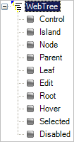

////

|metadata|
{
    "name": "web-role-priority",
    "controlName": [],
    "tags": ["How Do I","Styling"],
    "guid": "{B193F95F-A3E2-4421-A56A-9A42710E0C8A}",  
    "buildFlags": [],
    "createdOn": "2006-01-12T08:38:28Z"
}
|metadata|
////

= Role Priority

An important thing to understand about Roles is that "priorities" are assigned to them. The Application Styling Framework™ (ASF) uses these priorities to determine when that role should be rendered. This rendering order is critical because it is what allows Role Inheritance to work.

After you create a Style Library in Infragistics AppStylist® for ASP.NET, the tree structure in the left-hand pane displays a "Roles" node. Under the Roles node, if you expand a control, you will see the available roles for that control. The precedence order is from first to last, meaning the first role in the control's section will take precedence first, the second role will take precedence next and so on.

The example screen shot below shows the WebTree's™ Role priority. According to this priority, the roles would be applied in the following order: Control, Island, Node, Parent, Leaf, Edit, Root, Hover, Selected, Disabled. Therefore cascading style sheet (CSS) roles that you define for the Node role will be overridden by similar roles in the Parent role. An example of this would be, if you set the background color for the Node role and then define a background color for the Parent role, the Parent Role's background color will be shown.

== Related Topics

link:web-ui-roles.html[UI Roles]

link:web-role-inheritance.html[Role Inheritance]