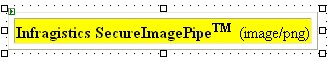

////

|metadata|
{
    "name": "web-secureimagepipe-about-secureimagepipe",
    "controlName": ["WebChart"],
    "tags": [],
    "guid": "{6F19BE8D-D27A-43F9-894E-B9EC60231228}",  
    "buildFlags": [],
    "createdOn": "2006-09-01T00:00:00Z"
}
|metadata|
////

= About SecureImagePipe

The SecureImagePipe™ control is an ASP.NET server control used to stream images through an .ASPX page. When used in combination with the Session  pick:[asp-net="link:infragistics4.webui.ultrawebchart.v{ProductVersion}~infragistics.webui.ultrawebchart.ultrachart~deploymentscenario.html[DeploymentScenario]"]  option of the WebChart™, the control allows you to avoid writing rendered chart image files to disk, instead storing the image files in the ASP.NET session state, and then streaming them to the client.

== Related Topic

link:chart-image-deployment-in-webchart.html[Image Deployment for WebChart]