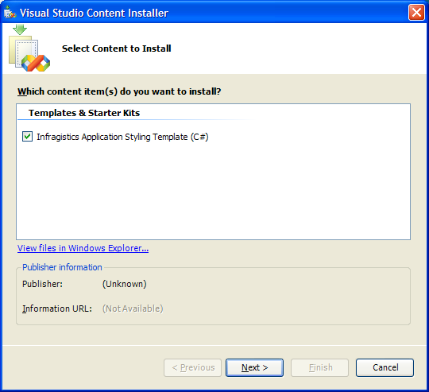
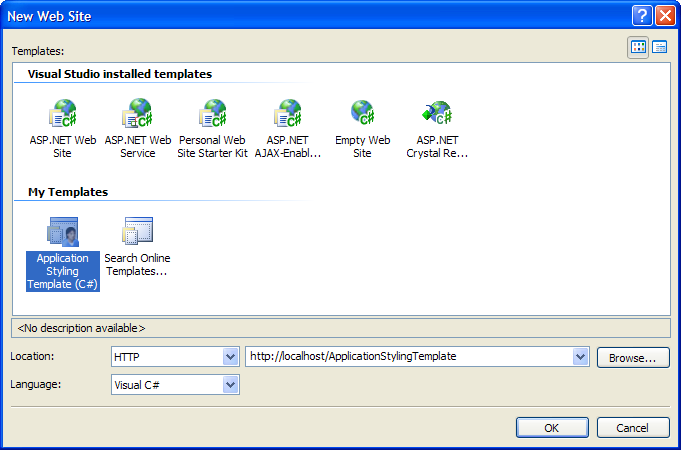

////

|metadata|
{
    "name": "web-using-application-styling-project-templates",
    "controlName": [],
    "tags": ["How Do I","Styling","Templating"],
    "guid": "{D682AE16-4866-415A-B691-CCA1F23A0067}",  
    "buildFlags": [],
    "createdOn": "0001-01-01T00:00:00Z"
}
|metadata|
////

= Using Application Styling Project Templates

Infragistics ASP.NET Application Styling offers project templates in Microsoft® Visual Studio® .NET 2005. You can use these project templates to create an empty Web site with Application Styling enabled.

*To install the Application Styling project templates:*

[start=1]
. Access the project templates from the following default shortcut path: Start > All Programs > Infragistics > {ProductNameVersion} > Get Going > Visual Studio 2005 Starter Kits.
[start=2]
. An HTML page opens, listing all the starter kits and project templates included with Infragistics ASP.NET. At the bottom of the page are links for the Application Styling project templates.
[start=3]
. Click the appropriate link, depending on whether you want to use the C# or Visual Basic .NET project template.
[start=4]
. A Visual Studio Content Installer (.vsi) launches.

[start=5]
. Follow the steps in the install wizard. When the installer finishes, the Application Styling project template will be installed..

*To create an Application Styling-enabled Web site:*

[start=1]
. Open Visual Studio .NET 2005.
[start=2]
. In the Start Page, create a Web site by clicking the Web Site link next to "Create". The New Web Site dialog box opens.

[start=3]
. In the New Web Site dialog box, do the following:

** Under My Templates, select the Application Styling project template that you recently installed.
** In the Language drop-down list, select the language for the template that you have installed.

[start=4]
. Click OK. The Application Styling Project Template dialog box opens.

image::images/Web_Using_Application_Styling_Project_Templates_04.png[]

[start=5]
. In the dialog box, click Yes only if you want your Web site to be configured for use with Microsoft ASP.NET 2.0 AJAX Extensions, and you already have the AJAX Extensions installed; otherwise, click No. If you click Yes, the web.config file of your Web site is updated, and the Default.aspx page will include a ScriptManager.

.Note:
[NOTE]
====
If you want to configure your Web site to use the AJAX Extensions, and the AJAX Extensions are not already installed, you can run the following installer, which is located in the default installation directory for the Infragistics ASP.NET product: C:\Program Files\Infragistics\{ProductNameVersion}\ASPAJAXExtSetup.msi..
====

[start=6]
. When the dialog box closes, the project will be loaded, and you can now start using it to work with Application Styling.