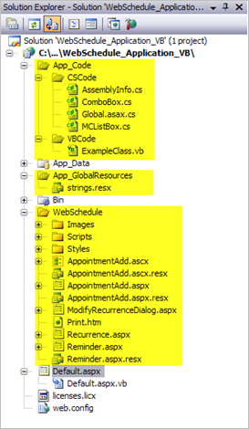

////

|metadata|
{
    "name": "web-webschedule-including-webschedule-dialog-forms-in-your-vb-net-web-site",
    "controlName": ["WebSchedule"],
    "tags": ["How Do I","Scheduling","Tips and Tricks"],
    "guid": "{8EE0A721-0E35-49EA-9BF4-D6C6D9229C75}",  
    "buildFlags": [],
    "createdOn": "0001-01-01T00:00:00Z"
}
|metadata|
////

= Including WebSchedule Dialog Forms in your VB.NET Web Site

== Before You Begin

The various WebSchedule controls rely on a series of pop-up dialog forms that are provided with the Infragistics ASP.NET product line. In order for your WebSchedule powered application to show these forms, they must be accessible by your application. One way of doing this is to include the various WebSchedule project files to your own application.

== What You Will Accomplish

After reading this topic, you will understand how to correctly add the WebSchedule forms project files and related references to your VB .NET Web Site. 

*Assumptions for the following code example:*

* You already have an ASP.NET Application configured for File System deployment with one WebForm named Default.aspx.
* Default.aspx contains an instance of WebMonthView™ that is connected with an instance of WebScheduleInfo™.
* WebScheduleInfo is connected to an instance of WebScheduleOleDbProvider which uses the in-box Microsoft© AccessDataSource™ control.
* The Application also has an `App_Data` folder with the WebSchedule2.mdb Microsoft Access™ database file included as WebSchedule’s database. For information on how to configure WebSchedule to use the WebSchedule2.mdb Microsoft Access Database, see link:webschedule-connecting-webschedule-to-a-database-in-visual-studio-2005.html[Connecting WebSchedule to a Database in Visual Studio 2005].

== Follow These Steps

[start=1]
. Locate the WebSchedule folder, typically located here:

`C:\Inetpub\wwwroot\aspnet_client\Infragistics\200XXCLRXX\Forms\WebSchedule`.

Make a copy of the WebSchedule folder and its contents to your project’s folder.
[start=2]
. If your application does not have an `App_Code` folder, you can simply right click the application node in the Solution Explorer and from the menu, select Add ASP.NET Folder and select `App_Code`. It is possible that your application may already have an `App_Code` folder. The `App_Code` folder is a special ASP.NET folder where source code files are placed.
[start=3]
. Since the WebSchedule code files are written in C#, you simply cannot add them to your VB.NET `App_Code` folder as the compiler is expecting VB.NET code files. Create two new folders in the `App_Code` folder. One folder is to be named CSCode and the other folder is to be named VBCode. If you have any existing VB code files that are already located in the `App_Code` folder, please move them all into the VBCode folder. All subsequently created VB code files are to be moved to this folder.
[start=4]
. Move the files ComboBox.cs and MCListBox.cs from the WebSchedule `App_Code` folder to your application’s `App_Code\CSCode` folder. Move the Resource file to your application’s `App_GlobalResources` folder.
[start=5]
. Much like the `App_Code` folder, check to ensure that you have an `App_GlobalResources` folder. If you do not, please right click the application node in the Solution Explorer and from the menu, select Add ASP.NET Folder and select `App_GlobalResources`. It is possible that your existing application already has an `App_GlobalResources` folder.
[start=6]
. Move the file strings.resx from the WebSchedule `App_GlobalResources` folder to your application’s `App_GlobalResources`. The `App_GlobalResources` folder contains files that represent various resources that are separated and exposed for localization.
[start=7]
. Delete the `Bin`, `App_Code`, and `App_GlobalResources` folders from the WebSchedule folder.
[start=8]
. Delete the Forms.sln, FormsVS08.sln, FormsVS08.suo, Global.asax, Global.asax.cs, Global.asax.resx, licenses.licx, and Web.config files from the WebSchedule folder. Since the main WebSchedule files have been integrated into our main application, these files are no longer needed and can be safely deleted. Your sample application should look similar to the following image. The items that were changed in these steps have been highlighted in yellow:

[start=9]
. Since several Forms that contain Infragistics ASP.NET controls have been added, we must ensure that we also add the appropriate references to our application. The WebSchedule application itself contains the following references:

Infragistics.WebUI.Shared.{ProductVersion}

Infragistics.WebUI.WebSchedule.{ProductVersion}

In the Solution Explorer, right click the Application node and select Property Pages. In the Property Pages dialog, select the References node and review the references that are added to your application. If any of these four references do not exist in your application, please click the Add button and from the dialog, under the .NET tab, locate the references that you require, select them and click the OK button. Your application should now contain all of the references that you need. If your application contains other Infragistics ASP.NET controls, it is possible that these references may already have been added previously.

[start=10]
. Add the following Infragistics section to the ConfigSections in your existing Web.Config file.

*In XML:*

----
<configuration>
 <configsections>
 <!--ADD THE FOLLOWING LINE-->
 <section name="infragistics.web"
     type="System.Configuration.SingleTagSectionHandler,System, 
     Version=1.0.3300.0, 
     Culture=neutral, 
     PublicKeyToken=b77a5c561934e089" />
  <sectiongroup name="system.web.extensions"
      type="System.Web.Configuration.SystemWebExtensionsSectionGroup, System.Web.Extensions, 
      Version=3.5.0.0, 
      Culture=neutral, 
      PublicKeyToken=31BF3856AD364E35" >
   <sectiongroup name="scripting"
       type="System.Web.Configuration.ScriptingSectionGroup, System.Web.Extensions, 
       Version=3.5.0.0, 
       Culture=neutral, 
       PublicKeyToken=31BF3856AD364E35" >
   <!--OTHER CONFIGURATION MEMBERS OMITTED FOR BREVITY-->
   </sectiongroup>
  </sectiongroup>
</configsections>
<!--ADD THE FOLLOWING LINE-->
<infragistics.web formsDirectory="~/WebSchedule" />
----

[start=11]
. Since your VB.NET Web Site has an `App_Code` folder that contains both VB.NET code files as well as C# code files, the Web.Config must also be updated in order for this multi-language code file support to work. Add the following CodeSubdirectories element to the Web.Config:

*In XML:*

----
<compilation debug="true" strict=" explicit="true">
  <assemblies>
    <!—Assembly elements omitted for brevity  -->
  </assemblies>
  <!--ADD THE FOLLOWING codeSubDirectories ELEMENT  -->
  <codeSubDirectories>
    <add directoryName="VBCode"/>
    <add directoryName="CSCode"/>
  </codeSubDirectories>
</compilation>
----

[start=12]
. Save, compile and run the application.
[start=13]
. Double click a day in the WebMonthView control.
[start=14]
. If everything was configured correctly, the Appointment Dialog will show, allowing you to enter a new Appointment (shown in the image below)

