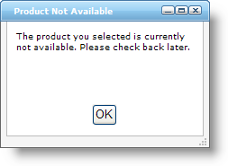
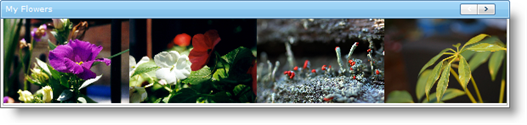
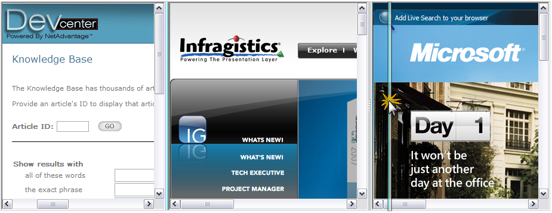

////

|metadata|
{
    "name": "web-whats-new-in-2008-volume-1",
    "controlName": [],
    "tags": ["FAQ","Getting Started"],
    "guid": "{A550E420-D9B0-4514-8894-AF66A40F70A8}",  
    "buildFlags": [],
    "createdOn": "2007-12-12T08:36:03Z"
}
|metadata|
////

= What's New in 2008 Volume 1

The Infragistics ASP.NET 2008 Volume 1 release includes a number of powerful new features and functionalities to allow you to take even more advantage of our ASP.NET controls and components.

== Full Support for Visual Studio 2008

In the 2008 Volume 1 release, Visual Studio 2008 is fully supported. The Infragistics ASP.NET controls and components are tested fully to ensure they function in the Visual Studio 2008 development environment. They are also compatible with new technologies such as .NET Language Integrated Query (LINQ).

== New WebDialogWindow Control

WebDialogWindow™ displays as a simple 
 section in your HTML page that is able to bypass many of the pop-up blockers in present-day browsers, while still appearing to the end users as if it were a pop-up window. This keen user interface control allows you to easily add dialog box functionality into any ASP.NET application for the Web. The dialog window's content area, being a 
 tag itself, can contain any HTML markup or ASP.NET content your application requires. WebDialogWindow supports being displayed as either a modal (the user must interact with and close the dialog box; interaction with the rest of your page is suspended) or modeless (non-modal; the user is free to interact with the rest of your page) dialog box.

Like every Infragistics ASP.NET AJAX Framework control, the WebDialogWindow seamlessly integrates into our Application Styling Framework™ (ASF). With industry standard CSS-based properties, you can manually style the appearance of this ASP.NET dialog window control and leverage your existing style sheets.

A few of the other key features of this ASP.NET dialog control include:

* *Modes* - The WebDialogWindow allows you to set whether the dialog behaves as a modal or modeless (non-modal) dialog would allowing you to better control the flow of your application.
* *Header* - The WebDialogWindow displays a customizable header area into which you can place caption text, several buttons including such stand-by's as the close, minimize and maximize buttons seen in desktop applications.
* *Resizing* - Just like a resizable dialog on the desktop, you can enable your end user to resize the WebDialogWindow at run-time.
* *Location* - Cause the WebDialogWindow to display at the starting location in the page where you want it to appear.
* *Window State* - WebDialogWindow takes care of remembering whether the user has minimized, restored or maximized its appearance.

== Related Topics

link:webdialogwindow-about-webdialogwindow.html[About WebDialogWindow]

link:webdialogwindow-getting-started-with-the-webdialogwindow.html[Getting Started with the WebDialogWindow]

link:webdialogwindow-using-webdialogwindow.html[Using WebDialogWindow]

== New WebImage Viewer Control

The WebImageViewer™ is a sliding image view control for ASP.NET that allows you to provide end users with a sleek, easy to use Web interface for viewing a plethora of images, and which can also serve as a navigation control. WebImageViewer gives end users the ability to continuously cycle through a list of images that when clicked, can be linked to various resources on your site. The list of images can be easily oriented horizontally or vertically through a single property setting. This ASP.NET control makes an excellent candidate when you need to allow end users to navigate through a list of products, employee records, or any other asset for which you have photos or images and wish to expose within your Web application. The quick responsiveness and refined user experience comes from the optimized design made possible by the Infragistics ASP.NET AJAX Framework and the Microsoft ASP.NET AJAX Extensions.

Key features you will find in this image view control for ASP.NET include:

* *Image Orientation* - The list of images can be oriented horizontally (across) or vertically (up/down).
* *Smooth Scrolling Animation* - Custom configurable animation behavior determines how images are animated when scrolled, and you can scroll through the images one page at a time, one image at a time, or use a continuous smooth scrolling effect.
* *Data Binding* - The WebImageViewer can be data bound to a custom data model that has the file path to use for accessing the images, their target URLs for when they are clicked, and the tool tip text that should be displayed on mouse over.
* *Navigation* - When you need visually-appealing, image-driven navigation in your Web application, you can use the WebImageViewer to expose resources to your end users. The resource content of your Target URLs can appear in the same page, within a named frame, or into a new window.

== Related Topics

link:webimageviewer-about-webimageviewer.html[About WebImageViewer]

link:webimageviewer-getting-started-with-the-webimageviewer.html[Getting Started with the WebImageViewer]

link:webimageviewer-using-webimageviewer.html[Using WebImageViewer]

== New WebSplitter Control

The WebSplitter™ control provides a neat and elegant way to separate and organize content within your Web Application. WebSplitter provides the end user with the ability to resize, expand, and collapse the content contained with in the content panes. Depending on how you design your Web Application, you can change the orientation of WebSplitter to Horizontal or Vertical. When vertically oriented, the content panes will be positioned side to side and next to one another. The split bars will be located in between the panes running from top to bottom. Clicking and dragging the split bars from side to side will cause the width of the panes to be adjusted. When horizontally oriented, the panes will be positioned from top to bottom. The split bars will also be located in between the panes and they will run from left to right.

Key features found in this ASP.NET splitter bar control include:

* *Orientation* - Orient your splitter bar horizontally or vertically on the page.
* *Resizing Behavior* - You can make the content pane resize in real time as the user clicks and drags the splitter bar, or on slower clients you can defer resizing until the user completes the mouse drag and releases the splitter bar.
* *Expand / Collapse* - Display buttons on the splitter bar that allows users to expand or collapse the content panes they represent to either side of the splitter.
* *Content Panes* - Place any content inside your content pane templates: user controls, ASP.NET controls, literal markup content, or anything else that your user interface requires.

== Related Topics

link:websplitter-about-websplitter.html[About WebSplitter]

link:websplitter-getting-started-with-the-websplitter.html[Getting Started with the WebSplitter]

link:websplitter-using-websplitter.html[Using WebSplitter]

== WebGrid and Webcombo Now Support ITypedList

The WebGrid™ and WebCombo™ controls now support the ITypedList interface. You can now take advantage of the methods exposed by the ITypedList interface during WebCombo and WebGrid’s column generation process. For example, by using the GetItemProperties() method of the ITypedList interface, your object can publish information about the properties it wants to expose to a binding operation.

The WebGrid and WebCombo controls can detect when types that implement the ITypedList interface are being bound and call the appropriate interface methods in order to determine the column information.