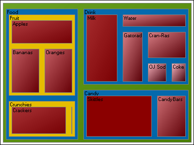
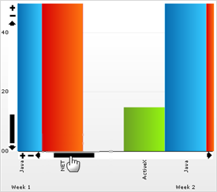

////

|metadata|
{
    "name": "web-whats-new-in-2008-volume-2",
    "controlName": [],
    "tags": ["FAQ","Getting Started"],
    "guid": "{F4BB41F0-C82B-488B-9904-544E0D6668B7}",  
    "buildFlags": [],
    "createdOn": "2008-01-05T15:05:48Z"
}
|metadata|
////

= Whats New in 2008 Volume 2

The Infragistics ASP.NET 2008 Volume 2 release includes a number of powerful new features and functionalities to allow you to take even more advantage of our ASP.NET controls and components.

== WebChart 2008.2

== New Treemap Chart Added

We added a new treemap chart to the WebChart™ component.

You can use treemap charts to display large hierarchical data sets in a rectangle space. Treemap charts are typically used to visualize the contents of a hard drive with thousands of files in many levels of directories.

== Related Topic

link:chart-treemap-chart-2d.html[Treemap Chart]

== Scroll Bar Enhancements

It is now possible to drag the scroll bar to move through your chart.

== Related Topic

link:chart-scrolling-and-scaling-charts.html[Scrolling and Scaling Charts]

== New WebHierarchicalDataSource Component

The WebHierarchicalDataSource™ component allows you to easily edit, add, and manipulate various types of standard Microsoft® data sources. With this new component, you can add relationships between two different data source controls and display them as a hierarchy in a data bound control. You can add data sources when designing the data you want to show, or use existing data sources already in the application. Linking data sources together is easy and flexible; making WebHierarchicalDataSource a powerful addition to your application.

Imagine having two existing data sources in your application -- with a few clicks in WebHierarchicalDataSource's Quick Designer, you can combine the data and display them as a single data source. You won't need to create your own logic to manually combine the data.

Some of the features of WebHierarchicalDataSource include:

* *Multiple Data Sources* – Add multiple data sources to the component and create data relations between them.
* *Single Parent to Single Child Relations*
* *Single Parent to Multiple Child Relations*
* *Composite Key Relations*
* *Self-Related Relations*
* *Simple Interface* – All of WebHierarchicalDataSource's functionality is available through a designer allowing you to quickly make changes to your data source.
* *Standard Support* – WebHierarchicalDataSource can use Microsoft® data source controls and is supported by data-bound controls that support hierarchical data sources.

== Related Topics

link:web-webhierarchicaldatasource.html[WebHierarchicalDataSource]

link:webhierarchicaldatasource-about-webhierarchicaldatasource.html[About WebHierarchicalDataSource]

link:webhierarchicaldatasource-using-webhierarchicaldatasource.html[Using WebHierarchicalDataSource]

link:webhierarchicaldatasource-api-overview.html[API Overview]

== New WebSlider Control

The WebSlider™ control allows your end users to quickly and easily change values in an application. The control can change one or two values, or a range of values. WebSlider consists of two buttons, a track, and several thumbs, all of which can be used to change its value(s). The control’s easy-to-use design makes dynamic data manipulation simple and elegant.

The WebSlider control uses the Infragistics ASP.NET AJAX Framework, which seamlessly integrates into our Application Styling Framework™ (ASF). With industry standard CSS-based properties, you can manually style the appearance of WebSlider and leverage your existing style sheets.

A few of WebSlider's features includes:

* *Slide Movements* – Grab and move WebSlider's thumb from side to side, increasing or decreasing its value.
* *Data Manipulation* – The WebSlider control exposes events and properties that you can use to change values of other controls/components based on its value and vice versa.
* *Customization* – Using CSS, you can style several of the components that make up WebSlider. You can also customize WebSlider by setting certain properties for behaviors, making it possible for one WebSlider control to look and behave completely different from the next.
* *Keyboard Support* – Change WebSlider's value with built-in keyboard support.

image::images/Web_New_WebSlider_Control.png[]

== Related Topics

link:web-webslider.html[WebSlider]

link:webslider-about-webslider.html[About WebSlider]

link:webslider-using-webslider.html[Using WebSlider]

link:webslider-api-overview.html[API Overview]

== WebGrid Now Supports Custom ComboBox Values

Previously, when you embedded WebCombo™ in a WebGrid™ control, your end user was not able to enter values that were not included in WebCombo's drop-down list. However, in Infragistics ASP.NET 2008 Volume 2, your end user can now input values into a cell with an embedded WebCombo control and persist that value.

== The WebSchedule Controls Now Support the Safari Browser

Starting in Infragistics ASP.NET 2008 Volume 2, the WebSchedule™ Controls support the Apple® Safari™ Web Browser. The rich features of these controls that were previously unavailable in Safari are now implemented for the browser.