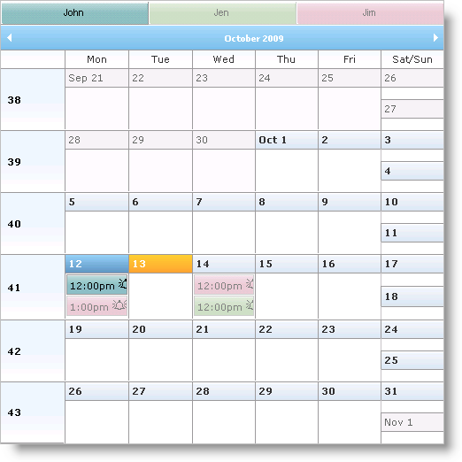
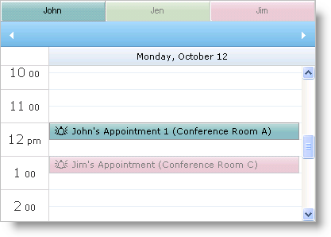

////

|metadata|
{
    "name": "web-whats-new-in-2009-volume-2",
    "controlName": [],
    "tags": ["FAQ","Getting Started"],
    "guid": "{348415E0-7F60-4D76-B250-7ED46A945DE7}",  
    "buildFlags": [],
    "createdOn": "2009-05-06T11:15:21Z"
}
|metadata|
////

= What's New in 2009 Volume 2

The Infragistics ASP.NET 2009 Volume 2 release includes a collection of new controls built on the Infragistics ASP.NET AJAX framework.

== New AJAX Indicator

The new AJAX Indicator feature provides a way to display a message to the end user while they are waiting for a response on an AJAX call. The indicator will show itself when a control initiates an AJAX call, and automatically hides itself once the server response completes on the client.

By default, a shared AJAX Indicator exists for all Infragistics™ AJAX controls along with common property settings. You can also configure the indicator on each control individually and you can also also configure it globally for an entire application through the web.config file. Settings applied from the control level or through the web.config file will have priority over the shared AJAX indicator settings.

The AJAX Indicator is completely customizable. Some of the important customizations available are listed below:

* Enabling and Disabling the Indicator.
* Setting the location for the Indicator, either relative to the page or to a specific control.
* Disable or grey out a control or the entire web page during an AJAX call.
* Assigning Image or Text for the wait message during an AJAX call.

The following Infragistics™ AJAX controls support the new AJAX Indicator.

* WebDataGrid™
* WebDataTree™
* WebDropDown™
* WebHierarchicalDataGrid™

== Related Topic

link:web-ajax-indicator.html[AJAX Indicator]

== New WebCurrencyEditor Control

The WebCurrencyEditor™ control is a new addition to the expanding list of Infragistics ASP.NET AJAX controls. The WebCurrencyEditor control’s new design makes it an efficient and scalable editor control, with native AJAX capabilities.

Like all Infragistics ASP.NET AJAX controls, WebCurrencyEditor seamlessly integrates into the Infragistics® Application Styling framework. With CSS based properties, you can manually customize the WebCurrencyEditor control by leveraging your existing style sheets.

A few of the WebCurrencyEditor features include:

* *High-Performance* -- Lightweight markup and optimized code improve performance.
* *Standards Conformance* -- CSS 2 and XHTML 1.0 compliance.
* *Spin Buttons* -- End users can easily spin through a list of values.
* *Standard Validators support* -- Supports ASP.NET validator controls.
* *NegativeCssClass* -- This is applied to the editor when the value is negative.
* *DisplayFactor* -- Applies a multiplier to the value (List of supported values : 1, 10, 100,1000,10000,100000,1000000).
* *Min and Max values* -- You can easily specify the allowable range that can be entered into the editor.
* *MinDecimalPlaces* -- Allows you to set the minimum number of decimal places to be displayed when the control loses focus.
* *SelectionOnFocus* -- You can set different selection types for whenever entering edit mode.
* *Culture* -- You can set the CultureInfo object used by the control for localized formatting.
* *Native AJAX Support* -- Because the Infragistics ASP.NET AJAX controls are built on top of the Microsoft® ASP.NET AJAX Extensions, most WebCurrencyEditor functionalities are executed using AJAX, eliminating full page postbacks.

== Related Topics

link:webcurrencyeditor-about-webcurrencyeditor.html[About WebCurrencyEditor]

link:webcurrencyeditor-using-webcurrencyeditor.html[Using WebCurrencyEditor]

== New WebDatePicker Control

The WebDatePicker™ control is a new addition to the expanding list of Infragistics ASP.NET AJAX controls. The WebDatePicker control’s new design makes it an efficient and scalable editor control, with native AJAX capabilities.

Like all Infragistics ASP.NET AJAX controls, WebDatePicker seamlessly integrates into the Infragistics® Application Styling framework. With CSS based properties, you can manually customize the WebDatePicker control by leveraging your existing style sheets.

A few of the WebDatePicker features include:

* *High-Performance* -- Lightweight markup and optimized code improve performance.
* *Standards Conformance* -- CSS 2 and XHTML 1.0 compliance.
* *Spin Buttons* -- End users can easily spin through a list of values.
* *Standard Validators support* -- Supports ASP.NET validator controls.
* *Min and Max values* -- You can easily specify the allowable range of dates/times that can be entered into the editor.
* *ReduceDayOnInvalidDate* -- If the end-user enters a value which is greater than the maximum day in the month, then the value can be automatically reduced.
* *ShowPatternOnFocus* -- In edit mode, the displayed string (input pattern) can be built dynamically with cut-off prompts and literal characters on the right side of the caret.
* *SelectionOnFocus* -- You can set different selection types for whenever entering edit mode.
* *Culture* -- You can set the CultureInfo object used by the control for localized formatting.
* *Custom drop-down Calendar* -- A custom drop-down calendar can be set to the control to use.
* *UseLastGoodDate* -- Ability to automatically use the last good date value when the control loses focus and has invalid values of date fields.
* *YearToFillCentury* -- Autofills year field to the 20th or 21st century, if only 1 or 2 digits are entered by the end-user.
* *Native AJAX Support* -- Because the Infragistics ASP.NET AJAX controls are built on top of the Microsoft® ASP.NET AJAX Extensions, most WebDatePicker functionalities are executed using AJAX, eliminating full page postbacks.

== Related Topics

link:webdatepicker-about-webdatepicker.html[About WebDatePicker]

link:webdatepicker-using-webdatepicker.html[Using WebDatePicker]

== New WebDateTimeEditor Control

The WebDateTimeEditor™ control is a new addition to the expanding list of Infragistics ASP.NET AJAX controls. The WebDateTimeEditor control’s new design makes it an efficient and scalable editor control, with native AJAX capabilities.

Like all Infragistics ASP.NET AJAX controls, WebDateTimeEditor seamlessly integrates into the Infragistics® Application Styling framework. With CSS based properties, you can manually customize the WebDateTimeEditor control by leveraging your existing style sheets.

A few of the WebDateTimeEditor features include:

* *High-Performance* -- Lightweight markup and optimized code improve performance.
* *Standards Conformance* -- CSS 2 and XHTML 1.0 compliance.
* *Spin Buttons* -- End users can easily spin through a list of values.
* *Standard Validators support* -- Supports ASP.NET validator controls.
* *Min and Max values* -- You can easily specify the allowable range of dates/times that can be entered into the editor.
* *ReduceDayOnInvalidDate* -- If the end-user enters a value which is greater than the maximum day in the month, then the value can be automatically reduced.
* *ShowPatternOnFocus* -- In edit mode, the displayed string (input pattern) can be built dynamically with cut-off prompts and literal characters on the right side of the caret.
* *SelectionOnFocus* -- You can set different selection types for whenever entering edit mode.
* *Culture* -- You can set the CultureInfo object used by the control for localized formatting.
* *Native AJAX Support* -- Because the Infragistics ASP.NET AJAX controls are built on top of the Microsoft® ASP.NET AJAX Extensions, most WebDateTimeEditor functionalities are executed using AJAX, eliminating full page postbacks.

== Related Topics

link:webdatetimeeditor-about-webdatetimeeditor.html[About WebDateTimeEditor]

link:webdatetimeeditor-using-webdatetimeeditor.html[Using WebDateTimeEditor]

== New WebMaskEditor Control

The WebMaskEditor™ control is a new addition to the expanding list of Infragistics ASP.NET AJAX controls. The WebMaskEditor control’s new design makes it an efficient and scalable editor control, with native AJAX capabilities.

Like all Infragistics ASP.NET AJAX controls, WebMaskEditor seamlessly integrates into the Infragistics® Application Styling framework. With CSS based properties, you can manually customize the WebMaskEditor control by leveraging your existing style sheets.

A few of the WebMaskEditor features include:

* *High-Performance* -- Lightweight markup and optimized code improve performance.
* *Standards Conformance* -- CSS 2 and XHTML 1.0 compliance.
* *Spin Buttons* -- End users can easily spin through a list of values.
* *Standard Validators support* -- Supports ASP.NET validator controls.
* *ShowMaskOnFocus* -- In edit mode, the displayed string (input pattern) can be built dynamically with cut-off prompts and literal characters on the right side of the caret.
* *SelectionOnFocus* -- You can set different selection types for whenever entering edit mode.
* *InputMask* -- Allows you to set input mask used to filter keyboard entries.
* *Native AJAX Support* -- Because the Infragistics ASP.NET AJAX controls are built on top of the Microsoft® ASP.NET AJAX Extensions, most WebMaskEditor functionalities are executed using AJAX, eliminating full page postbacks.

== Related Topics

link:webmaskeditor-about-webmaskeditor.html[About WebMaskEditor]

link:webmaskeditor-using-webmaskeditor.html[Using WebMaskEditor]

== New WebMonthCalendar Control

The WebMonthCalendar™ control is a new addition to the expanding list of Infragistics ASP.NET AJAX controls. The WebMonthCalendar control’s new design makes it an efficient and scalable calendar control, with native AJAX capabilities.

Like all Infragistics ASP.NET AJAX controls, WebMonthCalendar seamlessly integrates into the Infragistics® Application Styling framework. With CSS based properties, you can manually customize the WebMonthCalendar control by leveraging your existing style sheets.

A few of the WebMonthCalendar features include:

* *High-Performance* -- Lightweight markup and optimized code improve performance.
* *Standards Conformance* -- CSS 2 and XHTML 1.0 compliance.
* *Keyboard Navigation* -- Supports accessing the control using keyboard.
* *Standard Validators support* -- Supports ASP.NET validator controls.
* *Min and Max values* -- You can easily specify the allowable range of dates that can be entered into the editor.
* *CustomDays* -- Allows you to modify the appearance of specific days in the calendar.
* *Customizing drop-down lists* -- Provides you the option to customize number of columns for drop-down lists of months and years and number of rows for list of years.
* *EnableWeekNumbers* -- Provides you an option to show week numbers in the calendar to your end-users.
* *SelectionType* -- Allows you to control how your end-users select the dates like single day, single week or multiple days.
* *SelectionOnFocus* -- You can set different selection types for whenever entering edit mode.
* *Culture* -- You can set the CultureInfo object used by the control for localized formatting.
* *Animations* -- Allows you to customize animations when opening/closing the drop-down lists.
* *CssClasses for Focusing and Hovering* -- Supports for mouseover styles by all areas and focus styles by days.
* *Native AJAX Support* -- Because the Infragistics ASP.NET AJAX controls are built on top of the Microsoft® ASP.NET AJAX Extensions, most WebMonthCalendar functionalities are executed using AJAX, eliminating full page postbacks.

== Related Topics

link:webmonthcalendar-about-webmonthcalendar.html[About WebMonthCalendar]

link:webmonthcalendar-using-webmonthcalendar.html[Using WebMonthCalendar]

== New WebNumericEditor Control

The WebNumericEditor™ control is a new addition to the expanding list of Infragistics ASP.NET AJAX controls. The WebNumericEditor control’s new design makes it an efficient and scalable editor control, with native AJAX capabilities.

Like all Infragistics ASP.NET AJAX controls, WebNumericEditor seamlessly integrates into the Infragistics® Application Styling framework. With CSS based properties, you can manually customize the WebNumericEditor control by leveraging your existing style sheets.

A few of the WebNumericEditor features include:

* *High-Performance* -- Lightweight markup and optimized code improve performance.
* *Standards Conformance* -- CSS 2 and XHTML 1.0 compliance.
* *Spin Buttons* -- End users can easily spin through a list of values.
* *Standard Validators support* -- Supports ASP.NET validator controls.
* *NegativeCssClass* -- This is applied to the editor when the value is negative.
* *DisplayFactor* -- Applies a multiplier to the value (List of supported values : 1, 10, 100,1000,10000,100000,1000000).
* *Min and Max values* -- You can easily specify the allowable range of numbers that can be entered into the editor.
* *MinDecimalPlaces* -- Allows you to set the minimum number of decimal places to be displayed when the control loses focus.
* *Native AJAX Support* -- Because the Infragistics ASP.NET AJAX controls are built on top of the Microsoft® ASP.NET AJAX Extensions, most WebNumericEditor functionalities are executed using AJAX, eliminating full page postbacks.

== Related Topics

link:webnumericeditor-about-webnumericeditor.html[About WebNumericEditor]

link:webnumericeditor-using-webnumericeditor.html[Using WebNumericEditor]

== New WebPercentEditor Control

The WebPercentEditor™ control is a new addition to the expanding list of Infragistics ASP.NET AJAX controls. The WebPercentEditor control’s new design makes it an efficient and scalable editor control, with native AJAX capabilities.

Like all Infragistics ASP.NET AJAX controls, WebPercentEditor seamlessly integrates into the Infragistics® Application Styling framework. With CSS based properties, you can manually customize the WebPercentEditor control by leveraging your existing style sheets.

A few of the WebPercentEditor features include:

* *High-Performance* -- Lightweight markup and optimized code improve performance.
* *Standards Conformance* -- CSS 2 and XHTML 1.0 compliance.
* *Spin Buttons* -- End users can easily spin through a list of values.
* *Standard Validators support* -- Supports ASP.NET validator controls.
* *NegativeCssClass* -- This is applied to the editor when the value is negative.
* *DisplayFactor* -- Applies a multiplier to the value (List of supported values : 1, 10, 100,1000,10000,100000,1000000).
* *Min and Max values* -- You can easily specify the allowable range that can be entered into the editor.
* *MinDecimalPlaces* -- Allows you to set the minimum number of decimal places to be displayed when the control loses focus.
* *SelectionOnFocus* -- You can set different selection types for whenever entering edit mode.
* *Native AJAX Support* -- Because the Infragistics ASP.NET AJAX controls are built on top of the Microsoft® ASP.NET AJAX Extensions, most WebPercentEditor functionalities are executed using AJAX, eliminating full page postbacks.

== Related Topics

link:webpercenteditor-about-webpercenteditor.html[About WebPercentEditor]

link:webpercenteditor-using-webpercenteditor.html[Using WebPercentEditor]

== New WebTextEditor Control

The WebTextEditor™ control is a new addition to the expanding list of Infragistics ASP.NET AJAX controls. The WebTextEditor control’s new design makes it an efficient and scalable editor control, with native AJAX capabilities.

Like all Infragistics ASP.NET AJAX controls, WebTextEditor seamlessly integrates into the Infragistics® Application Styling framework. With CSS based properties, you can manually customize the WebTextEditor control by leveraging your existing style sheets.

A few of the WebTextEditor features include:

* *High-Performance* -- Lightweight markup and optimized code improve performance.
* *Standards Conformance* -- CSS 2 and XHTML 1.0 compliance.
* *Multiline Text* -- Allows editing of multiline text in the display.
* *Spin Buttons* -- End-users can easily spin through a list of values.
* *CustomButtonHotKeys* -- Allows using hot keys to trigger custom button clicks.
* *Password mode* -- Mask your input characters by setting a single property.
* *Standard Validators support* -- Supports ASP.NET validator controls.
* *SelectionOnFocus* -- You can set different selection types for whenever entering edit mode.
* *Native AJAX Support* -- Because the Infragistics ASP.NET AJAX controls are built on top of the Microsoft® ASP.NET AJAX Extensions, most WebTextEditor functionalities are executed using AJAX, eliminating full page postbacks.

== Related Topics

link:webtexteditor-about-webtexteditor.html[About WebTextEditor]

link:webtexteditor-using-webtexteditor.html[Using WebTextEditor]

== New WebHierarchicalDataGrid Control

The new WebHierarchicalDataGrid™ control allows you to display hierarchical data. It derives from the WebDataGrid™ control and has many related features. WebHierarchicalDataGrid can be bound to a multi level data source with multiple child bands on a single level.

All the functionalities for a flexible, feature-rich grid control are present in WebHierarchicalDataGrid.

The following list shows some of the WebHierarchicalDataGrid features:

* *Hierarchical Data Source Support* – Supports all hierarchical data source controls as well as Dataset objects and objects that implement the IEnumerable interface.
* *AJAX Enabled* – You can fully enable AJAX in the control for smoother data retrieval and unobtrusive data operations.
* *Client-Side Object Model* - Dynamically work with the control on the client-side using the expansive JavaScript API.
* *Autogenerate Bands and Columns* - WebHierarchicalDataGrid can optionally walk through your hierarchical data to automatically produce bands and columns.
* *Paging* - Break up your data into smaller, viewable pages of data. Paging can be enabled on both parent and child levels.
* *Templates* - Most of the elements in WebHierarchicalDataGrid can be templated allowing for maximum flexibility and customization.
* *Editing* - Cell editing, row adding, row deleting, and a Row Editing Template for customizable editing, with automatic updates to the data source. All Editing tasks can be enabled on parent and child levels.
* *Sorting* - Sort WebHierarchicalDataGrid control’s data for a more organized display on parent as well as child levels.
* *Auto-Detect Editor* –Editor Controls are automatically set based on the column data types when editing is turned on.

image::images/WebHierarchicalDataGrid_Binding_to_Data_03.png[]

== Related Topics

link:webhierarchicaldatagrid-about-webhierarchicaldatagrid.html[About WebHierarchicalDataGrid]

link:webhierarchicaldatagrid-getting-started-with-webhierarchicaldatagrid.html[Getting Started with WebHierarchicalDataGrid]

link:webhierarchicaldatagrid-using-webhierarchicaldatagrid.html[Using WebHierarchicalDataGrid]

== New WebDataGrid Column Fixing

The WebDataGrid™ control now supports Column Fixing. Your end-users can now fix columns within the grid area; this operation is performed on the client. The fixed columns will remain visible at all times within the grid even when the end-user scrolls the grid horizontally.

Column fixing also comes with several UI enhancements that allows you to customize the following options:

* Hide/Show push pin buttons on column headers for all or individual columns.
* Align button to left or right of the caption.
* Fix columns to the left or right of the grid.

== Related Topics

link:webdatagrid-column-fixing.html[Column Fixing]

== New WebDataGrid Virtual Scrolling

The WebDataGrid™ control now supports Virtual Scrolling which allows it to send partial amounts of data records to the client, and request additional data records on demand as the end-user scrolls through the control. The Virtual Scrolling behavior therefore greatly improves performance by allowing the end-user to navigate through large volumes of data without having to send the entire data source to the client.

The virtual scrolling behavior works in two different modes: Virtual mode allows for visible scrolling of rows; When an end-user drags the scrollbar, within the row cache, the scrolling is smooth and visible. With deferred scrolling there is no moving of rows when scrolling. WebDataGrid displays a tooltip next to the scrollbar displaying the row number that will be loaded when the user scrolls. When the end user stops scrolling, rows in that scroll region are displayed in the view port.

== Related Topics

link:webdatagrid-virtual-scrolling.html[Virtual Scrolling]

== New WebDataGrid Column Hiding

The WebDataGrid™ control now allows you to hide a column you do not want to display to your end-users. For example, you may not want to show columns that are meaningless to your end-users. You can easily hide a column through the designer or programmatically either from the server-side or the client-side.

== Related Topic

link:webdatagrid-hiding-a-column.html[Hiding a Column]

== Updated Editor Providers and Default Editors for WebDataGrid

WebDataGrid™ now uses the following Editor Providers based on the new lightweight ASP.NET AJAX editor controls thus leading to the next step in the evolution of today's WebEditors:

* CurrencyEditorProvider
* DatePickerProvider
* DateTimeEditorProvider
* MaskEditorProvider
* MonthCalendarProvider
* NumericEditorProvider
* PercentEditorProvider
* TextEditorProvider

The new Editor Providers give you more enhanced functionality so that you can have more powerful data entry applications.

== Default Editors

On an editing-enabled WebDataGrid control, the most appropriate editor provider will be used on each column depending on the column's data type. For example, numeric and DateTime data type columns will automatically use the Numeric EditorProvider and the DateTimeEditorProvider respectively. However, if you wish to override this default functionality, you can always specify your own editor provider(s).

== Related Topics

link:webdatagrid-editor-providers.html[Editor Providers]

link:webdatagrid-using-editor-providers.html[Using DatePicker as an editor provider for WebDataGrid]

== New WebDataTree Disable Auto-Checking

WebDataTree™ now has a new feature that allows you to disable auto-checking of checkbox tree nodes. For example, when an end-user checks a child node in WebDataTree, its parent node (if unchecked) becomes partially checked (TriState CheckBoxMode) or fully checked (if all the child nodes are checked), or if a parent node is checked, all its child nodes are also checked. However with the disable auto-checking feature you can stop the tree nodes from being checked for those scenarios in which this behavior is not needed.

== Related Topic

link:webdatatree-disabling-auto-checking-in-webdatatree.html[Disabling Auto-Checking in WebDataTree]

== New WebScheduleGenericDataProvider Component

The WebScheduleGenericDataProvider™ component allows you to bind the WebSchedule™ controls to any supported data sources. This addition of the WebScheduleGenericDataProvider component gives you more flexibility in choosing WebSchedule data sources; you no longer need to rely on just the SqlDataProvider or the OleDbDataProvider for data binding.

== Supported Data Sources

The following is a list of WebScheduleGenericDataProvider's supported data sources.

* DataSet and DataTable
* IListSource
* IDataSource
* IEnumerable (read-only, updates must be IList or ICollection)

== Related Topics

link:webschedulegenericdataprovider-webschedulegenericdataprovider.html[WebScheduleGenericDataProvider]

link:webschedulegenericdataprovider-webschedulegenericdataprovider-smart-tag.html[WebScheduleGenericDataProvider Smart Tag]

link:webschedule-binding-to-access-data-source-using-webschedulegenericdataprovider.html[Binding to Access Data Source Control Using WebScheduleGenericDataSource]

== New WebSchedule Multi Day Event Banner

The WebDayView™ and WebMonthView™ WebSchedule™ controls can display a continuous banner for events that span multiple days, weeks, months, or years. The WebScheduleInfo™ component's link:{ApiPlatform}webui.webschedule{ApiVersion}~infragistics.webui.webschedule.webscheduleinfo~enablemultidayeventbanner.html[EnableMultiDayEventBanner] property controls this feature, which is True by default. If EnableMultiDayEventBanner is set to false, a multiple day event displays as single blocks across multiple days.

You can also display arrows indicating the start and end dates that the event spans, by setting the link:{ApiPlatform}webui.webschedule{ApiVersion}~infragistics.webui.webschedule.webscheduleinfo~enablemultidayeventarrows.html[EnableMultiDayEventArrows] property, which is True by default.

image::images/WebScheduleGenericDataProvider_About_Multi_Day_Event_Banner_01.png[]

== Related Topics

link:webschedulegenericdataprovider-multi-day-event-banner.html[Multi Day Event Banner]

link:webschedulegenericdataprovider-localize-multi-day-event-banner-caption.html[Localize Multi Day Event Banner Caption]

link:webschedulegenericdataprovider-style-multi-day-event-banner.html[Style Multi Day Event Banner]

== New WebSchedule Multi Resource View

The WebSchedule™ controls (WebDayView™ and WebMonthView™) allow you to display scheduling information from multiple resources. To enable multiple resource view, set the WebScheduleInfo component's link:{ApiPlatform}webui.webschedule{ApiVersion}~infragistics.webui.webschedule.webscheduleinfo~enablemultiresourceview.html[EnableMultiResourceView] property to True.

== Overlay Mode

Overlay mode allows your end users to see scheduling information for different resources in one view; the active resource displays with a unique style to distinguish it from the inactive resources. For information on customizing the styles for active and inactive resources, see link:webschedule-styling-active-and-inactive-resources.html[Styling Active and Inactive Resources].

A tab control allows you to switch between the different resources. Set the link:{ApiPlatform}webui.webschedule{ApiVersion}~infragistics.webui.webschedule.webdayview~enablemultiresourcecaption.html[EnableMultiResourceCaption] to True or False to control this behavior.

Figure 1 - WebMonthView.

Figure 2 - WebDayView.

Related Topics

link:webschedule-styling-active-and-inactive-resources.html[Styling Active and Inactive Resources]

link:webschedule-set-visible-resources.html[Set Visible Resources]

== Miscellaneous

== Browser Support

All our ASP.Net AJAX controls support Internet Explorer 8, Safari 4, Chrome 2.0 and Firefox 3.5.