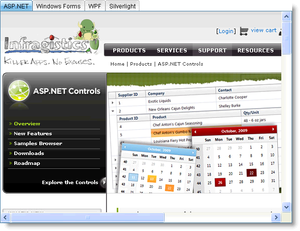

////
|metadata|
{
    "name": "web-whats-new-in-2010-volume-1",
    "controlName": [],
    "tags": ["FAQ","Getting Started"],
    "guid": "{59AB9A26-DF2E-4543-9BFE-D905E754D0AB}",
    "buildFlags": [],
    "createdOn": "2010-01-03T23:50:50Z"
}
|metadata|
////

= What's New in 2010 Volume 1

The Infragistics ASP.NET 2010 Volume 1 release includes the following new controls and features built on the Infragistics ASP.NET AJAX framework.

== New AJAX Compression

The new AJAX compression module in Infragistics ASP.NET 10.1 will compress Ajax responses generated by the server when using any of Infragistics ASP.NET AJAX controls based on the Infragistics ASP.NET AJAX framework. The browser will then de-compress the response on the client and process it further.

When you turn on this feature, you immediately get the following benefits.

* *Bandwidth* – When a response is GZIPed, the bandwidth used by the Ajax response will decrease automatically. Your bandwidth capacity will improve and you will be able to serve more users at any given time, without clogging the network.
* *Speed* – When the response size goes down, the round trip of an Ajax request from the server goes down with it.

The following tables show the performance gains obtained from AJAX compression when using a WebDataGrid control with 26 columns and 2155 rows with paging enabled.

=== Without Compression

[options="header", cols="a,a,a"]
|====
|WebDataGrid Page Size|Response Size (KB)|Round Trip Time (Secs)

|20
|50.6
|1.18

|50
|81.1
|1.14

|100
|140.9
|1.23

|200
|261.8
|1.4

|500
|627.7
|2.13

|1000
|1228.8
|4.32

|====

=== With Compression

[options="header", cols="a,a,a"]
|====
|WebDataGrid Page Size|Response Size (KB)|Round Trip Time (Secs)

|20
|7.4
|1.19

|50
|10.2
|1.19

|100
|15.8
|1.19

|200
|27.4
|1.29

|500
|62.5
|1.51

|1000
|121
|2.12

|====

== Related Topic

link:about-ajax-compression.html[About Ajax Compression]

== New WebTab Control

The WebTab™ control is a new addition to the expanding list of Infragistics ASP.NET AJAX controls. The WebTab control’s new design makes it an efficient and scalable tab layout control, with native AJAX capabilities.

Like all Infragistics ASP.NET AJAX controls, WebTab seamlessly integrates into the Infragistics® Application Styling framework. With CSS based properties, you can manually customize the WebTab control by leveraging your existing style sheets.

A few of the WebTab features include:

* *High-Performance* -- Lightweight markup and optimized code improve performance.
* *Standards Conformance* -- CSS 2 and XHTML 1.0 compliance.
* *Content Pane* -- Supports content panes as template areas or target URLs.
* *Tab Moving* --Allows moving of tabs in a single row.
* *Tab Orientation* -- can be oriented either horizontally or vertically.
* *Display Mode* -- Can display single-row or multi-row tabs.
* *Load-on-Demand* -- Not all content is fetched during the initial load , only the content of the selected tab.
* *Native AJAX Support* -- Because the Infragistics ASP.NET AJAX controls are built on top of the Microsoft® ASP.NET AJAX Extensions, most WebCurrencyEditor functionalities are executed using AJAX, eliminating full page postbacks.

== Related Topics

link:webtab-about-webtab.html[About WebTab]

link:webtab-using-webtab.html[Using WebTab]

== New WebExplorerBar Control

The WebExplorerBar™ control is a new addition to the expanding list of Infragistics ASP.NET AJAX controls. WebExplorerBar’s new design provides functionality much like that found in the Windows Explorer bar. WebExplorerBar can be used to display your hierarchical data model or it can also be used as a navigation control. Many possibilities exist when integrating WebExplorerBar into your applications.

Like all Infragistics ASP.NET AJAX controls, WebExplorerBar seamlessly integrates into the Infragistics® Application Styling framework. With CSS based properties, you can manually customize the WebExplorerBar control by leveraging your existing style sheets.

A few of the WebExplorerBar features include:

* *High-Performance* - Lightweight markup and optimized code improve performance.
* *Standards Conformance* - CSS 2 and XHTML 1.0 compliance.
* *Load on Demand* - Rather than initially render your entire data source upon the initial page load, you can enable the Load on Demand feature which only sends a small fraction of your data upon the initial page load. Subsequent group expansions invoke an AJAX callback which causes the additional groups to be retrieved and loaded. This provides dramatic performance improvements over simply loading your entire large data source in one attempt.
* *Templates* - WebExplorerBar elements can be templated for the ultimate in flexibility. Groups can be templated and you can also provide a template for when no data is loaded in WebExplorerBar.
* *Group Editing* - WebExplorerBar groups can also be edited. The end-user can double-click or press F2 to enter edit mode on specific groups.
* *Animations* - WebExplorerBar group expansions can occur in an animated fashion. May preset animation options are exposed through a simple property setting so that you can easily add professional animated effects to your web applications.
* *Client-Side object model* - WebExplorerBar provides an extensive client-side object model that exposes properties, methods and even events that can be handled in order to respond to many events that would traditionally require a server-side round trip. This type of architecture promotes a very fast and responsive end-user experience when used in your applications.
* *Many other features!*

== Related Topics

link:webexplorerbar-about-webexplorerbar.html[About WebExplorerBar]

link:webexplorerbar-getting-started-with-webexplorerbar.html[Getting Started with WebExplorerBar]

link:webexplorerbar-using-webexplorerbar.html[Using WebExplorerBar]

== WebHierarchicalDataGrid Outlook GroupBy Feature

== Outlook GroupBy

The Outlook GroupBy feature of WebHierarchicalDataGrid™ allows your end users to group data into a more readable and navigable view. The feature displays a section at the top or bottom of the control where your end users can drag columns into, in order to group their data.

Once a column is grouped, the control creates grouped rows for every unique grouped value. Each grouped row displays the value and number of items in the group by default, and can be expanded to display the data rows nested within. WebHierarchicalDataGrid displays the column header in the Groupby area to illustrate the GroupBy layout for the data.

== Related Topics

link:webhierarchicaldatagrid-outlook-groupby.html[Outlook GroupBy]

link:webhierarchicaldatagrid-about-outlook-groupby.html[About Outlook GroupBy]