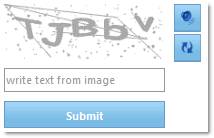

////

|metadata|
{
    "name": "web-whats-new-in-2010-volume-2",
    "controlName": [],
    "tags": ["FAQ","Getting Started"],
    "guid": "41e916a5-6c1d-4db4-8211-bc295352c20f",  
    "buildFlags": [],
    "createdOn": "2010-06-01T04:18:25.2939993Z"
}
|metadata|
////

= What's New in 2010 Volume 2

The Infragistics ASP.NET 2010 Volume 2 release includes the following new controls and features built on the Infragistics ASP.NET AJAX framework.

== New WebRating Control

The WebRating™ control allows you to collect input from end users, most of the time in terms of votes and ratings for a particular product. This style of editor is available on many web sites, such as NetFlix and RottenTomatoes.

The WebRating control has the following features:

* Customizable number of rating items
* User average and vote count
* Horizontal/Vertical orientation
* Customizable tooltip
* Various fill settings from exact average to a rounded value
* Customizable images and styles
* Rich Server and Client Side APIs for custom functionality
* Acts as an Editor Provider to be embedded in controls such as WebDataGrid

== Related Topics

link:webrating-about-webrating.html[About WebRating]

link:webrating-getting-started-with-webrating.html[Getting Started with WebRating]

link:webrating-using-webrating.html[Using WebRating]

== New WebCaptcha Control

The WebCaptcha™ control is a new addition to the expanding list of Infragistics ASP.NET AJAX controls. The WebCaptcha component’s design makes it an efficient and easy to use spam protection control, with native AJAX capabilities.

Like all Infragistics ASP.NET AJAX controls, WebCaptcha seamlessly integrates into the Infragistics® Application Styling framework. With CSS based properties, you can manually customize the WebCaptcha control by leveraging your existing style sheets.

A few of the WebCaptcha features include:

* *High-Performance* -- Lightweight markup and optimized code improve performance.
* *Protection Modes* -- Supports several types of protection.
* *Dictionary Modes* -- Can be used with predefined words or logical questions and answers.
* *Audio Support* -- Can spell the randomly generated text code.
* *Native AJAX Support* -- Because the Infragistics ASP.NET AJAX controls are built on top of the Microsoft® ASP.NET AJAX Extensions, most WebCurrencyEditor functionalities are executed using AJAX, eliminating full page postbacks.

== Related Topics

link:webcaptcha-about-webcaptcha.html[About WebCaptcha]

link:webcaptcha-getting-started-with-webcaptcha.html[Getting Started with WebCaptcha]

link:webcaptcha-using-webcaptcha.html[Using WebCaptcha]

== New WebExcelExporter Control

The new WebExcelExporter™ control allows you to automatically export Grid data. No matter what kind of Infragistics DataGrid you are using (WebDataGrid™ or WebHierarchicalDataGrid™), you can easily achieve your goal to get the data into an Excel™ file, in the format of your choice. The Excel™ file formats that are supported are Excel™ 97 to Excel™ 2003 (all these versions share a common format) and Excel™ 2007.

== Related Topics

link:web-webexcelexporter-about-webexcelexporter.html[About WebExcelExporter]

link:webexcelexporter-getting-started-with-webexcelexporter.html[Getting Started with WebExcelExporter]

link:webexcelexporter-using-webexcelexporter.html[Using WebExcelExporter]

== New WebScriptManager Control

The new WebScriptManager control enables the javascript IntelliSense for Infragistics ASP.NET Ajax controls and provides CDN support.

== Related Topics

pick:[asp-net="link:infragistics4.web.v{ProductVersion}~infragistics.web.ui.webscriptmanager.html[WebScriptManager]"]

== New WebDataTree Drag and Drop Feature

WebDataTree™ now has new feature that allows you to drag and drop node(s) between nodes on the same tree or to another WebDataTree. The behavior has three modes –Default, Copy and Move. The default mode works as Copy if we hold down Ctrl key pressed, otherwise it works like Move. You can insert before, between and after node, as well into chosen node. In this case the dropped node become child of the node we drop dragged one.

== Related Topics

link:webdatatree-drag-and-drop.html[WebDataTree Drag and Drop]

== New WebHierarchicalDataGrid Row Filtering Feature

The filtering feature of WebDataGrid™ is now available in WebHierarchicalDataGrid™. Filtering breaks the data into a smaller subset that matches your filter criteria and displays it. This makes the data more viewable and manageable to your end-users. If AJAX is enabled, the filtering is asynchronous. You can filter using the API provided for WebDataGrid or through the filter row UI.

== Related Topics

link:webhierarchicaldatagrid-filtering.html[Filtering]

== New WebTab Header Feature - Left and Right Orientation

WebTab™ now supports the following four different header locations in addition to the existing ones:

* LeftTop
* LeftBottom
* RightTop
* RightBottom

== Related Topics

link:webtab-orientation-and-alignment.html[Orientation and Alignment]

== Windows 7 Styles

Infragistics ASP.NET controls now supports Windows 7 Styles.

== Related Topics

link:web-application-styling-framework-asf.html[Application Styling Framework (ASF)]

== VS2010 Features

Click on the following links to learn more about our support to the new Visual Studio® 2010 features:

* link:javascript-intellisense-support.html[JavaScript Intellisense Support]
* link:markup-snippet-support.html[Code Snippet Support]

== ASP.NET 4 Compatibility

Click on the following link to learn how Infragistics ASP.NET controls are compatible with ASP.NET 4:

* link:binding-to-domaindatasource.html[DomainDataSource Support]
* link:support-for-granular-viewstate-and-setting-client-ids.html[ViewState and Client IDs]

== Infragistics ASP.NET CDN Support (CTP)

Infragistics ASP.NET 2010 volume 2 introduces support for Content Delivery Network (CDN). CDN support is implemented by allowing the delivery of the Infragistics ASP.NET control’s JavaScript, Image, and CSS files by servers that are much closer to the client PC than your web server that hosts the web site. CDN support is currently provided by Infragistics so that when you enable this feature, URLs for JavaScript, Image, and CSS files are prefixed by a redirect managed by Infragistics; the redirect forwards requests to our current CDN provider. You can also configure your web application to use your own CDN provider. Use of the CDN feature can greatly improve performance, web server capacity, and end-user experience. For more detailed information on the Infragistics ASP.NET CDN feature, see link:web-infragistics-content-delivery-network-cdn.html[Infragistics Content Delivery Network (CDN)] .