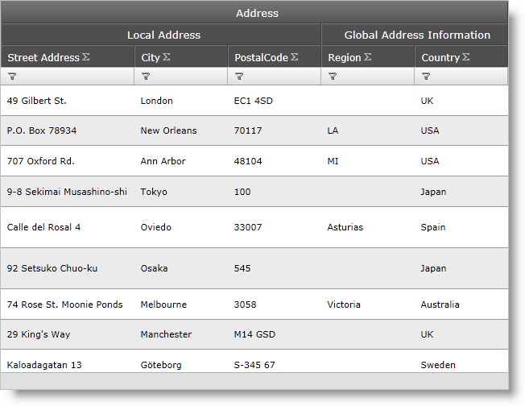
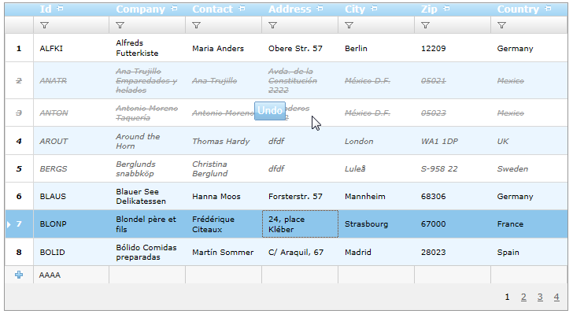
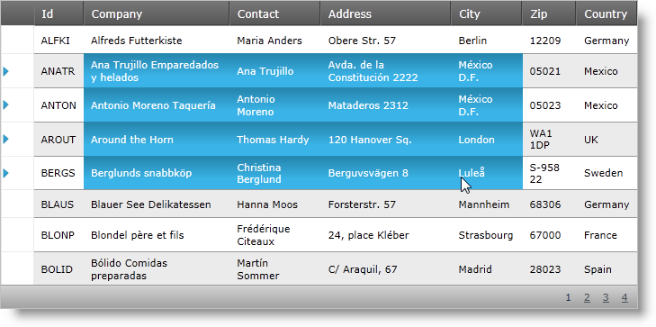

////

|metadata|
{
    "name": "web-whats-new-in-2011-volume-2",
    "controlName": [],
    "tags": ["FAQ","Getting Started"],
    "guid": "71bcfa06-7faf-4d45-b2c8-6b0f610caf66",  
    "buildFlags": [],
    "createdOn": "2011-10-25T11:51:15.2370924Z"
}
|metadata|
////

= What's New in 2011 Volume 2

== Topic Overview

== Purpose

This topic provides an overview of the new functionalities and components introduced with the Infragistics ASP.NET 11.2.

== In this topic

This document contains the following sections:

<<One,New Functionalities and Components>>

<<Two,WDG-WHDG Word Exporter>>

<<Three,WebDataGrid Multicolumn Headers>>

<<Four,WDG-WHDG Batch Updating>>

<<Five,WebImageButton Implements IButtonControl>>

<<Six,Excel-Style Copy and Paste>>

<<Seven,Touch Support Aikido>>

[[One]]
== New Functionalities and Components

[[Two]]
== WDG-WHDG Word Exporter

Starting with the 11.2 release, you can export Grid data to MS Word® files. The new WebWordExporter™ control allows you to export data from either of the Infragistics Data Grids (WebDataGrid™ or WebHierarchicalDataGrid™).

== *Related Topics*

link:webwordexporter-getting-started-with-webwordexporter.html[Getting Started With WebWordExporter]

link:webwordexporter-about-webwordexporter.html[About WebWordExporter]

[[Three]]
== WebDataGrid Multi-Column Headers

The WebDataGrid now supports multi-column headers where multiple levels of headers can be configured in the grid and data columns can be grouped into parent headers. The multi-column behavior works well with column resizing, column moving, sorting, and filtering.

== *Related Topics*

link:webdatagird-multi-column-headers.html[Configuring WebDataGrid Multi-Column Headers]

[[Four]]
== WDG-WHDG Batch Updating

Batch Update mode of the Editing Core Behavior allows you to modify, either update, insert or delete rows, without going to the server on every row editing. All the data is edited on the client and it is persisted on the server on the first postback. The main features of the Batch Update mode are:

* Modify more than one row at a time
* Undo the modified data before sending it to the server
* Dynamic recalculation on the client if there are summaries enabled
* Client-side events
* Using server events for updating, adding and deleting rows

== *Related Topics*

link:webdatagrid-batch-updating.html[WDG Batch Updating]

link:webhierarchicaldatagrid-batch-updating.html[WHDG Batch Updating]

[[Five]]
== WebImageButton Implements IButtonControl

The WebImageButton™ now implements the IButtonControl interface. This is provides additional benefits for validation and submitting forms using the System.Web.UI.WebControls.IButtonControl properties and events.

== *Related Topics*

link:http://msdn.microsoft.com/en-us/library/system.web.ui.webcontrols.ibuttoncontrol.aspx[IButtonControl Interface]

[[Six]]
== Excel-Style Copy and Paste

Click and drag to select single or multiple cells and rows in either the WebDataGrid or WebHierarchicalDataGrid. Use standard keyboard shortcuts to copy these items to your clipboard and paste into Excel® or another WebDataGrid or WebHierarchicalDataGrid.

== *Related Topics*

link:webdatagrid-clipboard.html[Clipboard]

[[Seven]]
== Touch Support Aikido

The new Infragistics ASP.NET Volume 2 is now available for tablet platforms. The Infragistics ASP.NET now controls support touch events and the controls are redesigned to fit the common tablet-based sizes.

== *Related Topics*

link:touch-support-in-netadvantage-for-aspnet.html[Touch Support in Infragistics ASP.NET]