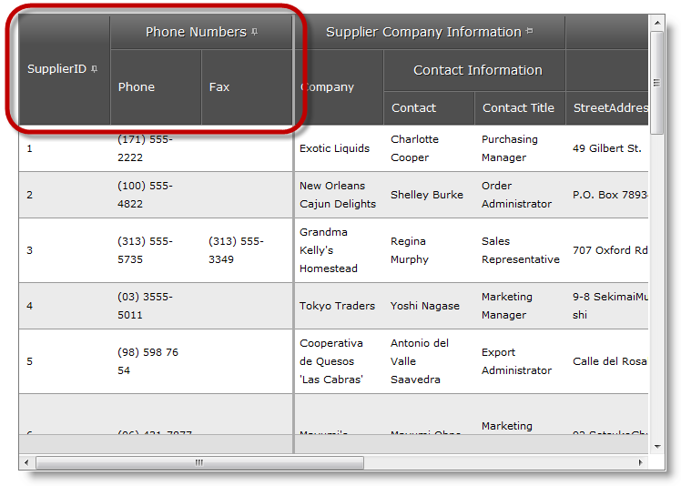
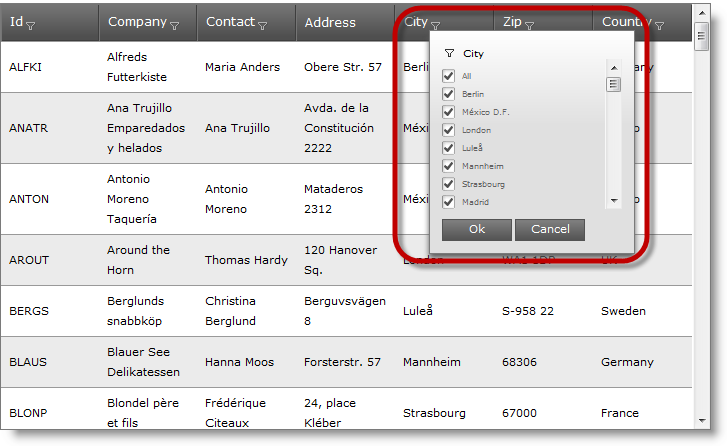
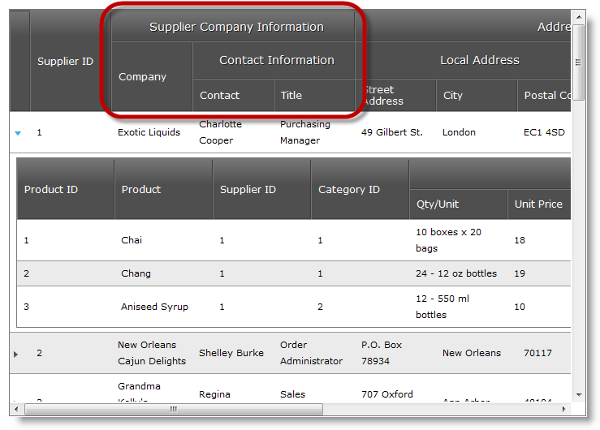
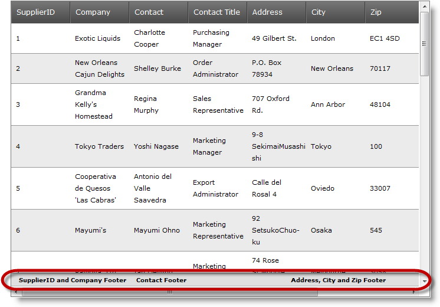
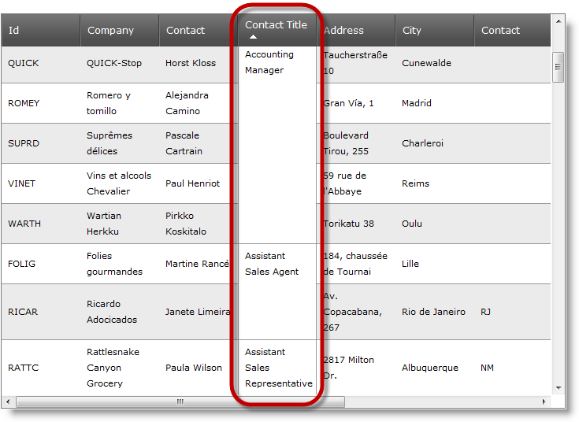

////

|metadata|
{
    "name": "web-whats-new-in-2012-volume-1",
    "controlName": [],
    "tags": ["Breaking Changes","Getting Started","How Do I"],
    "guid": "8f585554-e735-424e-b848-4ef7b026e29b",  
    "buildFlags": [],
    "createdOn": "2012-04-16T13:20:01.8759479Z"
}
|metadata|
////

= What's New in 2012 Volume 1

== Topic Overview

=== Purpose

This topic provides an overview of the new functionalities introduced with the Infragistics ASP.NET 12.1®

== New Features

=== New features overview

The following table summarizes the new features of the Infragistics ASP.NET 12.1 Additional details are available after following the summary table.

[options="header", cols="a,a"]
|====
|Feature|Description

|<<multi_column_headers_and_column_fixing,WebDataGrid Multi-Column Headers and Column Fixing>>
|_WebDataGrid_ Multi-Column Headers now works with Column Fixing behavior.

|<<wdg_whdg_excel_style_filtering,WebDataGrid WebHierarchicalDataGrid Excel Style Filtering [CTP]>>
|Excel-style filtering gives users the option to select the search condition from a checkbox list with distinct values for the column.

|<<whdg_multi_column_headers,WebHierarchicalDataGrid Multi-Column Headers>>
|The _WebHierarchicalDataGrid_ now supports multi-column headers.

|<<wdg_whdg_multi_column_footers,WebDataGrid WebHierarchicalDataGrid Multi-Column Footers>>
|Multi-Column footers functionality allows you to merge footer for several columns.

|<<wdg_whdg_cell_merging,WebDataGrid WebHierarchicalDataGrid Cell Merging>>
|The Cell Merging feature provides you with the capability to perform visual merging of cells with the same value in a column.

|<<touch_support,Touch support>>
|Touch support is now available for all the ASP.NET controls.

|====

[[multi_column_headers_and_column_fixing]]

=== WebDataGrid Multi-Column Headers and Column Fixing

The  _WebDataGrid_   Multi-Column headers now work with Column Fixing behavior. You can fix individual columns or grouped columns, but not columns inside a group.

==== Related Samples:

* link:{SamplesURL}/samples/webdatagrid/display/multicolumnheaderswithcolumnfixing/default.aspx?cn=data-grid&sid=f1d006c8-dda8-4f36-b96f-897569f1df6f[Multi-Column headers with Column Fixing]

[[wdg_whdg_excel_style_filtering]]

=== WebDataGrid/WebHierarchicalDataGrid Excel Style Filtering [CTP]

Excel-style filtering gives users the option to select the search condition from a checkbox list with distinct values for the column. They can choose a subset of the list items or all items.

==== Related Samples:

* link:{SamplesURL}/samples/webdatagrid/organization/excelstylefiltering/default.aspx?cn=data-grid&sid=28d09818-7853-46fb-ba0a-a930e003aa83[Filtering – Excel Style (WebDataGrid)]
* link:{SamplesURL}/samples/webhierarchicaldatagrid/organization/excelstylefiltering/default.aspx?cn=hierarchical-data-grid&sid=9119c46b-1735-4bab-8bcd-4041270e59fe[Filtering – Excel Style (WebHierarchicalDataGrid)]

[[whdg_multi_column_headers]]

=== WebHierarchicalDataGrid Multi-Column Headers

The  _WebHierarchicalDataGrid_   now supports multi-column headers where multiple levels of headers can be configured in the grid and data columns can be grouped into parent headers.

==== Related Topics:

* link:webhierarchicaldatagrid-configuring-multi-column-headers.html[Configuring WebHierarchicalDataGrid Multi-Column Headers]

[[wdg_whdg_multi_column_footers]]

=== WebDataGrid/WebHierarchicalDataGrid Multi-Column Footers

Multi-Column footers functionality allows you to merge a footer for several columns.

==== Related Topics:

* link:webdatagrid-configuring-multi-column-footers.html[Configuring Multi-Column Footers (WebDataGrid)]
* link:webhierarchicaldatagrid-configuring-multi-column-footers.html[Configuring Multi-Column Footers (WebHierarchicalDataGrid)]

[[wdg_whdg_cell_merging]]

=== WebDataGrid/WebHierarchicalDataGrid Cell Merging

The Cell Merging features of the  _WebDataGrid_   and  _WebHierarchicalDataGrid_   controls provide you with the capability to perform visual merging of cells with the same value.

.Note:
[NOTE]
====
For  _WebDataGrid_   cell merging is tied to sorting behavior.
====

.Note:
[NOTE]
====
For  _WebHierarchicalDataGrid_   cell merging is tied to sorting or group by behaviors.
====

==== Related Topics:

* link:webdatagrid-cell-merging-overview.html[Cell Merging Overview (WebDataGrid)]
* link:webdatagrid-enabling-cell-merging.html[Enabling Cell Merging (WebDataGrid)]
* link:webhierarchicaldatagrid-cell-merging-overview.html[Cell Merging Overview (WebHierarchicalDataGrid)]
* link:webhierarchicaldatagrid-enabling-cell-merging.html[Enabling Cell Merging (WebHierarchicalDataGrid)]

[[touch_support]]

=== Touch support

When the ASP.NET controls are opened through a touch platform browser, they react properly when the user interact with them, by processing touch events on the client. In addition to this change from the previous release,  _WebVideoPlayer_   adds special behavior, when it is running on a touch platform browser.

When running  _WebVideoPlayer_   on a mobile device, the default device video player controls are rendered, unless the Modernizr JavaScript library is undefined. If for some reason you do not have the  _Modernizr_   library available on your page, then the  _igVideoPlayer_   control is rendered, which in some cases may have fewer touch capabilities than the default device video player. That is why when  _Modernizr_   library is available  _igVideoPlayer_   falls back to the default device video player.

==== Related Topics:

* link:touch-support-in-netadvantage-for-aspnet.html[Touch Support in Infragistics ASP.NET]