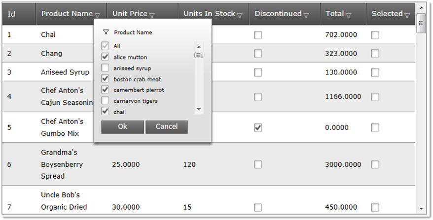
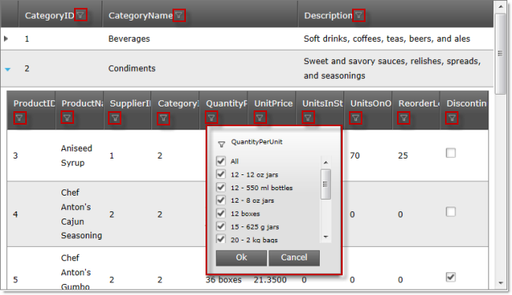

////

|metadata|
{
    "name": "web-whats-new-in-2012-volume-2",
    "controlName": [],
    "tags": ["Design Environment","Editing","Filtering","Grids"],
    "guid": "6bc11c24-edcf-4448-9737-65f3a068c27f",  
    "buildFlags": [],
    "createdOn": "2012-09-21T17:17:19.8856067Z"
}
|metadata|
////

= What's New in 2012 Volume 2

== Topic Overview

==== Features overview

This topic provides an overview of the new features for the ASP.NET 2012 Volume 2 release.

== New Features

==== Features overview

The following table summarizes the new features for the ASP.NET 2012 Volume 2 release. Additional details about some of them are available after this summary table.

[options="header", cols="a,a"]
|====
|Feature|Description

|<<_Ref326155173,Auto-generation of columns fully supported for generic data sources in _WebDataGrid_™/ _WebHierarchicalDataGrid_™>>
|The _WebDataGrid_ / _WebHierarchicalDataGrid_ fully supports the auto-generation of columns with generic collections.

|<<_Ref326155174,Dynamic retrieval and configuration of input masks for the _WebMaskEditor_™ client-side>>
|The _WebMaskEditor_ client-side object model has now methods for getting and setting the ut mask.

|<<_Ref326155175,Excel-Style Filtering in _WebDataGrid_ / _WebHierarchicalDataGrid_ >>
|The Excel-Style Filtering feature of the WebDataGrid/WebHierarchicalDataGrid filters the data in the grid using the filtering conventions employed by Microsoft® Excel® worksheets. The feature basically breaks the data into a smaller subset that matches your filter criteria and displays the matches.

|Metro User Interface (UI) support for design-time dialogs and Icons in Microsoft Visual Studio® 2012
|Starting with 12.2,Infragistics ASP.NET supports Metro UI for design-time dialogs and icons in Visual Studio 2012.

|====

[[_Ref326155173]]

=== Auto-generation of columns fully supported for generic data sources in WebDataGrid / WebHierarchicalDataGrid

Both link:web-webdatagrid-webdatagrid.html[*_WebDataGrid*_] and link:web-webhierarchicaldatagrid.html[_*WebHierarchicalDataGrid_* ] now fully support auto-generation of columns with generic collections. The  _WebDataGrid_  / _WebHierarchicalDataGrid_   can generate their columns automatically even if its  _link:http://msdn.microsoft.com/en-us/library/system.collections.ienumerable.aspx[IEnumerable]_  data source is empty. The columns are generated using the types of the objects in the collection, to which the grid is bound. Before 12.2, at least one record had to be available in the data source to generate the columns correctly.

[[_Ref326155174]]

=== Dynamic retrieval and configuration of input masks for the WebMaskEditor client-side

The  _WebMaskEditor_   client-side object model proposes methods for getting and setting the input mask. They are ` link:webtexteditor~infragistics.web.ui.webmaskeditor~inputmask.html[get_inputMask()]` and ` link:webtexteditor~infragistics.web.ui.webmaskeditor~inputmask.html[set_inputMask()]`. In a scenario when you need to change the mask dynamically, this will save you from making a request to the server in order to configure the  _WebMaskEditor_  .

==== Related Topics:

* link:configuring-and-retrieving-input-masks-dynamically.html[Get-ing and Set-ing the  _WebMaskEditor_  Masks on the Server and on the Client]

[[_Ref326155175]]

=== Excel-Style Filtering in WebDataGrid / WebHierarchicalDataGrid

The Excel-Style Filtering feature of the  _WebDataGrid_  / _WebHierarchicalDataGrid_   filters the data in the grid using the filtering conventions employed by Microsoft Excel worksheets. The feature basically breaks the data into a smaller subset that matches your filter criteria and displays the matches.

The following pictures demonstrate the Excel-Style Filtering feature in  _WebDataGrid_   (top) and  _WebHierarchicalDataGrid_   (bottom), respectively.

==== Related Topics:

* link:webdatagrid-excelstylefiltering-overview.html[Excel-Style Filtering Overview ( _WebDataGrid_ )]
* link:webhierarchicaldatagrid-excelstylefiltering-overview.html[Excel-Style Filtering Overview ( _WebHierarchicalDataGrid_ )]

[[_Ref326941914]]

=== Topics

The following topics provide additional information related to this topic:

[options="header", cols="a,a"]
|====
|Topic|Purpose

| link:configuring-and-retrieving-input-masks-dynamically.html[Configuring and Retrieving Input Masks Dynamically ( _WebMaskEditor_ )]
|This topic demonstrates how to get and set the _WebMaskEditor_™ input masks dynamically client-side..

| link:webdatagrid-excelstylefiltering-overview.html[Excel-Style Filtering Overview ( _WebDataGrid_ )]
|This topic introduces the Excel-Style Filtering feature of the _WebDataGrid_ control.

| link:webhierarchicaldatagrid-excelstylefiltering-overview.html[Excel-Style Filtering Overview ( _WebHierarchicalDataGrid_ )]
|This topic introduces the Excel-Style Filtering feature of the _WebHierarchicalDataGrid_ control.

|====