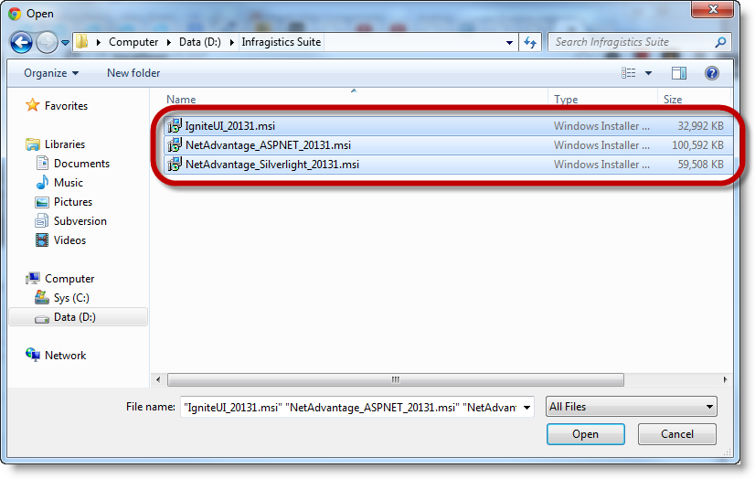
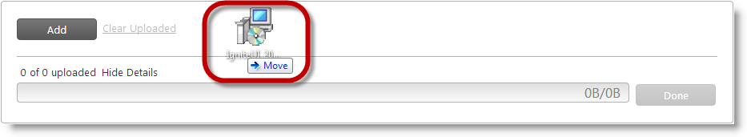

////
|metadata|
{
    "name": "web-whats-new-in-2013-volume-1",
    "controlName": [],
    "tags": [],
    "guid": "2dd04abf-18d1-416b-b068-bc98e43f38cf",
    "buildFlags": [],
    "createdOn": "2013-03-20T19:26:25.4644964Z"
}
|metadata|
////

= What's New in 2013 Volume 1

== Topic Overview

==== Purpose

This topic provides an overview of the new features for the ASP.NET 2013 Volume 1 release.

== New Features

==== New features summary chart

The following table summarizes the new features for the ASP.NET 2013 Volume 1 release. Additional details about some of them are available after this summary table.

[options="header", cols="a,a,a"]
|====
|Control|Feature|Description

|<<_Ref351481551,WebUpload>>™
|General improvements
|In HTML-5-enabled browsers, the _WebUpload_ control uses link:http://www.w3.org/TR/XMLHttpRequest2/[XMLHttpRequest Level 2] to get the status of the upload.

|
|<<_Ref351480306,Saving files as memory stream>>
|_WebUpload_ allows you to process files as memory stream objects.

|
|<<_Ref351481466,Selecting multiple files at once for upload>>
|_WebUpload_ allows users to select multiple files at once either from the browser’s open file dialog or by drag-and-drop. This feature works for HTML 5 enabled browsers.

|<<_Ref351481624,WebHierarchicalDataGrid>>™
|<<_Ref351482128,Support for empty row islands>>
|Rows islands now support adding of child rows through code even where no child rows currently exist on a row island.

|====

[[_Ref351481551]]
== _WebUpload_

[[_Ref351480306]] 
==== Saving files as memory stream
Prior to 13.1, the _WebUpload_ component could only upload files as file stream objects. Now you can upload files as memory stream objects. This enables you to manipulate the files directly in memory (for example you can save them to database or compress them). 

To handle this new capability, a new application-wide option – `FileSaveType` – has been added for the _WebUpload_ . This option accepts as values either _filestream_ or _memorystream_, each corresponding to the respective upload approach. By default, the `FileSaveType` option is set to _filestream_ . This option enables the functionality in the _WebUpload_ control. 

==== Related Topics 

* link:webupload-saving-files-as-stream.html[Saving Files as Stream ( _WebUpload_ )] 

[[_Ref351481466]] 
==== Selecting multiple files at once for upload
Prior to 13.1, users had to select files one by one from the browser’s open file dialog. Now users can select multiple files at once, either from the browser’s open file dialog or by drag-and-drop. 

To add multiple files to _WebUpload_, users can either: 

* Select multiple files at once from the file Open dialog, or 

* Drag-and-drop the files from Windows® Explorer onto the _WebUpload_ control 

The following screenshots illustrate the two alternative file selection approaches: selecting multiple files in the file Open dialog (left) or dragging and dropping them from Windows Explorer onto the _WebUpload_ control panel (right). 
Multiple files selection in the file Open dialog 

 

Dropping selected files from Windows Explorer onto _WebUpload_ 

 

Multiple files selection leverages the link:http://www.w3.org/TR/html-markup/input.file.html#input.file[HTML 5 _multiple_ attribute] of the `input` element. The functionality is available only in the browsers which support that attribute. 

==== Related Topics 

* link:webupload-configuring-webupload.html[Configuring _WebUpload_ ] 

[[_Ref351481624]]
== _WebHierarchicalDataGrid_

[[_Ref351482128]]

==== Support for empty row islands

Prior to 13.1, the  _WebHierarchicalDataGrid_   only supported adding child rows to an empty row island through the use of the add row. Now, the  _WebHierarchicalDataGrid_   adds an improvement where rows islands support adding child rows through code even where no child rows currently exist on a row island. This was a limitation in previous releases and the  _WebHiearchicalDataGrid_   now supports this behavior.

To enable the feature, set the `EnableChildlessRowsPopulation` property to  _true_   off of the `EditingCore` behavior.

*Related Content*

*Topics*

The following topics provide additional information related to this topic.

[options="header", cols="a,a"]
|====
|Topic|Purpose

| link:webupload-saving-files-as-stream.html[Saving Files as Stream ( _WebUpload_ )]
|This topic explains how to process and save upload files as either file or memory streams. A detailed procedure is provided on saving files as memory stream by individual processing of each uploaded file chunk.

| link:webupload-configuring-webupload.html[Configuring _WebUpload_ ]
|This topic explains, with code examples, how to configure the _WebUpload_ control.

|====