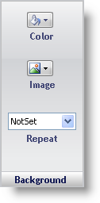

////

|metadata|
{
    "name": "webappstylist-background-pane",
    "controlName": ["WebAppStylist"],
    "tags": ["Styling","Theming"],
    "guid": "{773B7433-8086-4EDA-AAAD-40C05C586C77}",  
    "buildFlags": [],
    "createdOn": "0001-01-01T00:00:00Z"
}
|metadata|
////

= Background Pane

The Background properties determine what the background of the Role will look like:

*Color* -- Clicking the drop-down button will open the color picker. You can choose colors from several predefined sets such as Custom, Web, System, Office XP, Office 2003, VS 2005, and Office 2007. Click the Default button to revert the color back to its default value. Click the white box with a red slash through it to set the background as transparent. Click the Color Wheel to open the Custom Color dialog box. Or, you can choose any color currently displayed on the screen with the eyedropper tool.

*Image* -- Select File from the drop-down menu if you would like to use your own image as a background. Select CreateGradient to open the Gradient Editor. From here you can create a new image from scratch. Set the height and width on the image, the colors of the gradient, the orientation, and other features. For more information on how to create a custom gradient, see link:webappstylist-creating-a-gradient-background.html[Creating a Gradient Background].

*Repeat* -- If you have selected an image to display in the background, this property determines whether the image will repeat (tile like a windows desktop background), not repeat, repeat-X (repeat only horizontally), or repeat-Y (repeat only vertically).

