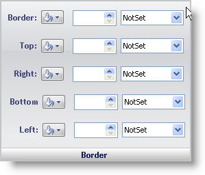

////

|metadata|
{
    "name": "webappstylist-border-pane",
    "controlName": ["WebAppStylist"],
    "tags": ["Styling","Theming"],
    "guid": "{B43892AF-3312-41DE-9E1B-929B0DD2FFBF}",  
    "buildFlags": [],
    "createdOn": "0001-01-01T00:00:00Z"
}
|metadata|
////

= Border Pane

The Border properties determine what the border of the Role will look like, including all borders, and top, right, bottom, and left borders individually.

*Border* -- Change the color of the border with the drop-down color picker on the left. The box in the center will adjust the weight of the border. The weight of the border is determined in pixels. The drop-down list on the right allows you to choose a type of border. Choose from many styles of borders including Double, Groove, Inset, and None.

*Top* -- Similar to Border, but affects only the top border.

*Right* -- Similar to Border, but affects only the right border.

*Bottom* -- Similar to Border, but affects only the bottom border.

*Left* -- Similar to Border, but affects only the left border.

