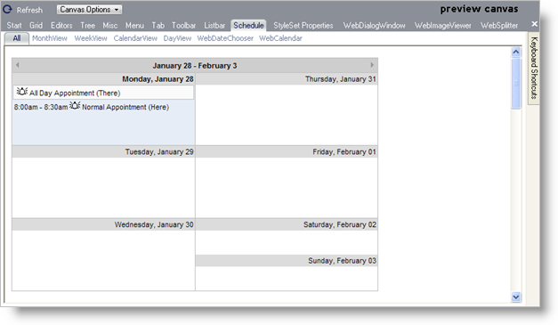
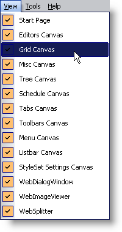
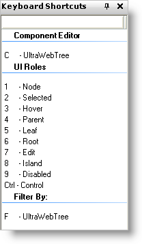

////

|metadata|
{
    "name": "webappstylist-canvas",
    "controlName": ["WebAppStylist"],
    "tags": ["Styling","Theming"],
    "guid": "{DC8FF44B-B68B-4E63-8FC4-D83A29AC1F87}",  
    "buildFlags": [],
    "createdOn": "0001-01-01T00:00:00Z"
}
|metadata|
////

= Canvas

The canvas is a visual demonstration of how your style would look in a real Web application. All changes to Role appearance properties are reflected in the canvas area. The canvas is divided into nine tabbed areas (eleven if you count the Start page and StyleSet Properties, which are technically not canvases), each area displaying a control or set of controls.

For example, the Schedule canvas shown below displays a large month view. However, by selecting one of the tabs below the Canvas tabs, you can view any other WebSchedule control such as WeekView, CalendarView, etc. You can also choose the All tab to display every WebSchedule control on one canvas.

Click the following links to find out which controls are contained within each canvas:

* link:webappstylist-personalizing-your-style-libraries.html[Personalizing Your Style Libraries]
* link:webappstylist-schedule.html[Schedule]
* link:webappstylist-webdatagrid.html[WebDataGrid]
* link:webappstylist-webdatamenu.html[WebDataMenu]
* link:webappstylist-webdatatree.html[WebDataTree]
* link:webappstylist-webdialogwindow.html[WebDialogWindow]
* link:webappstylist-webdropdown.html[WebDropDown]
* link:webappstylist-webexplorerbar.html[WebExplorerBar]
* link:webappstylist-webhierarchicaldatagrid.html[WebHierarchicalDataGrid]
* link:webappstylist-webimageviewer.html[WebImageViewer]
* link:webappstylist-webprogressbar.html[WebProgressBar]
* link:webappstylist-websplitter.html[WebSplitter]
* link:webappstylist-webslider.html[WebSlider]
* link:webappstylist-webtab.html[WebTab]
* link:webappstylist-webtexteditors.html[WebTextEditors]

== Specifying Which Canvases are Shown

You can display any combination of canvases at one time. By default, Infragistics AppStylist for ASP.NET displays all canvases (or only the ones included in the current StyleSet). If you want to hide a canvas, simply click the 'x' button in the upper-right corner of the canvas. If you would like to show a canvas, click the View menu item.

If a highlighted check box does not appear next to the canvas name, that canvas is not being displayed in the workspace. Click the canvas name to add it to the workspace.

== Keyboard Shortcuts

As you hover over each item in a canvas, the Keyboard Shortcuts window (to the right of the canvas by default) will be populated with valuable Role information.

The Keyboard Shortcuts window is divided into two columns:

* *Key* -- Press the corresponding key on your keyboard to activate that particular Control, Role, or to filter by control.
* *Role* -- Always displays the corresponding component first and then lists the Roles that the object can play. Also included is an option to filter by control. The control to filter by will always be the corresponding component.

Keyboard shortcuts are an extremely important part of navigation. If you don't know what a particular Role is named, but you know what it looks like, the keyboard shortcut can help you figure out the Role by hovering over the familiar object.