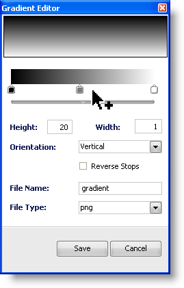

////

|metadata|
{
    "name": "webappstylist-creating-a-gradient-background",
    "controlName": ["WebAppStylist"],
    "tags": [],
    "guid": "{8CDDEAF1-622D-444B-BF6C-4705142E44E1}",  
    "buildFlags": [],
    "createdOn": "0001-01-01T00:00:00Z"
}
|metadata|
////

= Creating a Gradient Background

One very important element of Web applications is gradient backgrounds. Using a gradient adds depth to the application as well as visual appeal. Included in Infragistics AppStylist for ASP.NET's default functionality is a Gradient Editor that can assist you in creating almost any kind of gradient. The following procedure will guide you through the process of creating a gradient background for any UI Role.

[start=1]
. Use the Roles tree in the Style Explorer to navigate to the UI Role to which you would like to apply a gradient background. For the purposes of this walkthrough, we'll use the WebTree Control UI Role.
[start=2]
. When you've selected the appropriate UI Role, find the Image drop-down button in the Background Pane of the Designer. Click the drop-down arrow and select CreateGradient from the drop-down list.

The Gradient Editor dialog box appears.

By default, there are two stops, black and white. You can add more stops and change the color of those stops by clicking them.
[start=3]
. Click in-between the black and white stops to create a third stop. Your mouse cursor will change to a pointer with a plus sign to indicate that you can add another stop.

[start=4]
. Click the left stop. A color picker appears.

Select the color Blue from the color picker. The preview reflects your changes.

[start=5]
. Leave the Height, Width, and Orientation as is. However, if you set the Orientation to Horizontal, you may want to change the Height and Width properties to correspond. (If you have a horizontal gradient only one pixel wide, you won't see any of the gradient.)
[start=6]
. In the File Name field, give the gradient a descriptive name such as "Vertical_Blue_2_White".

[start=7]
. In the File Type drop-down list, select a format for the gradient. You can choose from PNG, JPEG, and GIF. Leave PNG selected for now.

[start=8]
. Click Save to close the Gradient Editor dialog box.
[start=9]
. If you are viewing the WebTree canvas, you will notice immediately that the new gradient is applied.

