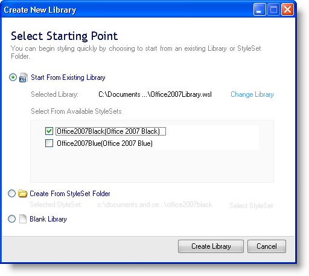

////

|metadata|
{
    "name": "webappstylist-creating-a-style-library",
    "controlName": ["WebAppStylist"],
    "tags": ["How Do I","Styling","Theming"],
    "guid": "{97D1A4BD-3C8E-4B4B-A183-3F788954EAB8}",  
    "buildFlags": [],
    "createdOn": "0001-01-01T00:00:00Z"
}
|metadata|
////

= Creating a Style Library

If you need to make several Style Libraries for one or more applications, you will need to create a new Style Library. If you have just launched Infragistics AppStylist for ASP.NET, you will see a Start page. In the Open Recent section of the Start page, you can create a new Style Library by clicking the Create New Library button. If you prefer not to use this method, you can follow the steps in the following procedure:

*To create a new Style Library:*

[start=1]
. On the File menu, click New Style Library... (you can also create a new Style Library by pressing the Ctrl-N key combination). The Create New Library dialog box appears.
[start=2]
. The Create New Library dialog box offers three paths to creating a new Style Library.

.. *Start From Existing Library* -- Selecting this option allows you to create a new Style Library based on a previously existing one. Clicking Change Library will open an Open File dialog box. You can search for a Style Library and click Open to select a Style Library. The StyleSets contained within the Style Library will appear in the box below. Select all, some, or none of the StyleSets from the box and click Create Library.

.. *Create From StyleSet Folder* -- Selecting this option allows you to create a new Style Library based on a previously existing StyleSet. Clicking Select StyleSet will open a Infragistics AppStylist Folder Browser dialog box. Navigate through the tree until you find a folder in which a previously created StyleSet exists. Click OK to set that folder as the basis for the new Style Library. If the folder is not valid, a dialog box will open explaining that the folder is not valid. Once you have chosen a valid StyleSet folder, click Create Library to create your new Style Library based on a StyleSet.

.. *Blank Library* -- Selecting this option allows you to create a new Style Library from scratch. Click Create Library to create a new Style Library including a default StyleSet. This default StyleSet includes basic styles for each component. If you would prefer a completely blank StyleSet, you will need to create a new one. See link:webappstylist-creating-a-styleset.html[Creating a StyleSet] for more information.

[start=3]
. If there are unsaved changes in the current Style Library, a dialog box will open asking if you'd like to save them.

** Clicking Yes will open the Save As dialog box if this is a new Style Library that has not been saved before; otherwise, Infragistics AppStylist saves and closes the current Style Library and creates a new Style Library. For more information on saving Style Libraries, see link:webappstylist-saving-your-work.html[Saving Your Work].
** Clicking No will abandon any unsaved changes to the current Style Library and create a new Style Library.
** Clicking Cancel will stop creating a new Style Library and you can continue working on your current one.

[start=4]
. A new Style Library is created and you can begin styling components using the default StyleSet or you can link:webappstylist-creating-a-styleset.html[Create a StyleSet].