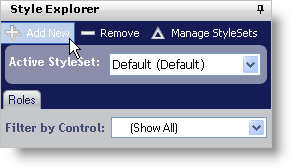
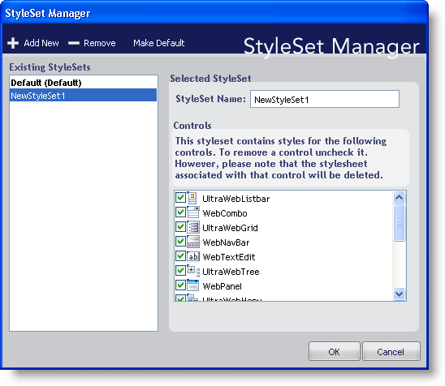
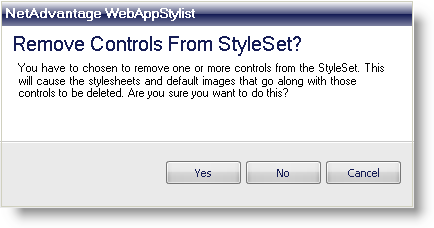
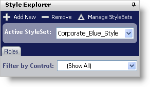

////

|metadata|
{
    "name": "webappstylist-creating-a-styleset",
    "controlName": ["WebAppStylist"],
    "tags": ["Styling","Theming"],
    "guid": "{E43FC544-0120-4DFA-AA13-590AD8075EA7}",  
    "buildFlags": [],
    "createdOn": "0001-01-01T00:00:00Z"
}
|metadata|
////

= Creating a StyleSet

A single Style Library can contain multiple StyleSets that apply to any number of Infragistics ASP.NET controls. You can create a StyleSet for only WebGrid™ or you can create one that applies to both WebGrid and WebTree™. The following procedure will create a simple StyleSet and add it to the Style Library.

*To create a new StyleSet:*

[start=1]
. Click Add New in the toolbar at the top of the Style Explorer.

The StyleSet Manager dialog box appears.

[start=2]
. Change the StyleSet Name of the StyleSet to something more descriptive such as 'Corporate_Blue_Style'. If you would like for the StyleSet to apply only to a specific control/component, deselect the check boxes of the controls/components that you do not want to include in this StyleSet.

.Note:
[NOTE]
====
If you deselect controls/components, Infragistics AppStylist for ASP.NET will NOT create style sheets for those particular controls/components. If you are modifying an existing StyleSet, once you remove a style from it, the associated style sheet and all images will be deleted.
====

[start=3]
. Click OK to add the StyleSet to the Style Library.

If you chose to remove specific controls/components, you will receive a warning dialog box. Click Yes to remove the controls/components from the StyleSet, essentially deleting the default style sheets and images. Click No or Cancel to go back to the StyleSet Manager dialog box.

The 'Corporate_Blue_Style' StyleSet now appears in the Active StyleSet drop-down list.

