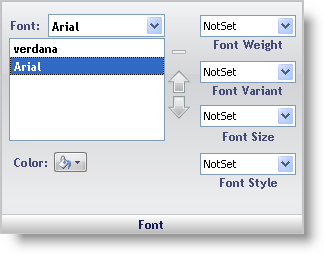

////

|metadata|
{
    "name": "webappstylist-font-pane",
    "controlName": ["WebAppStylist"],
    "tags": ["Styling","Templating"],
    "guid": "{941C36D6-E4CC-405F-8547-F287B818589D}",  
    "buildFlags": [],
    "createdOn": "0001-01-01T00:00:00Z"
}
|metadata|
////

= Font Pane

The Font properties determine what the font of the Role will look like:

*Font* -- Click the drop-down button and a list of all fonts on your system will appear. Selecting a font will add the font to the font list. You can add multiple fonts and arrange their order in the list with the up and down arrows. Click the minus (-) sign to remove a font from the list.

*Color* -- Selecting a color from the color picker will change the color of the font.

*Font Weight* -- This property sets the font to bold. You can also make it bolder or lighter.

*Font Variant* -- Use this property to make all lowercase letters display as small capital letters.

*Font Size* -- Set the size of the font, ranging from XX-small to XX-large.

*Font Style* -- This property sets the font to italics. You can also make it oblique.

