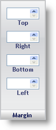

////

|metadata|
{
    "name": "webappstylist-margin-pane",
    "controlName": ["WebAppStylist"],
    "tags": ["Styling","Theming"],
    "guid": "{E3537488-9431-4406-BDC7-7D3992BE2D4E}",  
    "buildFlags": [],
    "createdOn": "0001-01-01T00:00:00Z"
}
|metadata|
////

= Margin Pane

The Margin properties determine how the margins of the Role will appear. The margins are located between the outer edge of an element and the border.

*Top* -- Input a positive whole number which will represent the distance in pixels between the top outer edge of the element and the border of the element. Use the spin buttons to increment/decrement the margin by one pixel.

*Right* -- Similar to Top, but affects only the right margin.

*Bottom* -- Similar to Top, but affects only the bottom margin.

*Left* -- Similar to Top, but affects only the left margin.

