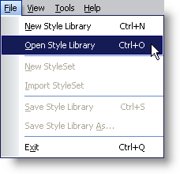
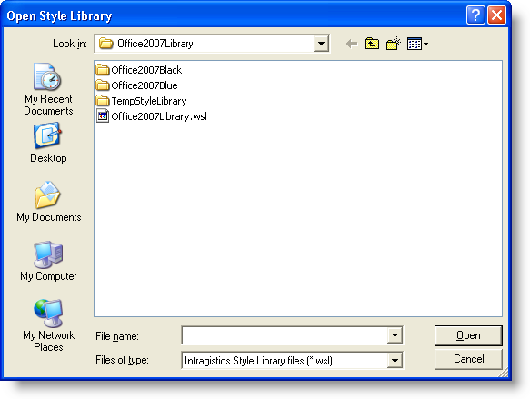

////

|metadata|
{
    "name": "webappstylist-opening-a-saved-style-library",
    "controlName": ["WebAppStylist"],
    "tags": ["Persistence"],
    "guid": "{5EAD7845-A30E-44A6-9723-FBBA1E1FBDAB}",  
    "buildFlags": [],
    "createdOn": "0001-01-01T00:00:00Z"
}
|metadata|
////

= Opening a Saved Style Library

There are three ways in which you can open a saved Style Library. You can use the Open Style Library... menu item from the File menu or, if you recently used a Style Library, it will show up in the Most Recently Used section of the File menu as well as the Open Recent section of the Start page.

*To open a saved Style Library from the File menu:*

[start=1]
. On the File menu, click Open Style Library...

The Open Style Library dialog box opens.

[start=2]
. Navigate to the folder where you saved your Style Library.
[start=3]
. Select the file you want to load and click Open. The Style Library is loaded into Infragistics AppStylist for ASP.NET.