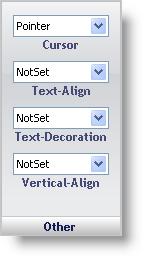

////

|metadata|
{
    "name": "webappstylist-other-pane",
    "controlName": ["WebAppStylist"],
    "tags": ["Styling","Theming"],
    "guid": "{A103C29D-CBA5-4E73-AA6D-B302464D1684}",  
    "buildFlags": [],
    "createdOn": "0001-01-01T00:00:00Z"
}
|metadata|
////

= Other Pane

The Other properties are miscellaneous properties.

*Cursor* -- Choose a variety of cursors from the drop-down list. A few of the cursors included are pointer, progress, text, wait, and hand.

*Text-Align* -- Align the element's text to either left, center, right, or justify.

*Text-Decoration* -- Choose to display a line over, through, or under an element's text by setting this property to Overline, Line-through, and Underline respectively.

*Vertical-Align* -- Vertically align your text to the top or bottom of an element, display text as superscript or subscript, or use several other aligning techniques.

