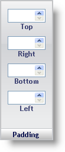

////

|metadata|
{
    "name": "webappstylist-padding-pane",
    "controlName": ["WebAppStylist"],
    "tags": ["Styling","Theming"],
    "guid": "{32906748-D077-4E81-8AD1-B32E4A9E3523}",  
    "buildFlags": [],
    "createdOn": "0001-01-01T00:00:00Z"
}
|metadata|
////

= Padding Pane

The Padding properties determine how the padding of the Role will appear. The padding is located between the border of an element and the inner edge.

*Top* -- Input a positive whole number which will represent the distance in pixels between the border of the element and the top inner edge of the element. Use the spin buttons to increment/decrement the margin by one pixel.

*Right* -- Similar to Top, but affects only the right padding.

*Bottom* -- Similar to Top, but affects only the bottom padding.

*Left* -- Similar to Top, but affects only the left padding.

