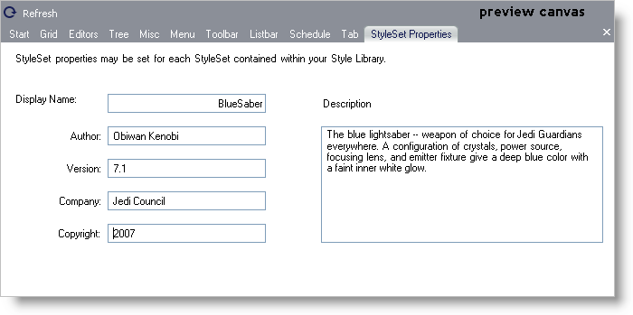

////

|metadata|
{
    "name": "webappstylist-personalizing-your-style-libraries",
    "controlName": ["WebAppStylist"],
    "tags": ["Styling","Theming"],
    "guid": "{51F9FA1F-B004-48A6-9F6B-1CA79A9F0D9F}",  
    "buildFlags": [],
    "createdOn": "0001-01-01T00:00:00Z"
}
|metadata|
////

= Personalizing Your Style Libraries

The StyleSet Properties tab in the preview canvas area allows you to tag your own Style Libraries with your own personal information. You can personalize each StyleSet contained within each Style Library. This information can include your name, copyright year, or even an end user license agreement, if you so desire.

To personalize a StyleSet, click the StyleSet Properties tab in the preview canvas area.

* *Display Name* -- This field identifies the name of the current Style Library.
* *Author* -- Place your name in this field, and/or any other name identifying who created the Style Library.
* *Version* -- Enter the current version of your Style Library. You can leave this field blank.
* *Company* -- If you are creating the StyleSet for your company, enter the company's name here. Otherwise, leave this field blank.
* *Copyright* -- Enter the copyright year or range of years in this field along with any other copyright text.
* *Description* -- Give a description of your StyleSet, what colors it uses, or any special instructions for someone who might be using or modifying the StyleSet.