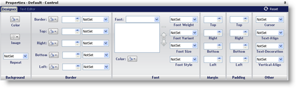

////

|metadata|
{
    "name": "webappstylist-roles",
    "controlName": ["WebAppStylist"],
    "tags": ["Styling","Theming"],
    "guid": "{3694B613-571B-4A94-9A04-DDD1052ABF9A}",  
    "buildFlags": [],
    "createdOn": "0001-01-01T00:00:00Z"
}
|metadata|
////

= Roles

The Roles tree helps you navigate the different types of roles that Application Styling offers. These roles play a pivotal part in styling your Web application as every one of them contains some sort of appearance change that can affect the look of your Web application.

== UI Roles and CSS

UI Roles are named for the role that they play in the user interface (the Web page itself). A UI Role might include a button, label, or any other graphical element the user can see in a Web site. In reality, each UI Role is defined as a class in a cascading style sheet (CSS) file. And all UI Roles for one control make up an entire CSS file. All CSS files together become a StyleSet.

== Cascade Effect

CSS files are made up of Elements, Classes, and IDs. Application Styling is only concerned with classes. Each class specifies how a specific element on a web page looks and behaves. This element can either be an entire table, a row in that table, or a cell in that row. The classes in a CSS file are applied to a web page in the same order they are inside the file itself. The first class is applied, followed by the second, third, and so on until the final class. If multiple classes are modifying the same properties on the same role, the last one that is applied "wins." When you expand the WebGrid node, for example, each role is applied in the order you see, as they are simply representations of classes in a CSS file.

== Role Tree

Because of the nature of the cascade in a CSS file, UI Roles can be uniquely categorized in the Role tree by inheritance. When you first expand the Roles node, you will see the Shared node. If you make an appearance change to any role in the Shared node, every UI Role will use these styles as they are applied to controls first (towards the top of the CSS file). However, once you expand any other control node and modify any Role, those modifications will then take precedence over any style applied to Shared. Only the properties that were modified will be overridden. All unmodified properties will still be inherited from Shared.

When you click on a UI Role, the Properties Panel below the Style Explorer will populate with a tabbed interface giving you the option to modify properties using the graphical Designer or Editor.

