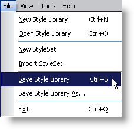
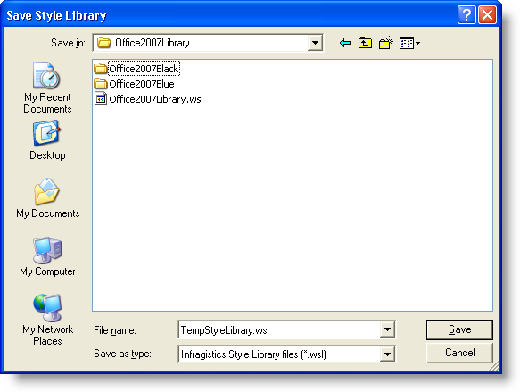

////

|metadata|
{
    "name": "webappstylist-saving-your-work",
    "controlName": ["WebAppStylist"],
    "tags": ["Persistence"],
    "guid": "{ABF90932-D9D9-4828-BE88-A2AB7D23C4EA}",  
    "buildFlags": [],
    "createdOn": "0001-01-01T00:00:00Z"
}
|metadata|
////

= Saving Your Work

The final step in the styling process before you can hand off your work to the developer is saving your Style Library as a Web Style Library (.wsl) file. This file contains all of your StyleSet information in a well formatted XML document.

*To save a new Style Library:*

[start=1]
. On the File menu, click Save Style Library...

The Save As dialog box opens.

[start=2]
. Name your Style Library and choose a folder to save it in.
[start=3]
. Click Save.

*To save an existing Style Library:*

[start=1]
. On the File menu, click Save Style Library... Infragistics AppStylist for ASP.NET will save the Style Library. You can either continue to work on the saved Style Library or work on a different one by link:webappstylist-opening-a-saved-style-library.html[Opening a Saved Style Library].
[start=2]
. If you would prefer that your unsaved changes be saved as another Style Library, then click Save Style Library As... on the File menu.

The Save As dialog box opens allowing you to save your Style Library with a different name.