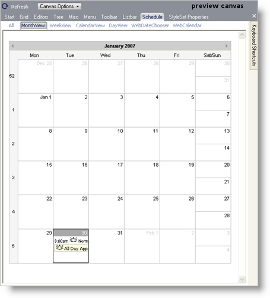

////

|metadata|
{
    "name": "webappstylist-schedule",
    "controlName": ["WebAppStylist"],
    "tags": ["Scheduling","Styling","Theming"],
    "guid": "{B9C69036-E78C-481D-8441-996197803D64}",  
    "buildFlags": [],
    "createdOn": "0001-01-01T00:00:00Z"
}
|metadata|
////

= Schedule

View all of your styling modifications that involve the WebSchedule components in the Schedule canvas. The canvas shows the WebSchedule components in several common configurations that you might encounter in your own web application. You will find the following controls/components on the WebSchedule canvas:

* WebMonthView
* WebCalendarView
* WebDayView
* WebDateChooser
* WebCalendar

